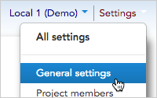
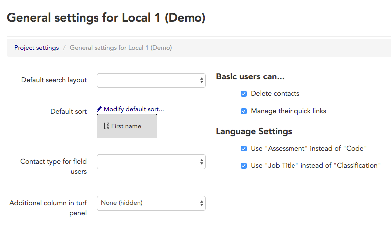
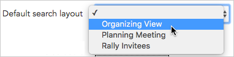
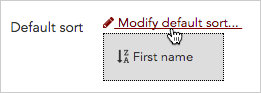
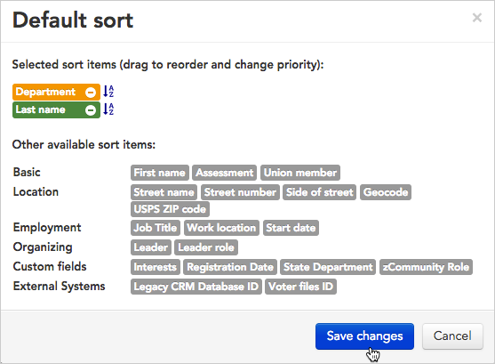
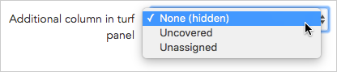
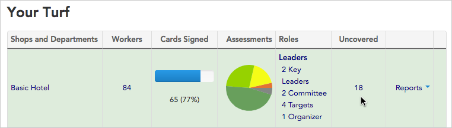
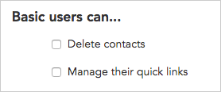
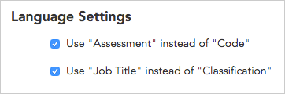
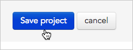

\[et\_pb\_text \_builder\_version="3.27.4" background\_size="initial" background\_position="top\_left" background\_repeat="repeat" template\_type="module"\]

**General settings** allow you to customize your Broadstripes project to match your organization's workflow. With general settings, you can select how you want certain key fields to be labeled, choose basic user permissions, and pick a default layout for displaying search results, among other things.

As an administrator, you can choose these settings just once, and they will be automatically applied across the project for all your users. The article below guides you step by step through managing your general settings.

1. To get started, access **General settings** by clicking **Settings** > **General settings** in the upper right corner of any page.

1. The **General settings form** will open.

### Default search layout

**Layouts** let you customize the appearance of the search results panel – the page that opens any time users run a search in Broadstripes. If your project has multiple organizers entering a lot of information, a good layout helps your users view and record information in the most effective way possible.

If you've [created a customized layout](https://help.broadstripes.com/help-articles/using-broadstripes/customize/save-a-layout/), you can select it as the default on the **General settings page**. Selecting a default search layout means that any time a user runs a search, the results will appear using the layout you've chosen. Users can also choose to create and save their own search results layouts, but by default, the layout you select in **General settings** will be used if no other layout is specified. Here's how:

1. Click the **Default search layout drop-down menu**.
2. Choose the layout you want from the list. (To learn about creating custom layouts, read the [Create and save a layout](https://help.broadstripes.com/help-articles/using-broadstripes/customize/save-a-layout/) article).

### Default sort

Sometimes a search brings back the contact records you need, but they're not displayed in a useful order. A custom sort lets you specify sort order (and even allows multi-tiered sorting), so your search results are easier to work with.

By default, Broadstripes will sort records alphabetically by first name, but from the **General settings page** you can specify a new default sort. After it's chosen, the default sort will be applied to search results any time your users run a search (unless they've specified another sort order). Here's how:

1. Click the **Modify default sort** link.

1. A **sort building tool** will open.

1. Build a sort by **clicking once** on any gray **field name block** to include it in your sort. Each field you choose will be added to the upper portion of the sort builder.
2. If you've chosen to sort by multiple fields, **drag and drop** the field name blocks you've selected to change the sort priority.
3. To toggle between ascending and descending alphabetical order, **click the  and icons**.
4. To learn more about creating custom sorts, read the [Create and save a sort](https://help.broadstripes.com/help-articles/using-broadstripes/customize/save-a-sort/) article.

### Contact type for field users

Choose the contact type you would like to apply to your field users (learn more about field users in the [user role](https://help.broadstripes.com/help-articles/admin-tools/running-a-project-admin/user-and-membership-overview/#ftoc-heading-9) section of the [Users and Membership Guide](https://help.broadstripes.com/help-articles/admin-tools/running-a-project-admin/user-and-membership-overview/).)

### Additional column in turf panel

The turf panel is a page that shows users a summary view of the shops they are responsible for organizing by their location. The turf panel is viewable on the Turf tab of a user's [Homepage](https://help.broadstripes.com/help-articles/using-broadstripes/get-started/use-the-homepage-tabs/).

From the **General settings page**, you can opt to add an additional column to all users' turf panels to display more information about the people they organize.

1. To start, click the **Additional column in turf panel** drop-down menu.

1. Choose from one of the given options:
    - **None (hidden)** will leave the turf panel as it is, with no additional column.
    - **Uncovered** will calculate and display the total number of people who have not been assigned a leader and have no leadership role.
    - **Unassigned** will calculate and display the total number of people who have not been assigned a leader.
2. After you've chosen and saved this setting, users will automatically see the new column in the turf panel on their **Turf tab**. Clicking the **numeric total** displayed in the column will show a detailed list of all the individual contacts.

Users can click the number 18 to open a list of people who are "uncovered."

### Limited Visibility

Sometimes an organizing team will include activists or volunteers who aren't well-known to the team's leadership or who, for other reasons, simply shouldn't have full access to the project's data.

When this is the case, you can check this box to turn on Broadstripes' **"Limited Visibility"** feature in your project. When this feature is on, project admins can still see all the records in the project, but [basic users](https://help.broadstripes.com/help-articles/admin-tools/running-a-project-admin/user-roles-and-permissions/#ftoc-heading-2) can only see the people and organizations "visible" to them.

If you enable the **"Limited Visibility"** feature in your project, you will also need to take additional steps to define which shops or departments a basic user can see. The shops and departments you've assigned will appear in a list in the "Visibility" column of the member's row in the [Memberships table](//help-articles/admin-tools/project-settings/members-settings/). Read more about defining what a user can see in the Limited visibility article.

### Data Imports can create multiple employments

Check this box to allow multiple employments to be created during the import process.

### Basic user permissions

The majority of Broadstripes users are categorized as **basic users**, and with general settings, you can control a few important permissions for them. You can learn more about different types of users in the [Users and membership guide](https://help.broadstripes.com/help-articles/admin-tools/running-a-project-admin/user-and-membership-overview/).

- **Delete contacts** check this box to allow users the power to [permanently delete contact records](https://help.broadstripes.com/help-articles/using-broadstripes/working-with-search-results/bulk-actions/) from your project. Note that once a contact is deleted, it cannot be undone.
- **Manage quick links** check this box if you want to allow users to [set up and maintain their own quick links](https://help.broadstripes.com/help-articles/using-broadstripes/customize/create-a-quick-link/) on the **Quick link tab** of their **Homepage**. As an administrator, you can set up users' quick links for them whether or not this is checked.

### Language settings

Different organizations use different language for talking about their work. **Language settings** let you specify how you want certain key fields to be labeled in your project.

- **Use "Assessment" instead of "Code"** Broadstripes allows you to assign each worker a numeric level of support for organizing (usually 1-5). Check this box if you prefer your project to use the label "Assessment" instead of "Code" wherever a worker's level of support is shown.
- **Use "Job Title" instead of "Classification"** Broadstripes lets you record any worker's employment within a tiered structure. Commonly, the upper tiers are labeled "Employer, Department, and Subdepartment," and the lowest tier can be labeled either "Job Title" or "Classification" depending on your choice here.

### Save your settings

When you've made the changes you want to your general settings, click the **Save** button to commit the changes. The changes will take immediate effect, although users may need to refresh or reload the pages they are on to see them.

\[/et\_pb\_text\]
