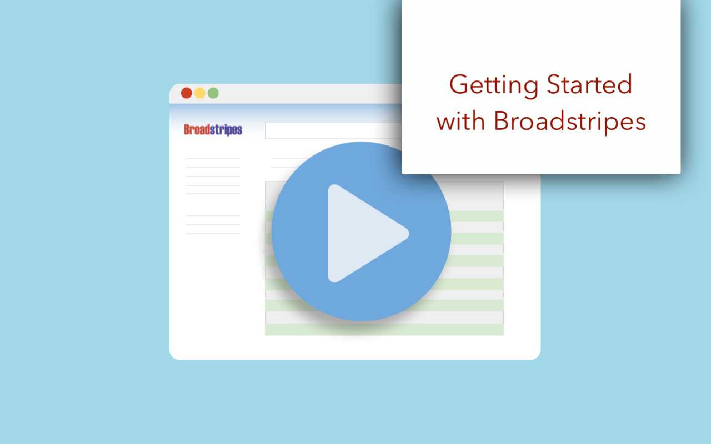
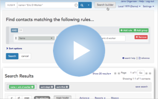
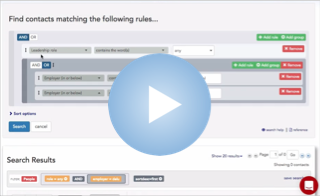
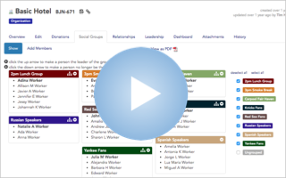
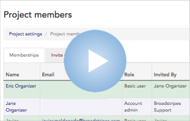
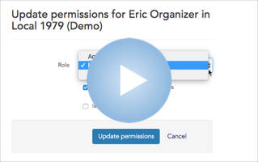

\[et\_pb\_section fb\_built="1" fullwidth="on" \_builder\_version="3.27.4" background\_image="https://help.broadstripes.com/wp-content/uploads/2018/02/isometropolis.jpg" background\_size="initial" background\_position="bottom\_right" background\_repeat="repeat" custom\_margin\_last\_edited="on|phone" custom\_padding="0px|0px|0px|0px" fb\_built="1" \_i="0" \_address="0"\]\[et\_pb\_fullwidth\_header title="Videos and Tutorials" button\_one\_url="https://help.broadstripes.com/admin-tools/" background\_overlay\_color="rgba(22,92,173,0)" admin\_label="Videos and tutorials header" \_builder\_version="3.27.4" title\_font="Lato|900|||||||" title\_font\_size="60px" content\_font="Nunito Sans|300|||||||" content\_font\_size="24px" background\_color="rgba(255, 255, 255, 0)" use\_background\_color\_gradient="on" background\_color\_gradient\_start="#e0ac00" background\_color\_gradient\_end="rgba(224,172,0,0.57)" background\_color\_gradient\_direction="52deg" background\_color\_gradient\_start\_position="52%" custom\_button\_one="on" button\_one\_text\_size="12px" button\_one\_text\_color="#00386d" button\_one\_icon="%%28%%" custom\_padding="|||159px||" custom\_padding\_tablet="|||40px|false|false" custom\_padding\_phone="|||10px" custom\_padding\_last\_edited="on|phone" saved\_tabs="all" button\_one\_text\_size\_\_hover\_enabled="off" button\_one\_text\_size\_\_hover="null" button\_two\_text\_size\_\_hover\_enabled="off" button\_two\_text\_size\_\_hover="null" button\_one\_text\_color\_\_hover\_enabled="off" button\_one\_text\_color\_\_hover="null" button\_two\_text\_color\_\_hover\_enabled="off" button\_two\_text\_color\_\_hover="null" button\_one\_border\_width\_\_hover\_enabled="off" button\_one\_border\_width\_\_hover="null" button\_two\_border\_width\_\_hover\_enabled="off" button\_two\_border\_width\_\_hover="null" button\_one\_border\_color\_\_hover\_enabled="off" button\_one\_border\_color\_\_hover="null" button\_two\_border\_color\_\_hover\_enabled="off" button\_two\_border\_color\_\_hover="null" button\_one\_border\_radius\_\_hover\_enabled="off" button\_one\_border\_radius\_\_hover="null" button\_two\_border\_radius\_\_hover\_enabled="off" button\_two\_border\_radius\_\_hover="null" button\_one\_letter\_spacing\_\_hover\_enabled="off" button\_one\_letter\_spacing\_\_hover="null" button\_two\_letter\_spacing\_\_hover\_enabled="off" button\_two\_letter\_spacing\_\_hover="null" button\_one\_bg\_color\_\_hover\_enabled="off" button\_one\_bg\_color\_\_hover="null" button\_two\_bg\_color\_\_hover\_enabled="off" button\_two\_bg\_color\_\_hover="null" \_i="0" \_address="0.0"\]

Learn Broadstripes skills with this collection of our video tutorials.

\[/et\_pb\_fullwidth\_header\]\[/et\_pb\_section\]\[et\_pb\_section fb\_built="1" custom\_padding\_last\_edited="on|desktop" disabled\_on="on|off|off" \_builder\_version="3.27.4" width="85%" width\_last\_edited="on|desktop" module\_alignment="center" custom\_margin="||||false|false" custom\_margin\_tablet="|0%||0%|false|false" custom\_margin\_last\_edited="on|desktop" custom\_padding="|0px|0px||false|false" fb\_built="1" \_i="1" \_address="1"\]\[et\_pb\_row column\_structure="1\_2,1\_2" use\_custom\_gutter="on" gutter\_width="1" disabled\_on="off|off|off" \_builder\_version="3.27.4" width="74%" width\_phone="99%" width\_last\_edited="on|desktop" max\_width="74%" module\_alignment="center" custom\_margin="|auto|8px|349px|false|false" custom\_margin\_tablet="||14px||false|false" custom\_margin\_last\_edited="on|desktop" custom\_padding="||3px|||" \_i="0" \_address="1.0"\]\[et\_pb\_column type="1\_2" \_builder\_version="3.27.4" \_i="0" \_address="1.0.0"\]\[et\_pb\_text admin\_label="Search header" \_builder\_version="3.27.4" text\_line\_height="1.4em" header\_2\_text\_color="#e09900" header\_2\_font\_size="30px" custom\_margin="||0px|" custom\_padding="||0px|100px||" header\_2\_font\_size\_last\_edited="off|" \_i="0" \_address="1.0.0.0"\]

## **Search for a video**

\[/et\_pb\_text\]\[et\_pb\_text disabled\_on="on|off|off" admin\_label="Desktop Table of Video links - searchable" \_builder\_version="3.27.4" custom\_margin\_phone="|4px|||false|false" custom\_margin\_last\_edited="on|phone" custom\_padding="|||100px||" \_i="1" \_address="1.0.0.1"\]

\[supsystic-tables id=11\]

\[/et\_pb\_text\]\[/et\_pb\_column\]\[et\_pb\_column type="1\_2" \_builder\_version="3.27.4" \_i="1" \_address="1.0.1"\]\[et\_pb\_text admin\_label="Video Spotlight" \_builder\_version="3.27.4" header\_4\_font="Roboto|300||on|||||" header\_4\_text\_align="center" header\_4\_text\_color="#990500" header\_4\_font\_size="15px" header\_4\_letter\_spacing="6px" custom\_margin="-3px||-7px|||" inline\_fonts="Roboto" \_i="0" \_address="1.0.1.0"\]

#### Video Spotlight

\[/et\_pb\_text\]\[et\_pb\_text admin\_label="Get Started Header" \_builder\_version="3.27.4" custom\_padding="0px||0px|||" \_i="1" \_address="1.0.1.1"\]

## New users – Get started!

\[/et\_pb\_text\]\[et\_pb\_text admin\_label="Get Started video" module\_class="wplightbox" \_builder\_version="3.27.4" background\_enable\_color="off" width="284" max\_width="90%" module\_alignment="center" height="178" custom\_padding\_phone="|5px||5px|false|false" custom\_padding\_last\_edited="on|phone" global\_module="22584" saved\_tabs="all" \_i="0" \_address="1.0.1.2"\]

### Getting started – Product tour 

\[/et\_pb\_text\]\[/et\_pb\_column\]\[/et\_pb\_row\]\[/et\_pb\_section\]\[et\_pb\_section fb\_built="1" disabled\_on="off|on|on" \_builder\_version="3.27.4" width="100%" custom\_padding="|47px|0px|47px||" fb\_built="1" \_i="2" \_address="2"\]\[et\_pb\_row use\_custom\_gutter="on" gutter\_width="1" \_builder\_version="3.27.4" width\_phone="99%" width\_last\_edited="on|desktop" max\_width="99%" module\_alignment="center" custom\_margin\_last\_edited="on|phone" custom\_padding="||3px|||" \_i="0" \_address="2.0"\]\[et\_pb\_column type="4\_4" \_builder\_version="3.27.4" \_i="0" \_address="2.0.0"\]\[et\_pb\_text admin\_label="Search header" \_builder\_version="3.27.4" text\_line\_height="1.4em" header\_2\_text\_color="#e09900" header\_2\_font\_size="30px" custom\_margin="||0px|" custom\_padding="||0px|" header\_2\_font\_size\_last\_edited="off|" \_i="0" \_address="2.0.0.0"\]

## **Search for a video**

\[/et\_pb\_text\]\[et\_pb\_text disabled\_on="off|on|on" admin\_label="Table of video links Mobile searchable" \_builder\_version="3.27.4" header\_4\_font="Roboto|300||on|||||" header\_4\_text\_align="center" header\_4\_text\_color="#990500" header\_4\_font\_size="15px" header\_4\_letter\_spacing="6px" custom\_margin="0px|-2px|-7px|||" inline\_fonts="Roboto" \_i="1" \_address="2.0.0.1"\]

\[supsystic-tables id=12\]

\[/et\_pb\_text\]\[/et\_pb\_column\]\[/et\_pb\_row\]\[/et\_pb\_section\]\[et\_pb\_section fb\_built="1" \_builder\_version="3.27.4" custom\_margin="-1px|||||" custom\_padding="2px|17px|0px|||" fb\_built="1" \_i="3" \_address="3"\]\[et\_pb\_row use\_custom\_gutter="on" custom\_padding\_last\_edited="on|desktop" module\_class=" et\_pb\_row\_fullwidth" \_builder\_version="3.27.4" background\_size="initial" background\_position="top\_left" background\_repeat="repeat" width="60%" width\_tablet="80%" width\_last\_edited="on|desktop" max\_width="89%" max\_width\_tablet="80%" max\_width\_last\_edited="on|desktop" module\_alignment="center" custom\_margin="|auto||90px||" custom\_margin\_last\_edited="on|desktop" custom\_padding="10px|0px|0px|0px|false|false" custom\_padding\_tablet="10px|0px|18.5938px|0px" custom\_padding\_phone="14px||||false|false" make\_fullwidth="on" \_i="0" \_address="3.0"\]\[et\_pb\_column type="4\_4" \_builder\_version="3.25" custom\_padding="|||" custom\_padding\_phone="|0px||0px" custom\_padding\_last\_edited="on|desktop" \_i="0" \_address="3.0.0" custom\_padding\_\_hover="|||"\]\[et\_pb\_text admin\_label="Browse header" \_builder\_version="3.27.4" text\_line\_height="1.4em" header\_2\_text\_color="#e09900" header\_2\_font\_size="30px" custom\_margin="||0px|" custom\_padding="0px||0px|||" header\_2\_font\_size\_last\_edited="off|" \_i="0" \_address="3.0.0.0"\]

## **Browse videos**

\[/et\_pb\_text\]\[et\_pb\_toggle title="Complete video catalog" \_builder\_version="3.27.4" width="100%" max\_width="100%" custom\_margin="19px|||10px|false|false" custom\_margin\_phone="37px|||0px|false|false" custom\_margin\_last\_edited="on|phone" \_i="1" \_address="3.0.0.1"\]

#### **Get started**

#### \[catlist name="new users – how to get started" numberposts=100 orderby="menu\_order"\]

#### **How to search**

#### \[catlist name="how to search broadstripes" numberposts=100 orderby="menu\_order"\]

#### **How to use Broadstripes**

#### \[catlist name="how to use broadstripes" numberposts=100 orderby="menu\_order"\]

#### **Admin videos**

#### \[catlist name="admin videos" numberposts=100 orderby="menu\_order"\]

\[/et\_pb\_toggle\]\[/et\_pb\_column\]\[/et\_pb\_row\]\[et\_pb\_row disabled\_on="off|on|on" \_builder\_version="3.27.4" \_i="1" \_address="3.1"\]\[et\_pb\_column type="4\_4" \_builder\_version="3.27.4" \_i="0" \_address="3.1.0"\]\[et\_pb\_text admin\_label="Get Started Header" \_builder\_version="3.27.4" header\_4\_font="Roboto|300||on|||||" header\_4\_text\_align="center" header\_4\_text\_color="#990500" header\_4\_font\_size="15px" header\_4\_letter\_spacing="6px" custom\_margin="40px||-7px|||" inline\_fonts="Roboto" \_i="0" \_address="3.1.0.0"\]

#### Video Spotlight

\[/et\_pb\_text\]\[et\_pb\_text admin\_label="Get Started Header" \_builder\_version="3.27.4" custom\_margin="||-1px|||" custom\_padding="0px|||||" \_i="1" \_address="3.1.0.1"\]

## New users – Get started!

\[/et\_pb\_text\]\[et\_pb\_text admin\_label="Get Started video" module\_class="wplightbox" \_builder\_version="3.27.4" background\_enable\_color="off" width="284" max\_width="90%" module\_alignment="center" height="178" custom\_padding\_phone="|5px||5px|false|false" custom\_padding\_last\_edited="on|phone" global\_module="22584" saved\_tabs="all" \_i="0" \_address="3.1.0.2"\]

### Getting started – Product tour 

\[/et\_pb\_text\]\[/et\_pb\_column\]\[/et\_pb\_row\]\[et\_pb\_row use\_custom\_gutter="on" custom\_padding\_last\_edited="on|phone" module\_class=" et\_pb\_row\_fullwidth" \_builder\_version="3.27.4" background\_size="initial" background\_position="top\_left" background\_repeat="repeat" width="60%" width\_tablet="80%" width\_last\_edited="on|desktop" max\_width="89%" max\_width\_tablet="80%" max\_width\_last\_edited="on|desktop" module\_alignment="center" custom\_margin="|auto||90px||" custom\_margin\_last\_edited="on|desktop" custom\_padding="51px|0px|0px|0px||" custom\_padding\_tablet="10px|0px|18.5938px|0px" \_i="2" \_address="3.2"\]\[et\_pb\_column type="4\_4" \_builder\_version="3.27.4" \_i="0" \_address="3.2.0"\]\[et\_pb\_text admin\_label="Featured video header" \_builder\_version="3.27.4" text\_line\_height="1.4em" header\_2\_text\_color="#e09900" header\_2\_font\_size="30px" custom\_margin="||0px|" custom\_padding="||0px|" header\_2\_font\_size\_last\_edited="off|" \_i="0" \_address="3.2.0.0"\]

## **Featured videos**

\[/et\_pb\_text\]\[/et\_pb\_column\]\[/et\_pb\_row\]\[/et\_pb\_section\]\[et\_pb\_section fb\_built="1" \_builder\_version="3.27.4" background\_enable\_color="off" use\_background\_color\_gradient="on" background\_color\_gradient\_start="rgba(12,113,195,0.03)" background\_color\_gradient\_end="#ffffff" background\_color\_gradient\_direction="169deg" background\_color\_gradient\_start\_position="18%" border\_color\_all="#0c71c3" custom\_margin="2em|10em|3em|10em|false|false" custom\_margin\_phone="-1em|2em|3em|2em|false|false" custom\_margin\_last\_edited="on|desktop" custom\_padding="|13px||0px||" fb\_built="1" \_i="4" \_address="4"\]\[et\_pb\_row \_builder\_version="3.27.4" background\_enable\_color="off" width\_last\_edited="on|desktop" module\_alignment="center" custom\_padding="0px||0px|||" \_i="0" \_address="4.0"\]\[et\_pb\_column type="4\_4" \_builder\_version="3.27.4" background\_enable\_color="off" \_i="0" \_address="4.0.0"\]\[et\_pb\_text admin\_label="Get Started Header" \_builder\_version="3.27.4" \_i="0" \_address="4.0.0.0"\]

## New users – How to get started

\[/et\_pb\_text\]\[/et\_pb\_column\]\[/et\_pb\_row\]\[et\_pb\_row column\_structure="1\_2,1\_2" \_builder\_version="3.27.4" border\_color\_all="#cecece" border\_width\_bottom="1px" width\_phone="71%" width\_last\_edited="on|desktop" max\_width="71%" module\_alignment="center" custom\_padding="||4px|||" \_i="1" \_address="4.1"\]\[et\_pb\_column type="1\_2" \_builder\_version="3.27.4" background\_enable\_color="off" \_i="0" \_address="4.1.0"\]\[et\_pb\_text admin\_label="Get Started video" module\_class="wplightbox" \_builder\_version="3.27.4" background\_enable\_color="off" width="98%" max\_width="98%" module\_alignment="center" height="178" custom\_padding\_phone="||||false|false" custom\_padding\_last\_edited="on|phone" global\_module="22584" saved\_tabs="all" \_i="0" \_address="4.1.0.0"\]

### Getting started – Product tour

\[/et\_pb\_text\]\[/et\_pb\_column\]\[et\_pb\_column type="1\_2" \_builder\_version="3.27.4" \_i="1" \_address="4.1.1"\]\[/et\_pb\_column\]\[/et\_pb\_row\]\[et\_pb\_row \_builder\_version="3.27.4" width\_last\_edited="on|desktop" module\_alignment="center" custom\_padding="0px||0px|||" \_i="2" \_address="4.2"\]\[et\_pb\_column type="4\_4" \_builder\_version="3.27.4" \_i="0" \_address="4.2.0"\]\[et\_pb\_text admin\_label="Search Broadstripes Header" module\_class="wplightbox" \_builder\_version="3.27.4" custom\_padding="35px|||||" \_i="0" \_address="4.2.0.0"\]

## How to search Broadstripes

\[/et\_pb\_text\]\[/et\_pb\_column\]\[/et\_pb\_row\]\[et\_pb\_row column\_structure="1\_2,1\_2" \_builder\_version="3.27.4" border\_color\_all="#cecece" border\_width\_bottom="1px" width\_last\_edited="on|desktop" module\_alignment="center" custom\_padding="||4px|||" \_i="3" \_address="4.3"\]\[et\_pb\_column type="1\_2" \_builder\_version="3.27.4" \_i="0" \_address="4.3.0"\]\[et\_pb\_text admin\_label="How to Build a Search with the Search Builder" \_builder\_version="3.27.4" custom\_margin="||||false|false" global\_module="22571" saved\_tabs="all" \_i="0" \_address="4.3.0.0"\]

### Build custom searches

\[/et\_pb\_text\]\[/et\_pb\_column\]\[et\_pb\_column type="1\_2" \_builder\_version="3.27.4" \_i="1" \_address="4.3.1"\]\[et\_pb\_text admin\_label="How to Add Rule Groups to Search" \_builder\_version="3.27.4" custom\_margin="||||false|false" link\_option\_url\_new\_window="on" global\_module="22580" saved\_tabs="all" \_i="0" \_address="4.3.1.0"\]

### Search with rule groups

\[/et\_pb\_text\]\[/et\_pb\_column\]\[/et\_pb\_row\]\[et\_pb\_row \_builder\_version="3.27.4" width\_last\_edited="on|desktop" module\_alignment="center" custom\_padding="0px||0px|||" \_i="4" \_address="4.4"\]\[et\_pb\_column type="4\_4" \_builder\_version="3.27.4" \_i="0" \_address="4.4.0"\]\[et\_pb\_text admin\_label="Working with Broadstripes Header" module\_class="wplightbox" \_builder\_version="3.27.4" custom\_padding="35px|||||" \_i="0" \_address="4.4.0.0"\]

## How to use Broadstripes

\[/et\_pb\_text\]\[/et\_pb\_column\]\[/et\_pb\_row\]\[et\_pb\_row column\_structure="1\_2,1\_2" \_builder\_version="3.27.4" border\_color\_all="#cecece" border\_width\_bottom="1px" width\_last\_edited="on|desktop" module\_alignment="center" custom\_padding="||4px|||" \_i="5" \_address="4.5"\]\[et\_pb\_column type="1\_2" \_builder\_version="3.27.4" \_i="0" \_address="4.5.0"\]\[et\_pb\_text admin\_label="Working with relationships" \_builder\_version="3.27.4" custom\_margin="20px||20px||false|false" global\_module="22581" saved\_tabs="all" \_i="0" \_address="4.5.0.0"\]

### Working with relationships

\[/et\_pb\_text\]\[/et\_pb\_column\]\[et\_pb\_column type="1\_2" \_builder\_version="3.27.4" \_i="1" \_address="4.5.1"\]\[et\_pb\_text admin\_label="Working with social groups" \_builder\_version="3.27.4" custom\_margin="20px||20px||false|false" global\_module="22735" saved\_tabs="all" \_i="0" \_address="4.5.1.0"\]

### Working with social groups

\[/et\_pb\_text\]\[/et\_pb\_column\]\[/et\_pb\_row\]\[et\_pb\_row \_builder\_version="3.27.4" width\_last\_edited="on|desktop" module\_alignment="center" custom\_padding="0px||0px|||" \_i="6" \_address="4.6"\]\[et\_pb\_column type="4\_4" \_builder\_version="3.27.4" \_i="0" \_address="4.6.0"\]\[et\_pb\_text admin\_label="Admin video Header" module\_class="wplightbox" \_builder\_version="3.27.4" custom\_padding="35px|||||" \_i="0" \_address="4.6.0.0"\]

## Admin tutorials

\[/et\_pb\_text\]\[/et\_pb\_column\]\[/et\_pb\_row\]\[et\_pb\_row column\_structure="1\_2,1\_2" \_builder\_version="3.27.4" border\_color\_all="#cecece" border\_width\_bottom="1px" width\_last\_edited="on|desktop" module\_alignment="center" custom\_padding="||4px|||" \_i="7" \_address="4.7"\]\[et\_pb\_column type="1\_2" \_builder\_version="3.27.4" \_i="0" \_address="4.7.0"\]\[et\_pb\_text admin\_label="Admin video invite a user" \_builder\_version="3.27.4" custom\_margin="20px||20px||false|false" global\_module="22582" saved\_tabs="all" \_i="0" \_address="4.7.0.0"\]

### Add and invite a new user

\[/et\_pb\_text\]\[/et\_pb\_column\]\[et\_pb\_column type="1\_2" \_builder\_version="3.27.4" \_i="1" \_address="4.7.1"\]\[et\_pb\_text admin\_label="Admin video change a user's role or permissions" \_builder\_version="3.27.4" custom\_margin="20px||20px||false|false" global\_module="22583" saved\_tabs="all" \_i="0" \_address="4.7.1.0"\]

### Change a user's role or permissions

\[/et\_pb\_text\]\[/et\_pb\_column\]\[/et\_pb\_row\]\[/et\_pb\_section\]
