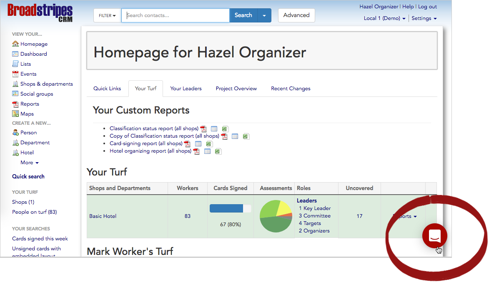

\[et\_pb\_section bb\_built="1" \_builder\_version="3.0.47"\]\[et\_pb\_row \_builder\_version="3.0.47" background\_size="initial" background\_position="top\_left" background\_repeat="repeat"\]\[et\_pb\_column type="1\_4"\]\[et\_pb\_text \_builder\_version="3.0.101" text\_font\_size="12px"\]

\[wpseo\_breadcrumb\]

\[/et\_pb\_text\]\[/et\_pb\_column\]\[et\_pb\_column type="3\_4"\]\[et\_pb\_post\_title meta="off" featured\_image="off" \_builder\_version="3.0.106" /\]\[et\_pb\_text \_builder\_version="3.0.106"\]

Sorry you're having trouble. We're here to help.

Please contact us using our in-app support by clicking the icon in the lower right corner of any page in the Broadstripes Help Center or Broadstripes app. 

Don't see the chat icon? Check your settings to make sure your browser isn't blocking our javascript.

You can also send an email to us at [support@broadstripes.com](mailto:support@broadstripes.com).

\[/et\_pb\_text\]\[et\_pb\_search exclude\_pages="off" exclude\_posts="off" include\_categories="1" placeholder="Search the site for help." \_builder\_version="3.0.101" /\]\[/et\_pb\_column\]\[/et\_pb\_row\]\[/et\_pb\_section\]
