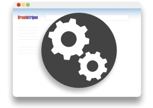

\[et\_pb\_section fb\_built="1" background\_color="rgba(0,99,170,0.65)" \_builder\_version="3.0.106" use\_background\_color\_gradient="on" background\_color\_gradient\_start="#0063aa" background\_color\_gradient\_end="rgba(255,255,255,0.25)" background\_color\_gradient\_direction="61deg" background\_color\_gradient\_start\_position="59%" background\_color\_gradient\_end\_position="89%" background\_color\_gradient\_overlays\_image="on" background\_image="https://help.broadstripes.com/wp-content/uploads/2018/02/isometropolis.jpg" background\_size="contain" background\_position="bottom\_right" background\_repeat="round" custom\_padding="35px|0px|0px|0px" custom\_css\_before=".printfriendly {display: none!important;}" custom\_css\_main\_element=".printfriendly {display: none!important;}"\]\[et\_pb\_row make\_fullwidth="on" custom\_padding="10px|0px|29px|0px" \_builder\_version="3.0.106" module\_alignment="center"\]\[et\_pb\_column type="1\_4" \_builder\_version="3.0.47" parallax="off" parallax\_method="on"\]\[/et\_pb\_column\]\[et\_pb\_column type="1\_2" \_builder\_version="3.0.47" parallax="off" parallax\_method="on"\]\[et\_pb\_text background\_layout="dark" \_builder\_version="3.0.105" text\_font="Nunito Sans|800|||||||" text\_font\_size="33px" text\_text\_color="#ffffff" text\_line\_height="1.6em" header\_font="Nunito Sans|800|||||||" header\_text\_align="center" header\_font\_size="33px" header\_text\_color="rgba(255,255,255,0.5)" header\_line\_height="1.6em" text\_orientation="center" custom\_margin="||10px|"\]

# How can we help?

\[/et\_pb\_text\]\[et\_pb\_search exclude\_pages="off" exclude\_posts="off" placeholder="Search the Knowledge Base" placeholder\_color="rgba(0,0,0,0.46)" \_builder\_version="3.0.100" input\_font="||||||||" input\_font\_size="17px" button\_font="||||||||" button\_font\_size="17px" background\_color="#ffffff" border\_radii="on|10px|10px|10px|10px" custom\_padding="15px||15px|" global\_module="475" saved\_tabs="all"\]\[/et\_pb\_search\]\[/et\_pb\_column\]\[et\_pb\_column type="1\_4" \_builder\_version="3.0.47" parallax="off" parallax\_method="on"\]\[/et\_pb\_column\]\[/et\_pb\_row\]\[/et\_pb\_section\]\[et\_pb\_section fb\_built="1" \_builder\_version="3.0.100" custom\_padding="5px|0px|20px|0px"\]\[et\_pb\_row use\_custom\_width="on" width\_unit="off" custom\_width\_percent="61%" use\_custom\_gutter="on" gutter\_width="1" custom\_padding="9px|0|0px|0" custom\_margin="0px|||" make\_equal="on" padding\_right\_1="0px" padding\_left\_1="0px" padding\_right\_2="0px" padding\_left\_2="0px" \_builder\_version="3.0.106" module\_alignment="center"\]\[et\_pb\_column type="1\_2" \_builder\_version="3.0.47" padding\_left="0px" padding\_right="0px" parallax="off" parallax\_method="on"\]\[et\_pb\_cta title="User Guides" button\_url="https://help.broadstripes.com/help-articles/using-broadstripes/" button\_text="Browse articles" background\_color="#ffffff" background\_layout="light" admin\_label="User Guides CTA" module\_class="trg-cta-card hover-grow" \_builder\_version="3.0.106" header\_font="|600|||||||" header\_font\_size="21px" header\_text\_color="rgba(12,113,195,0.82)" body\_font\_size="15px" body\_line\_height="1.4em" border\_radii="on|4px|4px|4px|4px" border\_width\_all="1px" border\_color\_all="#e8e8e8" max\_width="90%" custom\_margin="|||" custom\_padding="8px|||" custom\_padding\_last\_edited="off|" custom\_button="on" button\_text\_size="16px" button\_text\_color="rgba(11,121,186,0.9)" button\_icon="%%36%%" button\_icon\_color="#7a1111" button\_on\_hover="off" box\_shadow\_style\_button="preset3" box\_shadow\_blur\_button="24px" box\_shadow\_spread\_button="-14px" box\_shadow\_style="preset1" box\_shadow\_vertical="5px" box\_shadow\_blur="22px"\]Find answers – from getting started to mastering search, events, and reporting.

[Browse articles...](https://help.broadstripes.com/help-articles/using-broadstripes/) \[/et\_pb\_cta\]\[/et\_pb\_column\]\[et\_pb\_column type="1\_2" \_builder\_version="3.0.47" padding\_left="0px" padding\_right="0px" parallax="off" parallax\_method="on"\]\[et\_pb\_cta title="Admin Guides" button\_url="https://help.broadstripes.com/help-articles/admin-tools" button\_text="Browse articles" background\_color="#ffffff" background\_layout="light" admin\_label="Admin guides CTA" module\_class="trg-cta-card hover-grow" \_builder\_version="3.0.106" header\_font="|600|||||||" header\_font\_size="21px" header\_text\_color="rgba(12,113,195,0.82)" body\_font\_size="15px" body\_line\_height="1.3em" border\_radii="on|4px|4px|4px|4px" border\_width\_all="1px" border\_color\_all="#e8e8e8" max\_width="90%" custom\_margin="|||" custom\_padding="8px|||" custom\_button="on" button\_text\_size="16px" button\_text\_color="rgba(11,121,186,0.9)" button\_icon="%%36%%" button\_icon\_color="#7a1111" button\_on\_hover="off" box\_shadow\_style\_button="preset3" box\_shadow\_blur\_button="24px" box\_shadow\_spread\_button="-14px" box\_shadow\_style="preset1" box\_shadow\_vertical="5px" box\_shadow\_blur="22px"\]Manage users, import data and customize your Broadstripes project.

[Browse articles ...](https://help.broadstripes.com/help-articles/admin-tools/) \[/et\_pb\_cta\]\[/et\_pb\_column\]\[/et\_pb\_row\]\[et\_pb\_row custom\_padding="17px|0px|0px|0px" background\_color="rgba(0,0,0,0)" \_builder\_version="3.0.105" background\_size="initial" background\_position="top\_left" background\_repeat="repeat"\]\[et\_pb\_column type="1\_4" \_builder\_version="3.0.47" parallax="off" parallax\_method="on"\]\[/et\_pb\_column\]\[et\_pb\_column type="1\_2" \_builder\_version="3.0.47" parallax="off" parallax\_method="on"\]\[et\_pb\_cta button\_url="https://help.broadstripes.com/videos-and-tutorials/" button\_text="Go to videos" background\_color="#ffffff" background\_layout="light" \_builder\_version="3.0.106" header\_level="h4" header\_text\_align="center" header\_font\_size="17" header\_text\_color="#0c71c3" custom\_button="on" button\_text\_size="15" button\_text\_color="rgba(12,113,195,0.67)" button\_icon="%%36%%" button\_icon\_color="#721610" button\_on\_hover="off" button\_bg\_color\_hover="rgba(12,113,195,0.24)" button\_alignment="center" box\_shadow\_style\_button="preset3" box\_shadow\_blur\_button="16px" box\_shadow\_color\_button="rgba(0,0,0,0.2)"\]Check out our video tutorials \[/et\_pb\_cta\]\[/et\_pb\_column\]\[et\_pb\_column type="1\_4" \_builder\_version="3.0.47" parallax="off" parallax\_method="on"\]\[/et\_pb\_column\]\[/et\_pb\_row\]\[et\_pb\_row \_builder\_version="3.0.47" background\_size="initial" background\_position="top\_left" background\_repeat="repeat"\]\[et\_pb\_column type="4\_4" \_builder\_version="3.0.47" parallax="off" parallax\_method="on"\]\[et\_pb\_divider color="rgba(0,0,0,0.57)" show\_divider="on" \_builder\_version="3.0.106"\]\[/et\_pb\_divider\]\[/et\_pb\_column\]\[/et\_pb\_row\]\[et\_pb\_row use\_custom\_width="on" width\_unit="off" custom\_width\_percent="61%" use\_custom\_gutter="on" gutter\_width="1" custom\_padding="9px|0|0px|0" custom\_margin="0px|||" make\_equal="on" padding\_right\_1="0px" padding\_left\_1="0px" padding\_right\_2="0px" padding\_left\_2="0px" \_builder\_version="3.0.106" module\_alignment="center"\]\[et\_pb\_column type="1\_2" \_builder\_version="3.0.47" padding\_left="0px" padding\_right="0px" parallax="off" parallax\_method="on"\]\[et\_pb\_blurb title="User Guides" url="https://help.broadstripes.com/help-articles/using-broadstripes/" image="https://help.broadstripes.com/wp-content/uploads/2018/03/UsingBroadstripes\_CTA.png" image\_max\_width="85%" content\_max\_width="830px" \_builder\_version="3.0.106" header\_level="h2" header\_text\_align="center" header\_text\_color="#0c71c3" body\_text\_align="center" body\_line\_height="1.4em" border\_radii="on|1px|1px|1px|1px" border\_color\_all="rgba(51,51,51,0.69)" text\_orientation="center" module\_alignment="center" custom\_margin="5px|2px|5px|2px" custom\_padding="15px|20px|20px|20px" box\_shadow\_style="preset1" saved\_tabs="all"\]Find answers – from getting started to mastering search, events, and reporting.

[Browse articles ...](https://help.broadstripes.com/help-articles/using-broadstripes/) \[/et\_pb\_blurb\]\[/et\_pb\_column\]\[et\_pb\_column type="1\_2" \_builder\_version="3.0.47" padding\_left="0px" padding\_right="0px" parallax="off" parallax\_method="on"\]\[et\_pb\_blurb title="Admin Guides" url="https://help.broadstripes.com/help-articles/admin-tools/" image="https://help.broadstripes.com/wp-content/uploads/2018/03/BroadstripesAdminTools\_CTA.png" image\_max\_width="84%" content\_max\_width="830px" \_builder\_version="3.0.106" header\_level="h2" header\_text\_align="center" header\_text\_color="#0c71c3" body\_line\_height="1.4em" border\_radii="on|1px|1px|1px|1px" border\_color\_all="rgba(51,51,51,0.69)" text\_orientation="center" module\_alignment="center" custom\_margin="5px|2px|5px|2px" custom\_padding="15px|20px|20px|20px" box\_shadow\_style="preset1" saved\_tabs="all"\]Manage users, import data and customize your Broadstripes project.

[Browse articles ...](https://help.broadstripes.com/help-articles/admin-tools/) \[/et\_pb\_blurb\]\[/et\_pb\_column\]\[/et\_pb\_row\]\[et\_pb\_row custom\_padding="17px|0px|0px|0px" background\_color="rgba(0,0,0,0)" \_builder\_version="3.0.105" background\_size="initial" background\_position="top\_left" background\_repeat="repeat"\]\[et\_pb\_column type="1\_4" \_builder\_version="3.0.47" parallax="off" parallax\_method="on"\]\[/et\_pb\_column\]\[et\_pb\_column type="1\_2" \_builder\_version="3.0.47" parallax="off" parallax\_method="on"\]\[et\_pb\_cta button\_url="https://help.broadstripes.com/videos-and-tutorials/" button\_text="Go" background\_color="#ffffff" background\_layout="light" \_builder\_version="3.0.105" header\_level="h4" header\_text\_align="center" header\_font\_size="17" header\_text\_color="#0c71c3" custom\_button="on" button\_text\_size="15" button\_text\_color="rgba(12,113,195,0.67)" button\_icon="%%36%%" button\_icon\_color="#721610" button\_on\_hover="off" button\_bg\_color\_hover="rgba(12,113,195,0.24)" button\_alignment="center" box\_shadow\_style\_button="preset3" box\_shadow\_blur\_button="16px" box\_shadow\_color\_button="rgba(0,0,0,0.2)"\]Check out our video tutorials \[/et\_pb\_cta\]\[/et\_pb\_column\]\[et\_pb\_column type="1\_4" \_builder\_version="3.0.47" parallax="off" parallax\_method="on"\]\[/et\_pb\_column\]\[/et\_pb\_row\]\[et\_pb\_row \_builder\_version="3.0.47" background\_size="initial" background\_position="top\_left" background\_repeat="repeat"\]\[et\_pb\_column type="4\_4" \_builder\_version="3.0.47" parallax="off" parallax\_method="on"\]\[et\_pb\_divider color="rgba(0,0,0,0.57)" show\_divider="on" \_builder\_version="3.0.106"\]\[/et\_pb\_divider\]\[/et\_pb\_column\]\[/et\_pb\_row\]\[et\_pb\_row use\_custom\_width="on" width\_unit="off" custom\_width\_percent="61%" use\_custom\_gutter="on" gutter\_width="1" custom\_padding="9px|0|0px|0" custom\_margin="0px|||" make\_equal="on" padding\_right\_1="0px" padding\_left\_1="0px" padding\_right\_2="0px" padding\_left\_2="0px" \_builder\_version="3.0.106" module\_alignment="center"\]\[et\_pb\_column type="1\_2" \_builder\_version="3.0.47" padding\_left="0px" padding\_right="0px" parallax="off" parallax\_method="on"\]\[et\_pb\_cta title="User Guides" button\_url="https://help.broadstripes.com/help-articles/using-broadstripes/" button\_text="Browse articles" background\_color="#ffffff" background\_layout="light" admin\_label="User Guides CTA" \_builder\_version="3.0.106" header\_font="|600|||||||" header\_font\_size="21px" header\_text\_color="rgba(12,113,195,0.82)" body\_font\_size="15px" body\_line\_height="1.4em" border\_radii="on|4px|4px|4px|4px" border\_width\_all="1px" border\_color\_all="#e8e8e8" max\_width="90%" custom\_margin="|||" custom\_padding="8px|||" custom\_padding\_last\_edited="off|" custom\_button="on" button\_text\_size="16px" button\_text\_color="rgba(11,121,186,0.9)" button\_icon="%%36%%" button\_icon\_color="#7a1111" button\_on\_hover="off" box\_shadow\_style\_button="preset3" box\_shadow\_blur\_button="24px" box\_shadow\_spread\_button="-14px" box\_shadow\_style="preset1" box\_shadow\_vertical="5px" box\_shadow\_blur="22px"\]Find answers – from getting started to mastering search, events, and reporting. \[/et\_pb\_cta\]\[/et\_pb\_column\]\[et\_pb\_column type="1\_2" \_builder\_version="3.0.47" padding\_left="0px" padding\_right="0px" parallax="off" parallax\_method="on"\]\[et\_pb\_cta title="Admin Guides" button\_url="https://help.broadstripes.com/help-articles/admin-tools" button\_text="Browse articles" background\_color="#ffffff" background\_layout="light" admin\_label="Admin guides CTA" \_builder\_version="3.0.106" header\_font="|600|||||||" header\_font\_size="21px" header\_text\_color="rgba(12,113,195,0.82)" body\_font\_size="15px" body\_line\_height="1.3em" border\_radii="on|4px|4px|4px|4px" border\_width\_all="1px" border\_color\_all="#e8e8e8" max\_width="90%" custom\_margin="|||" custom\_padding="8px|||" custom\_button="on" button\_text\_size="16px" button\_text\_color="rgba(11,121,186,0.9)" button\_icon="%%36%%" button\_icon\_color="#7a1111" button\_on\_hover="off" box\_shadow\_style\_button="preset3" box\_shadow\_blur\_button="24px" box\_shadow\_spread\_button="-14px" box\_shadow\_style="preset1" box\_shadow\_vertical="5px" box\_shadow\_blur="22px"\]Manage users, import data and customize your Broadstripes project. \[/et\_pb\_cta\]\[/et\_pb\_column\]\[/et\_pb\_row\]\[et\_pb\_row custom\_padding="17px|0px|0px|0px" background\_color="rgba(0,0,0,0)" \_builder\_version="3.0.105" background\_size="initial" background\_position="top\_left" background\_repeat="repeat"\]\[et\_pb\_column type="1\_4" \_builder\_version="3.0.47" parallax="off" parallax\_method="on"\]\[/et\_pb\_column\]\[et\_pb\_column type="1\_2" \_builder\_version="3.0.47" parallax="off" parallax\_method="on"\]\[et\_pb\_cta button\_url="https://help.broadstripes.com/videos-and-tutorials/" button\_text="Go" background\_color="#ffffff" background\_layout="light" \_builder\_version="3.0.105" header\_level="h4" header\_text\_align="center" header\_font\_size="17" header\_text\_color="#0c71c3" custom\_button="on" button\_text\_size="15" button\_text\_color="rgba(12,113,195,0.67)" button\_icon="%%36%%" button\_icon\_color="#721610" button\_on\_hover="off" button\_bg\_color\_hover="rgba(12,113,195,0.24)" button\_alignment="center" box\_shadow\_style\_button="preset3" box\_shadow\_blur\_button="16px" box\_shadow\_color\_button="rgba(0,0,0,0.2)"\]Check out our video tutorials \[/et\_pb\_cta\]\[/et\_pb\_column\]\[et\_pb\_column type="1\_4" \_builder\_version="3.0.47" parallax="off" parallax\_method="on"\]\[/et\_pb\_column\]\[/et\_pb\_row\]\[/et\_pb\_section\]
