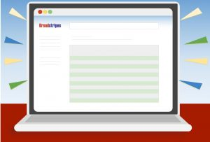
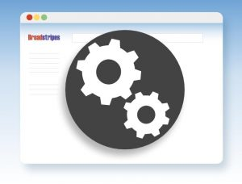

\[et\_pb\_section bb\_built="1" background\_color="rgba(0,99,170,0.65)" \_builder\_version="3.0.100" use\_background\_color\_gradient="on" background\_color\_gradient\_start="#0063aa" background\_color\_gradient\_end="rgba(255,255,255,0.25)" background\_color\_gradient\_direction="61deg" background\_color\_gradient\_start\_position="59%" background\_color\_gradient\_end\_position="89%" background\_color\_gradient\_overlays\_image="on" background\_image="https://help.broadstripes.com/wp-content/uploads/2018/02/isometropolis.jpg" background\_size="contain" background\_position="bottom\_right" background\_repeat="round" custom\_padding="35px|0px|24px|0px"\]\[et\_pb\_row make\_fullwidth="on" custom\_padding="10px|0px|29px|0px" \_builder\_version="3.0.98"\]\[et\_pb\_column type="1\_4"\]\[/et\_pb\_column\]\[et\_pb\_column type="1\_2"\]\[et\_pb\_text background\_layout="dark" \_builder\_version="3.0.99" text\_font="Nunito Sans|800|||||||" text\_font\_size="33px" text\_text\_color="#ffffff" text\_line\_height="1.6em" header\_font="Muli|900|||||||" header\_text\_color="rgba(255,255,255,0.5)" text\_orientation="center" custom\_margin="||10px|"\]

How can we help?

\[/et\_pb\_text\]\[et\_pb\_search exclude\_pages="off" exclude\_posts="off" placeholder="Search the Knowledge Base" placeholder\_color="rgba(0,0,0,0.46)" \_builder\_version="3.0.100" input\_font="||||||||" input\_font\_size="17px" button\_font="||||||||" button\_font\_size="17px" background\_color="#ffffff" border\_radii="on|10px|10px|10px|10px" custom\_padding="15px||15px|" global\_module="475" saved\_tabs="all" /\]\[/et\_pb\_column\]\[et\_pb\_column type="1\_4"\]\[/et\_pb\_column\]\[/et\_pb\_row\]\[/et\_pb\_section\]\[et\_pb\_section bb\_built="1" \_builder\_version="3.0.100"\]\[et\_pb\_row \_builder\_version="3.0.100"\]\[et\_pb\_column type="1\_2"\]\[et\_pb\_cta admin\_label="Using Broadstripes CTA" title="Using Broadstripes" button\_text="Get started" background\_color="#ffffff" background\_layout="light" \_builder\_version="3.0.100" header\_font="|600|||||||" body\_font\_size="13px" border\_radii="on|4px|4px|4px|4px" border\_width\_all="1px" border\_color\_all="#e8e8e8" max\_width="90%" custom\_margin="|||" custom\_button="on" button\_text\_size="16px" button\_text\_color="rgba(11,121,186,0.9)" button\_icon="%%36%%" button\_icon\_color="#7a1111" button\_on\_hover="off" box\_shadow\_style\_button="preset3" box\_shadow\_blur\_button="24px" box\_shadow\_spread\_button="-14px" box\_shadow\_style="preset1" box\_shadow\_vertical="5px" box\_shadow\_blur="22px" button\_url="https://help.broadstripes.com/help-guides/" url\_new\_window="off" use\_background\_color="on" button\_icon\_placement="right" header\_text\_color="rgba(12,113,195,0.82)" body\_line\_height="1.4em"\]

 Find answers – from getting started to mastering search, events, and reporting.

\[/et\_pb\_cta\]\[/et\_pb\_column\]\[et\_pb\_column type="1\_2"\]\[et\_pb\_cta admin\_label="Admin Tools CTA" title="Admin Tools" button\_text="Go to Admin Guide" background\_color="#ffffff" background\_layout="light" \_builder\_version="3.0.100" header\_font="|600|||||||" body\_font\_size="13px" border\_radii="on|4px|4px|4px|4px" border\_width\_all="1px" border\_color\_all="#e8e8e8" max\_width="90%" custom\_margin="|||" custom\_button="on" button\_text\_size="16px" button\_text\_color="rgba(11,121,186,0.9)" button\_icon="%%36%%" button\_icon\_color="#7a1111" button\_on\_hover="off" box\_shadow\_style\_button="preset3" box\_shadow\_blur\_button="24px" box\_shadow\_spread\_button="-14px" box\_shadow\_style="preset1" box\_shadow\_vertical="5px" box\_shadow\_blur="22px" button\_url="https://help.broadstripes.com/admin-tools/" url\_new\_window="off" use\_background\_color="on" button\_icon\_placement="right" header\_text\_color="rgba(12,113,195,0.82)" body\_line\_height="1.4em"\]

 Find answers – from getting started to mastering search, events, and reporting.

\[/et\_pb\_cta\]\[/et\_pb\_column\]\[/et\_pb\_row\]\[/et\_pb\_section\]\[et\_pb\_section bb\_built="1" \_builder\_version="3.0.47"\]\[et\_pb\_row \_builder\_version="3.0.100" background\_size="initial" background\_position="top\_left" background\_repeat="repeat" use\_custom\_width="on" custom\_width\_px="643px" custom\_padding="24.6562px|0px|24.6562px|0px"\]\[et\_pb\_column type="1\_2"\]\[et\_pb\_blurb title="Using Broadstripes" url="https://help.broadstripes.com/using-broadstripes/" use\_icon="on" font\_icon="%%369%%" icon\_color="rgba(12,113,195,0.45)" use\_icon\_font\_size="on" icon\_font\_size="81px" \_builder\_version="3.0.100" header\_level="h2" header\_font="Muli|300|||||||" header\_text\_align="center" header\_text\_color="rgba(124,10,2,0.6)" body\_font="|600|||||||" body\_font\_size="13" body\_text\_color="rgba(0,0,0,0.45)" body\_line\_height="1.3em" border\_radii="on|4px|4px|4px|4px" border\_color\_all="rgba(0,0,0,0.07)" module\_alignment="center" custom\_margin="|||" custom\_padding="20px|20px|20px|20px" animation\_style="slide" animation="bottom" box\_shadow\_style="preset3" box\_shadow\_vertical="4px" box\_shadow\_blur="20px" box\_shadow\_spread="-5px" global\_module="938" saved\_tabs="all" url\_new\_window="off" use\_circle="off" icon\_placement="top" background\_layout="light" use\_circle\_border="off"\]

Find answers – from getting started to mastering search, events, and reporting.

\[/et\_pb\_blurb\]\[/et\_pb\_column\]\[et\_pb\_column type="1\_2"\]\[et\_pb\_blurb admin\_label="Admin Tools Blurb" title="Admin Tools" use\_icon="on" font\_icon="%%176%%" icon\_color="rgba(12,113,195,0.45)" use\_icon\_font\_size="on" icon\_font\_size="81px" \_builder\_version="3.0.100" header\_level="h2" header\_font="Muli|300|||||||" header\_text\_align="center" header\_text\_color="rgba(124,10,2,0.6)" body\_font="|600|||||||" body\_font\_size="13" body\_text\_color="rgba(0,0,0,0.45)" body\_line\_height="1.3em" border\_radii="on|4px|4px|4px|4px" border\_color\_all="rgba(0,0,0,0.21)" text\_orientation="center" module\_alignment="center" custom\_margin="|||" custom\_padding="20px|20px|20px|20px" animation\_style="slide" animation="bottom" box\_shadow\_style="preset3" box\_shadow\_vertical="4px" box\_shadow\_blur="20px" box\_shadow\_spread="-5px" url="https://help.broadstripes.com/admin-tools/" url\_new\_window="off" use\_circle="off" use\_circle\_border="off" icon\_placement="top" background\_layout="light"\]

[Manage users, import and customize your project.](https://help.broadstripes.com/admin-tools/)

\[/et\_pb\_blurb\]\[/et\_pb\_column\]\[/et\_pb\_row\]\[/et\_pb\_section\]\[et\_pb\_section bb\_built="1" \_builder\_version="3.0.100" custom\_padding="45px|0px|33px|0px"\]\[et\_pb\_row use\_custom\_width="on" width\_unit="off" custom\_width\_percent="100%" use\_custom\_gutter="on" gutter\_width="2" custom\_padding="4px|30px|30px|31px" custom\_margin="|||" \_builder\_version="3.0.100" background\_size="initial" background\_position="top\_left" background\_repeat="repeat"\]\[et\_pb\_column type="1\_4"\]\[/et\_pb\_column\]\[et\_pb\_column type="1\_4"\]\[/et\_pb\_column\]\[et\_pb\_column type="1\_4"\]\[/et\_pb\_column\]\[et\_pb\_column type="1\_4"\]\[/et\_pb\_column\]\[/et\_pb\_row\]\[et\_pb\_row \_builder\_version="3.0.47" background\_size="initial" background\_position="top\_left" background\_repeat="repeat"\]\[et\_pb\_column type="1\_4"\]\[/et\_pb\_column\]\[et\_pb\_column type="1\_4"\]\[/et\_pb\_column\]\[et\_pb\_column type="1\_4"\]\[et\_pb\_cta title="Title" button\_text="Button text" \_builder\_version="3.0.100"\]

Content text

\[/et\_pb\_cta\]\[/et\_pb\_column\]\[et\_pb\_column type="1\_4"\]\[/et\_pb\_column\]\[/et\_pb\_row\]\[et\_pb\_row \_builder\_version="3.0.47" background\_size="initial" background\_position="top\_left" background\_repeat="repeat"\]\[et\_pb\_column type="4\_4"\]\[et\_pb\_cta title="Tools" url\_new\_window="on" button\_text="Click here" background\_color="#ffffff" background\_layout="light" \_builder\_version="3.0.100" border\_radii="on|4px|4px|4px|4px" border\_width\_all="1px" custom\_padding="15px|15px|15px|15px" button\_icon="%%54%%" button\_on\_hover="off" animation\_style="fade" box\_shadow\_style="preset3"\]

This is the content

\[/et\_pb\_cta\]\[/et\_pb\_column\]\[/et\_pb\_row\]\[/et\_pb\_section\]
