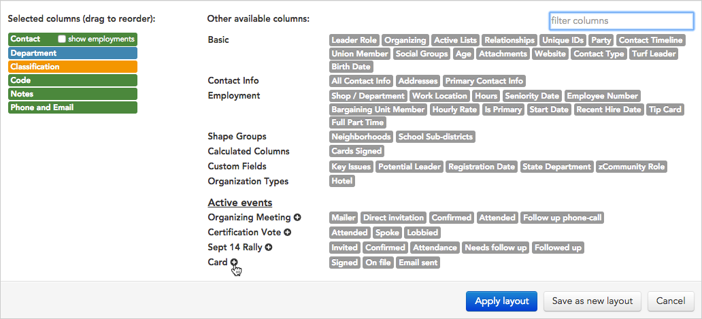

\[et\_pb\_section fb\_built="1" admin\_label="section" \_builder\_version="3.22.3"\]\[et\_pb\_row admin\_label="row" \_builder\_version="3.22.3" background\_size="initial" background\_position="top\_left" background\_repeat="repeat"\]\[et\_pb\_column type="4\_4" \_builder\_version="3.0.47"\]\[et\_pb\_text \_builder\_version="3.22.4" background\_size="initial" background\_position="top\_left" background\_repeat="repeat"\]

## Overview

Broadstripes' **layouts** let you customize the contents of the search results panel. Using the layout builder tool, you can choose just the columns of data you want to see, and leave out anything that might get in the way.

This article will step you through the simple task of **adding a new column to an existing layout**. (You can use the same process to add multiple columns if you want.)

Trying to **create a whole new layout** from scratch? You can read all about how to do that in the [create and save a layout](https://help.broadstripes.com/help-articles/using-broadstripes/customize/save-a-layout/) article.

## Add a column to an existing layout

1. Start on the **search results panel**. (Learn about running a search in the [Search by name](https://help.broadstripes.com/help-articles/using-broadstripes/search/search-by-name/) article.)
2. In the upper-right area above your search results, click the drop-down menu next to the word **Layout** as shown below. Our drop-down menu is labeled "**Card signing**" but yours may look slightly different depending on the name of your layout.

1. From the **Layout drop-down menu,** choose to either:
    - **Modify layout...** if you want to change the current layout.
    - **Save layout as...** if you want to make changes to a _copy_ of the current layout (leaving the current layout untouched).
2. For our example, we'll choose to **modify the layout**.
3. The **layout builder** will open.

### Add a column

1. Using the layout builder, **find the column you want to add** to your layout on the right side of the builder. **Click once** **to include the column** in your layout. The selected column will turn from gray to a bright color and will be added to the left side of the layout builder.\[caption id="" align="alignnone" width="1032"\] Single-click any gray column name on the right to add it to your search results layout.\[/caption\]
2. Note that if you are adding a column from the "**Active events**" section, Clicking the  **plus sign** next to the event name will add all of the event steps at once (or you can single-click on each step name to add them one at a time).\[caption id="" align="alignnone" width="892"\] If your project has active events, they will be shown at the bottom of the layout builder.\[/caption\]
3. Once you've added the new column to your layout, you can adjust its position.
    - **Drag and drop a column** to change its position in the search results matrix
    - The column name at the **top** of the layout builder will be the first column on the **left** when your search results are displayed, while column name at the **bottom** will display as the furthest to the **right**.

### Delete a column

You can **delete unwanted columns** by hovering over the column name and then clicking the  minus sign icon that appears.

\[caption id="" align="alignnone" width="240"\] Delete a column by clicking the minus sign next the the column's name.\[/caption\]

### Save your changes

Once your layout is modified, you can either choose **apply** the new layout just once, or **save and run it**.

- Click **Apply without saving** to simply apply the layout once to your current search results. This will re-display the results with the new column, but won't permanently save any of the changes you've made to the layout.
- Click **Save changes** to overwrite the saved layout with the modifications you've just made. You'll see the changes each time you choose this layout.

\[/et\_pb\_text\]\[/et\_pb\_column\]\[/et\_pb\_row\]\[/et\_pb\_section\]
