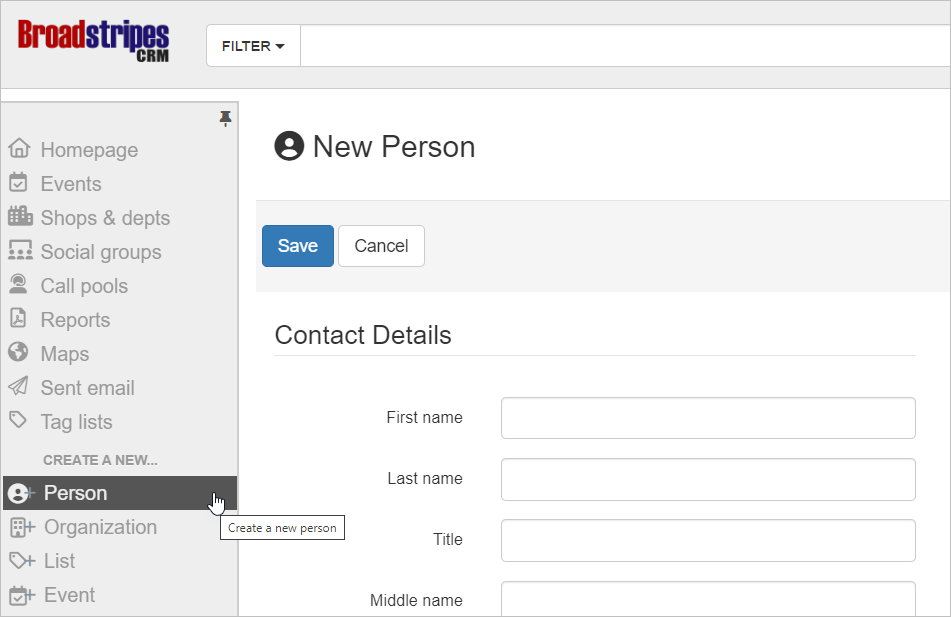

\[et\_pb\_section fb\_built="1" admin\_label="section" \_builder\_version="4.16" global\_colors\_info="{}"\]\[et\_pb\_row admin\_label="row" \_builder\_version="4.16" background\_size="initial" background\_position="top\_left" background\_repeat="repeat" global\_colors\_info="{}"\]\[et\_pb\_column type="4\_4" \_builder\_version="4.16" custom\_padding="|||" global\_colors\_info="{}" custom\_padding\_\_hover="|||"\]\[et\_pb\_text \_builder\_version="4.19.4" background\_size="initial" background\_position="top\_left" background\_repeat="repeat" global\_colors\_info="{}"\]

If you are entering a _new_ person or _new_ organization in Broadstripes, click **Person** or **Organization** from the CREATE A NEW section of the toolbar on the left-hand side of your window as shown below.

Create a new record for a person or org by using the links in the toolbar.

\[/et\_pb\_text\]\[/et\_pb\_column\]\[/et\_pb\_row\]\[/et\_pb\_section\]
