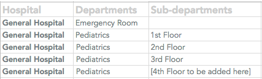
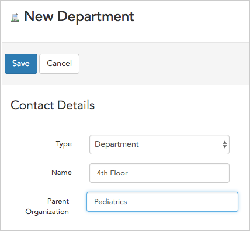

\[et\_pb\_section fb\_built="1" admin\_label="section" \_builder\_version="3.0.47"\]\[et\_pb\_row admin\_label="row" \_builder\_version="3.0.105" background\_size="initial" background\_position="top\_left" background\_repeat="repeat"\]\[et\_pb\_column type="4\_4" \_builder\_version="3.0.47" parallax="off" parallax\_method="on"\]\[et\_pb\_text \_builder\_version="3.19.12" background\_size="initial" background\_position="top\_left" background\_repeat="repeat"\]

Shops, departments, or sub-departments, broadly termed "organizations" by Broadstripes, are usually created in one of two ways:

- **during data import** using a worker spreadsheet with employment information
- **manually** (either before or after importing data) using the **CREATE A NEW ...** link in the Broadstripes toolbar

This article will look at creating new organizations manually using the **CREATE A NEW ...** link after data has been imported, as in the case where a shop is adding a new department or sub-department.

To learn about creating organizations _during_ import, see the [data import](https://help.broadstripes.com/help-articles/admin-tools/data-import-admin/data-import-oveview/) articles of the knowledge base.

## Create an organization manually

In this example, we'll be adding a new sub-department called "**4th Floor**" to the **Pediatrics**department in our hospital structure.

**Note** that since how you build and label the tiers of your shop or department hierarchy is all customizable (ours is set up for a hospital with departments and sub-departments), your choices may look different than ours.

1. To start, click the appropriate organization link under the “CREATE A NEW …” header in the left-hand navigation panel.

1. **Add** the new organization and specify a **Parent Organization**. Here's a simple look at our shop structure:\[caption id="attachment\_21775" align="aligncenter" width="427"\] In our hierarchy, **"4th Floor"** is a sub-department of Pediatrics.\[/caption\]

This means that when adding "**4th Floor**", we need to specify "**Pediatrics**" as the “**Parent Organization**,” so that the 4th Floor sub-department is placed _under_ Pediatrics (and not placed on the same tier as Pediatrics and Emergency Room).

\[caption id="" align="aligncenter" width="428"\] Give the department a name and specify its Parent Organization.\[/caption\]

1. **Add additional information** about the organization. Use the lower portion of the **New Department form** to record any other notes or information you want to track about the organization you are adding.
2. Click **Save** to add the new organization to your project.
3. **Add workers** using a bulk action. Since you've manually added this new sub-department after importing your worker lists, you'll need to assign workers to that employment using a **bulk action**. You can learn more about this in the [Bulk actions](https://help.broadstripes.com/help-articles/using-broadstripes/working-with-search-results/bulk-actions/) section of the knowledge base.

\[/et\_pb\_text\]\[/et\_pb\_column\]\[/et\_pb\_row\]\[/et\_pb\_section\]
