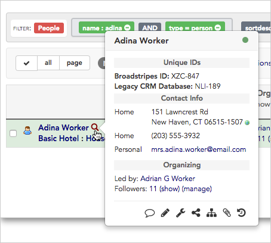
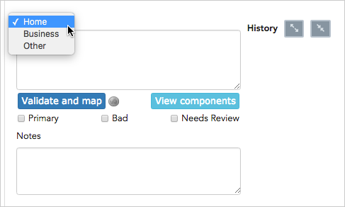
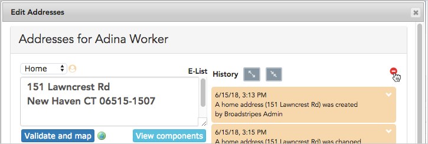
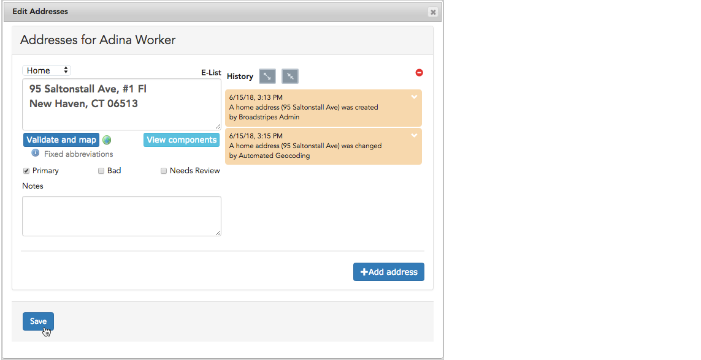

\[et\_pb\_section fb\_built="1" admin\_label="section" \_builder\_version="3.22" fb\_built="1" \_i="0" \_address="0"\]\[et\_pb\_row admin\_label="row" \_builder\_version="3.25" background\_size="initial" background\_position="top\_left" background\_repeat="repeat" \_i="0" \_address="0.0"\]\[et\_pb\_column type="4\_4" \_builder\_version="3.25" custom\_padding="|||" \_i="0" \_address="0.0.0" custom\_padding\_\_hover="|||"\]\[et\_pb\_text admin\_label="Text" \_builder\_version="3.27.4" background\_size="initial" background\_position="top\_left" background\_repeat="repeat" hover\_enabled="0" \_i="0" \_address="0.0.0.0"\]Broadstripes allows you to record any number of addresses for each person in your project. You can save a home, business, or other address, and also keep track of addresses you want to flag as unusable or "bad." Broadstripes even tracks the changes you or others have made to each address record, so you have a full history of what's been imported or manually updated over time.

This article will take you through the steps of how to **add, update,** or **delete an address** for a person or organization.

You can check out the [**Components of the Address Form article**](https://help.broadstripes.com/help-articles/using-broadstripes/working-with-contact-records/components-of-the-address-form/) if you'd like to get a more in-depth look at all aspects of Broadstripes addresses, including:

- how to understand each section of the **address form**
- recording and displaying **primary** and **secondary addresses**
- **geocoding** and **mapping** addresses
- tagging **bad addresses**
- how the **address change history panel** works

## Add a new address

1. For this example, we'll be adding an address to the record of an **existing person** in our project. (If you want to [add a new person](https://help.broadstripes.com/help-articles/using-broadstripes/working-with-contact-records/add-a-new-person/), or [add a new organization](https://help.broadstripes.com/help-articles/using-broadstripes/working-with-contact-records/add-a-shop-or-department/), that's fine. Once they are set up, the process of adding an address will be the same.)
2. Start by **running a search** to filter for just the contact whose address you want to work with. (Learn more about creating custom searches in the [Create and save a search](https://help.broadstripes.com/help-articles/using-broadstripes/customize/create-and-save-a-search/) article).
3. From the search results panel, **hover over** the worker's name and click the  **looking glass icon.** You'll see a pop-up window with some useful details, including their primary address information.
4. **Click** anywhere in the **address area** in the **Contact Info** section of the pop-up window to open the address form**.**
5. The **address form** will open in its own window.****
6. Click the **+Add address** button to create an additional address record for this person. (If you want to edit the existing record instead, jump to the **Edit an Address section**).
7. In the new address section that appears, use the **address type dropdown list** choose **Home**, **Business**, or **Other**. 
8. Check "**Primary"** if you want to Broadstripes to use this address as the main address for this person (for instance on maps, search result layouts, and exported spreadsheets). Any address previously checked "**Primary**" will be automatically unchecked. Leave "**Primary**" unchecked if the new address is a secondary address for this person.
9. **Type** the new address into the empty address pane.
10. You can add an optional **No****te** below the address to help other organizers (e.g. "Doorbell doesn't work; try knocking").
11. When your address is complete, click the **Validate and map** button. Clicking **Validate and map** signals Broadstripes to do two important tasks:
    - **Validate** the address against a database of current US Postal Service (USPS) addresses to verify it as a deliverable address.
    - "**Geocode**" the address, essentially locating its GPS coordinates so that Broadstripes can generate highly accurate maps and driving directions.
12. Next, review Broadstripes' system-generated comments below the address pane to confirm that the validation and mapping process was a success. Here's how to interpret some common comments:
    - **Address has been mapped:** This address is valid and needs no further attention
    - **The address could not be verified as entered and may not be deliverable by the post office:** This address may contain a typo or be outdated; you may want to manually flag it by checking the "**Needs review**" checkbox to remember to correct it later. Depending on your organization's data entry policies, you may also want to flag it by checking the "**Bad**" checkbox which will cause the address to be displayed with strikethrough, and prevent it from being displayed on a map or exported to spreadsheet from the search results.
    - Other warnings, such as "**The street was found, but not the number**" are also indications that the address you've entered is inaccurate. Follow your organization's rule of thumb to mark these correctly.
13.  When you are satisfied with your work, click **Save** at the bottom of the address form**.**

## Edit an existing address

#### Manual edits override some import features

Note that manual edits to an existing address will trigger a special feature in Broadstripes. When a manual address change is made, the **Manual lock icon**   will appear next to the address type dropdown list, and the **address becomes locked against further changes by an import.**

1. To edit an address, start by running a search to filter for just the contact whose address you're working with (Learn more about creating custom searches in the [Create and save a search](https://help.broadstripes.com/help-articles/using-broadstripes/customize/create-and-save-a-search/) article).
2. From the search results panel, **hover over** the worker's name and click the   **looking glass icon.** You'll see a pop-up window with some useful details, including their primary address information.
3. **Click** anywhere in the **address area** in the **Contact Info** section of the pop-up window to open the address form for editing**.**
4. The **address form** will open in its own window.****
5. **Place your cursor** in the **address pane** of the address you want to edit and **type** any changes. You can also check or uncheck "Primary" or add a note to the address.
6. When your edits are complete, click the **Validate and map** button to locate the updated address in a database of current US Postal Service and verify its GPS coordinates for display on maps and driving directions.
7. Next, review Broadstripes' system-generated comments below the address pane to confirm that the validation and mapping process was a success. Here's how to interpret some common comments:
    - **Address has been mapped:** This address is valid and needs to further attention
    - **The address could not be verified as entered and may not be deliverable by the post office:** This address may contain a typo or be outdated; you should manually flag it by checking the "**Needs review**" checkbox to remember to correct it later. Depending on your organization's data entry policies, you may also want to flag it by checking the "**Bad**" checkbox which will cause the address to be displayed with strikethrough, and prevent it from being displayed on a map or exported to spreadsheet from the search results.
    - Other warnings, such as "**The street was found, but not the number**" are also indications that the address you've entered is inaccurate. Follow your organization's rule of thumb to mark these correctly.
8.  When you are satisfied with your address updates, click **Save** at the bottom of the address form.

## Delete an existing address

If you have an address that you want to **completely eliminate** from a person's record rather than edit or mark as bad, you can choose to delete it. History of the deletion will not be shown in the address history pane. (If you have questions or want more information on working with addresses and specifics about how Broadstripes handles address data and tracks change history, check out the **Components of the Address Form** article.)

1. To delete an address, start by **running a search** to filter for just the contact whose address you want to delete (Learn more about creating custom searches in the [Create and save a search](https://help.broadstripes.com/help-articles/using-broadstripes/customize/create-and-save-a-search/) article).
2. From the search results panel, **hover over** the worker's name and click the   **looking glass icon.** You'll see a pop-up window with some useful details, including their primary address information.
3. **Click** anywhere in the **address area** in the **Contact Info** section of the pop-up window to open the address form**.**
4. The **address form** will open in its own window.****
5. **Click** the red **Delete** button in the upper right corner above the specific address you want to delete. You will be asked to **confirm** the deletion.
6. If you want to delete **multiple addresses** for a single person, you'll need to **repeat** this process for each address.
7. When you are satisfied with your deletions, click **Save** at the very bottom of the address form**.**

 \[/et\_pb\_text\]\[/et\_pb\_column\]\[/et\_pb\_row\]\[/et\_pb\_section\]
