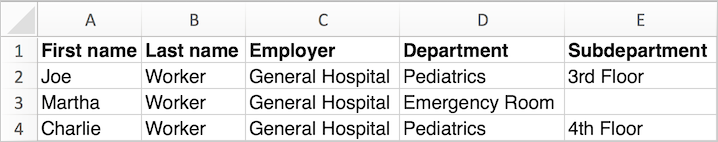

\[et\_pb\_section fb\_built="1" admin\_label="section" \_builder\_version="3.0.47"\]\[et\_pb\_row admin\_label="row" \_builder\_version="3.0.105" background\_size="initial" background\_position="top\_left" background\_repeat="repeat"\]\[et\_pb\_column type="4\_4" \_builder\_version="3.0.47" parallax="off" parallax\_method="on"\]\[et\_pb\_text \_builder\_version="3.0.106" background\_size="initial" background\_position="top\_left" background\_repeat="repeat"\]

Organizations are usually created in one of two ways:

- **during data import** using a worker spreadsheet with employment information
- **manually** using the **Create a new organization** link

## Create an organization through data import

When Broadstripes creates organizations through data import, it uses the employer, department, and subdepartment information supplied for the workers in your import spreadsheet list. Commonly, the import spreadsheet will be set up with a row for each different worker, and a column for each of the tiers of employment (e.g. employer, department, and subdepartment).

A very simple example might look like this:

Columns C, D, and E allow Broadstripes to create the following shop structure using the five distinct employment locations given:

- **General Hospital**
    - Emergency Room
    - Pediatrics
        - 3rd Floor
        - 4th Floor

While Broadstripes handles much of this process automatically, to help Broadstripes properly interpret your spreadsheet you'll need to follow a few simple steps:

1. Using the data import tool, map the **Employer, Department, and Subdepartment** columns in your import file to the built-in columns in Broadstripes with the same names.
2. In the **Configuration panel** below the import’s column-mapping interface, click the checkbox labeled **Automatically create shops and departments and link employments**.
3. Click the **Preview button** and then click **Schedule import** to run the import.

This will allow Broadstripes to:

- create the three workers shown on the spreadsheet (Joe, Martha, and Charlie)
- create the five organization locations listed (General Hospital, Emergency Room, Pediatrics, 3rd Floor, and 4th Floor)
- place the locations into a tiered structure (with Emergency Room and Pediatrics as departments under General Hospital, and so on)
- and, finally, link the new workers with that new employment structure

If organizations with those names (and the same structure) already exist, Broadstripes will not create duplicates but will link the new workers to the existing organizations.

If organizations with those names and structure do not exist, Broadstripes will create them and the structural relationships among them, and then link the new workers to them via employments.

## Create an organization manually

If you want to create your organization structure before importing the records of any people, you can do so “manually” by clicking the **Organization** link under the “CREATE A NEW …” header in the left-hand navigation panel. You can also create a new organization after records are imported – useful in the case of a shop adding a new department or subdepartment.

If creating the organizing structure manually, you need to create the same five organizations (General Hospital, Emergency Room, Pediatrics, 3rd Floor, and 4th Floor), but when creating the two departments (Pediatrics and Emergency) and the two subdepartments (3rd Floor and 4th Floor), you need to specify the appropriate “Parent Organization.” The parent organization relationships allow you to define the structure expressed in the employer, department, and subdepartment columns above.

When your employment structure is complete, you can import your workers with their **Employer, Department, and Subdepartment** specified in separate columns of your import spreadsheet, as shown above.

During the import process, deselect the checkbox labeled **Automatically create shops and departments and link employments** – your employments are already set up, so this step is not needed.

If you need to manually add a new organization after you've imported your worker lists (for instance if a new department has been created), you can assign workers to that employment using a bulk action. You can learn more about this in the [Bulk actions](https://help.broadstripes.com/v2018/docs/bulk-actions) section of the knowledge base.

\[/et\_pb\_text\]\[/et\_pb\_column\]\[/et\_pb\_row\]\[/et\_pb\_section\]
