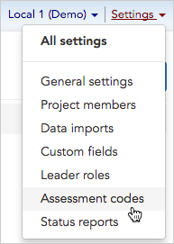
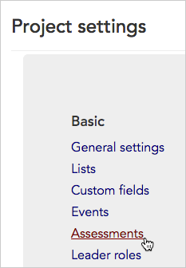
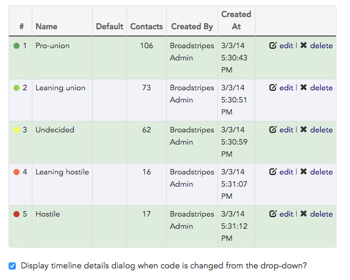
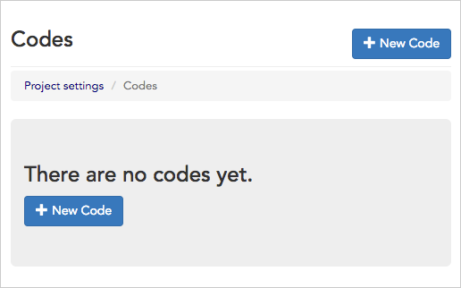

\[et\_pb\_section bb\_built="1" admin\_label="section"\]\[et\_pb\_row admin\_label="row" background\_position="top\_left" background\_repeat="repeat" background\_size="initial" \_builder\_version="3.0.105"\]\[et\_pb\_column type="4\_4"\]\[et\_pb\_text background\_position="top\_left" background\_repeat="repeat" background\_size="initial" \_builder\_version="3.0.106" background\_layout="light"\]

#### What's the difference between "Assessments" and "Codes"?

To give a short answer – well, nothing! "Assessment" and "Code" refer to the exact same piece of employment information in Broadstripes; it's just a matter of how it is labeled. In fact, you may use the label "Assessment" in one Broadstripes project and "Code" in another.

You can change this label at any time in your [General settings](https://help.broadstripes.com/help-articles/admin-tools/running-a-project-admin/project-settings-overview/).

Assessments help your users track where the workers stand in relation to your campaign's goals. Broadstripes makes it easy to set up a customized set of **assessment codes** to match your campaign's style.

Commonly, administrators will set up assessments using a 1 through 5 numeric scale, with 1 indicating the strongest support and 5 indicating hostility. However, with Broadstripes, you can create as many codes as you require to meet your needs.

1. To get started, you can access **Assessment codes** in one of two ways: Click **Settings** > **Assessment codes** in the upper right corner of any page.

Or, from the **Project settings page**, click the **Basic > Assessments** link.

1. The **Assessment code index page** will open, displaying all of the codes you have set up to measure workers' support. You can view and manage your project's codes from this page.

If you haven't yet set up any assessments, your index page will open with a button to create a **\+ New Code.**

1. For details on how to edit, delete, or create new assessment codes, go to the [Assessment codes](https://help.broadstripes.com/help-articles/admin-tools/data-tools-admin/assessment-codes/) article.

\[/et\_pb\_text\]\[/et\_pb\_column\]\[/et\_pb\_row\]\[/et\_pb\_section\]
