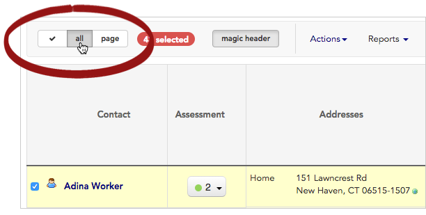
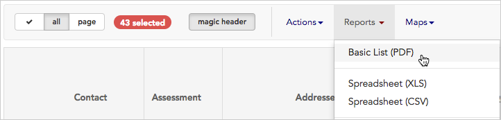
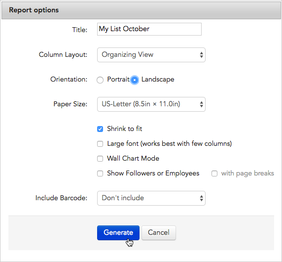
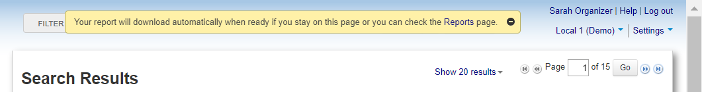
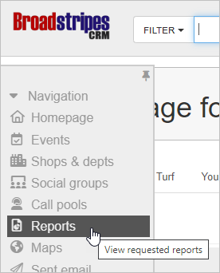

\[et\_pb\_section fb\_built="1" admin\_label="section" \_builder\_version="4.16" global\_colors\_info="{}"\]\[et\_pb\_row admin\_label="row" \_builder\_version="4.16" background\_size="initial" background\_position="top\_left" background\_repeat="repeat" global\_colors\_info="{}"\]\[et\_pb\_column type="4\_4" \_builder\_version="4.16" custom\_padding="|||" global\_colors\_info="{}" custom\_padding\_\_hover="|||"\]\[et\_pb\_text admin\_label="Text" \_builder\_version="4.19.4" background\_size="initial" background\_position="top\_left" background\_repeat="repeat" hover\_enabled="0" global\_colors\_info="{}" sticky\_enabled="0"\]

## Overview

With Broadstripes, it's easy to use the **Reports** feature to print your organizing information as a **list**. Here are a few reasons you might want to print a list:

- you can bring your information with you in hard copy to house visits and check-in meetings
- for quick reference or to record information when you don't have a computer
- as a tool for non-Broadstripes users to view and collect information

There are different types of lists that you can choose from, but we'll focus here on the **Basic List**.

The **Basic List** is just a printed version of your records using whatever layout you choose for your organizing project. For instance, if your layout includes **name**, **home address**, and a checkbox indicating **attendance** at an upcoming event, that is what your printed list will display (learn more about working with layouts in the [Create and save a layout](../../customize/save-a-layout/) article).

## Using a printed list in your workflow

You can use the information displayed on a printed list in the same way you'd use it in the Broadstripes app. For instance, if you take a printed list with you on a house visit, use the informational columns on the list (**name**, **home address**) to find who you're looking for. Once you have talked to people, use the **attendance checkboxes** on the list to manually record information about your conversations.

Later, when you are back at your computer, you can use the notes you took on the printed list to update Broadstripes. Using the same layout in Broadstripes to update this data that you used when you printed your list (for instance, **name**, **home address**, and a checkbox indicating **attendance**) greatly simplifies your task of data entry.

## Print a basic list

1. To print a list, start by **running a search** for the workers on your list. (Learn about running a search in the [Search by workplace](../../search/search-by-workplace/) or [Create and save a search](../../customize/create-and-save-a-search/) articles.)
2. When your search results appear, click **all** to include all the displayed results in your printed list.

1. All contacts will be selected (indicated by a **check** next to their name). **Uncheck** any person you want to _exclude_ from your list.
2. Once your contacts are selected, click the **Reports** menu and choose **Basic List**.

1. When the **Report options** window opens, give the file a **Title** and choose a **Column Layout** to determine which columns of data (fields) will be included in your printed list. (For more information about using layouts, see the [Choose a layout](../../get-started/choose-a-layout/) or [Create and save a layout](../../customize/save-a-layout/) articles.)

After you choose a layout, you have a bunch of options affecting how your list will look when it's finished:

> **Orientation** determines whether your list is displayed lengthwise (**Portrait**) or widthwise (**Landscape**) on paper.
> 
> **Paper Size** allows you to print your list on custom sized paper other than standard computer paper (8.5" by 11").
> 
> **Shrink to fit** automatically fits the list to the size of paper selected. We recommend you leave this checked in most cases.
> 
> **Large font** generates your list in a bigger font (for people with vision difficulties). However, be careful not to include too many information columns on lists you are printing in large font.
> 
> **Wall Chart Mode** formats your list so that it can be displayed as a wall chart to be hung up in an office or headquarters. Wall Chart Mode will automatically print in a Portrait orientation (widthwise).
> 
> **Show Followers or Employees** will list everyone that a given person on the list has influence over or leads. Use this option **with page breaks** if you want to keep that entire list on the same page as the rest of that person's information.
> 
> **Include Barcode** doesn't need to be checked off unless you are entering data from a canvass using scanners instead of manually typing it into Broadstripes.

1. Click **Generate**. This will create a PDF report you can download and print.
2. You'll see a message explaining that your PDF report is being created and will download automatically.

1. To view and print your PDF, you have two choices:
    - you can **stay on the current page** and wait for the report's **download dialog** to appear.
    - you can **leave the current page** and **check in later** to see if the report is ready. To check for the report later, click the **Reports** link in the navigation panel.  
        
    - That link brings you to the **Requested Reports** page where you can download any requested list at any time.

1. Once you've downloaded your PDF list, **open** and **print** it just as you would any other PDF document.

\[/et\_pb\_text\]\[/et\_pb\_column\]\[/et\_pb\_row\]\[/et\_pb\_section\]
