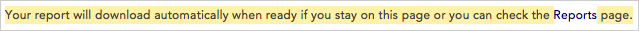
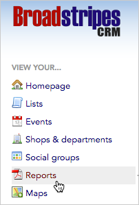

\[et\_pb\_section fb\_built="1" admin\_label="section" \_builder\_version="4.16" global\_colors\_info="{}"\]\[et\_pb\_row admin\_label="row" \_builder\_version="4.16" background\_size="initial" background\_position="top\_left" background\_repeat="repeat" global\_colors\_info="{}"\]\[et\_pb\_column type="4\_4" \_builder\_version="4.16" custom\_padding="|||" global\_colors\_info="{}" custom\_padding\_\_hover="|||"\]\[et\_pb\_text \_builder\_version="4.16" background\_size="initial" background\_position="top\_left" background\_repeat="repeat" global\_colors\_info="{}"\]

## Intro

When you want to download a list offline, but you need to manipulate it on your computer, the **Reports** function on Broadstripes allows you to download a list as a spreadsheet (.xls or .csv). Once the information is in a spreadsheet, you can manipulate and edit it as you see fit.

## Download a spreadsheet list

1. To download a list in spreadsheet format, start by **running a search** for the workers on your list. (Learn about running a search in the [Search by workplace](../../search/search-by-workplace/) or [Create and save a search](../../customize/create-and-save-a-search/) articles.)
2. When your search results appear, click **all** to include all the displayed results in your spreadsheet list.

1. All contacts will be selected (indicated by a **check** next to their name). **Uncheck** any person you want to _exclude_ from your list.
2. Once your contacts are selected, click the **Reports** menu and choose the spreadsheet format you want: either **Spreadsheet (XLS)** or **Spreadsheet (CSV)**. Note that choosing CSV will not permit you to create multiple sheets within your document, unlike XLS format.

1. A **Spreadsheet options** window will open.

1. Give the file a **Title** and choose a **Column Layout** to determine which columns of data (fields) will be included in your printed list. (For more information about using layouts, see the [Choose a layout](../../get-started/choose-a-layout/) or [Create and save a layout](../../customize/save-a-layout/) articles.)
2. Choose additional options as needed:
    - Checking **One row per contact** will create one spreadsheet row for each contact; if a contact has multiple addresses they will each be listed together in the address column, separated by dashes (the same will happen for multiple employments or any other field that allows multiple values).
        - Leaving this **unchecked** will create a spreadsheet where multiple addresses are each on a separate row.
    - Checking **Show Followers or Employees** will create a spreadsheet row for each person (or organization), and additional rows for each of their followers (or employees).
3. Click **Generate**. This will create the spreadsheet "report" you can download.
4. You'll see a message explaining that your spreadsheet report is being created and will download automatically.

1. To download your speadsheet, you have two choices:
2. You can **stay on the current page** and wait for the report's **download dialog** to appear, asking you where you want to save your spreadsheet.

1. You can **leave the current page** and **check in later** to see if the report is ready. To check for the report later, click to the **Reports** link in the navigation panel. That link brings you to the **Requested Reports** page which lists the reports you've requested.
    
    \[caption id="attachment\_2727" align="aligncenter" width="202"\] Click the **Reports** link to display a list of reports.\[/caption\]

\[caption id="attachment\_2744" align="aligncenter" width="333"\] Click the file's name to download it from **Requested Reports**.\[/caption\]

1. Once you've downloaded your spreadsheet list, you can **open** and **edit** it just as you would any other .XLS or .CSV document.

\[/et\_pb\_text\]\[/et\_pb\_column\]\[/et\_pb\_row\]\[/et\_pb\_section\]
