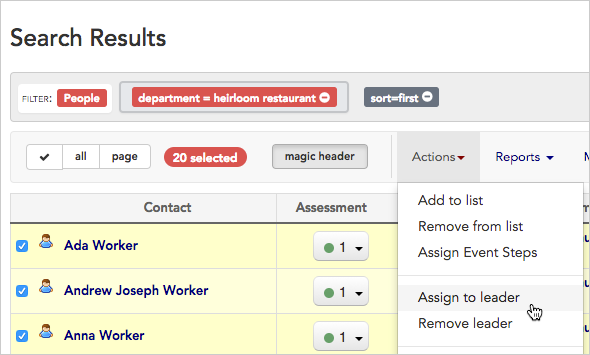
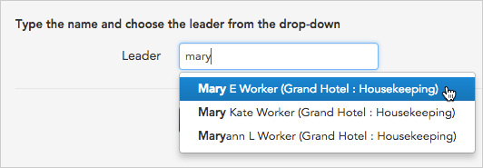
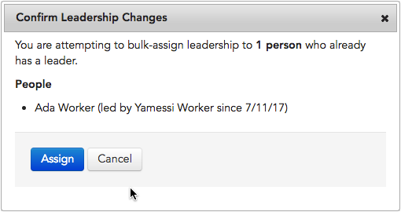
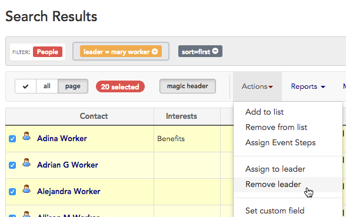
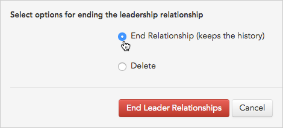

\[et\_pb\_section fb\_built="1" \_builder\_version="4.16" global\_colors\_info="{}"\]\[et\_pb\_row \_builder\_version="4.16" background\_size="initial" background\_position="top\_left" background\_repeat="repeat" global\_colors\_info="{}"\]\[et\_pb\_column type="4\_4" \_builder\_version="4.16" custom\_padding="|||" global\_colors\_info="{}" custom\_padding\_\_hover="|||"\]\[et\_pb\_text \_builder\_version="4.27.0" global\_colors\_info="{}"\]

# Action: Assign to leader/Remove leader

* * *

## Assign a leader

Broadstripes' bulk actions make it simple to assign a leader to multiple contacts at once. If you need to remove a leader, you can do that with a bulk action, too.

1. First, run a search for the people you want to assign to a leader. Then, from the **Search Results** page, [select those contacts](https://help.broadstripes.com/help-articles/using-broadstripes/working-with-search-results/selecting-deselecting-contacts/). (If you need help running a search, check out the [Create and save a search](https://help.broadstripes.com/help-articles/using-broadstripes/customize/create-and-save-a-search/) article.)
2. With the contacts selected, go to the **Actions** drop-down menu and choose **Assign to leader**.
3. When prompted for the leader, **begin typing their name** in the text box. Broadstripes will suggest names that match. **Select the correct name** from the list and click **Add leader**.

If any of the selected workers were previously assigned to a leader, Broadstripes will ask you to **Assign** (confirm) or **Cancel** the new leadership assignment.

1. Broadstripes will automatically update all of the contact records that you selected with their new leader. A **notification** will appear to confirm the update.

## Remove leadership information

If you want to remove leadership information from a group of contacts, you can do that from the actions drop-down menu, too. In the previous example, we assigned 20 contacts to Mary Worker. In this example, we'll remove Mary Worker as the leader of those workers. When we're done, their records will show that they have no leader.

1. We'll start by running a search for people Mary leads. From the **Search Results** page, we'll [select the contacts](https://help.broadstripes.com/help-articles/using-broadstripes/working-with-search-results/selecting-deselecting-contacts/) we assigned to Mary in the previous example. (If you need help running a search, check out the [Create and save a search](https://help.broadstripes.com/help-articles/using-broadstripes/customize/create-and-save-a-search/) article.)
2. With those contacts selected, we'll go to the **Actions** drop-down menu and choose **Remove leader**.

1. Next, we'll be given a choice to **End Relationship** or **Delete**.
    - Choose **End Relationship** if you want to keep an historical record of the fact that Mary was once the worker's leader (an entry showing the start and end date of the relationship will be written on the **Leadership tab** of the worker's record).
    - Choose **Delete** if you want to completely erase the leadership relationship and any history of it (for instance, if Mary was assigned in error).

1. Click the **End Leader Relationships** button.
2. Broadstripes will automatically update all of the selected contact records to show that they are not lead by anyone. A **pop-up box** will appear to confirm our update.

\[/et\_pb\_text\]\[/et\_pb\_column\]\[/et\_pb\_row\]\[/et\_pb\_section\]
