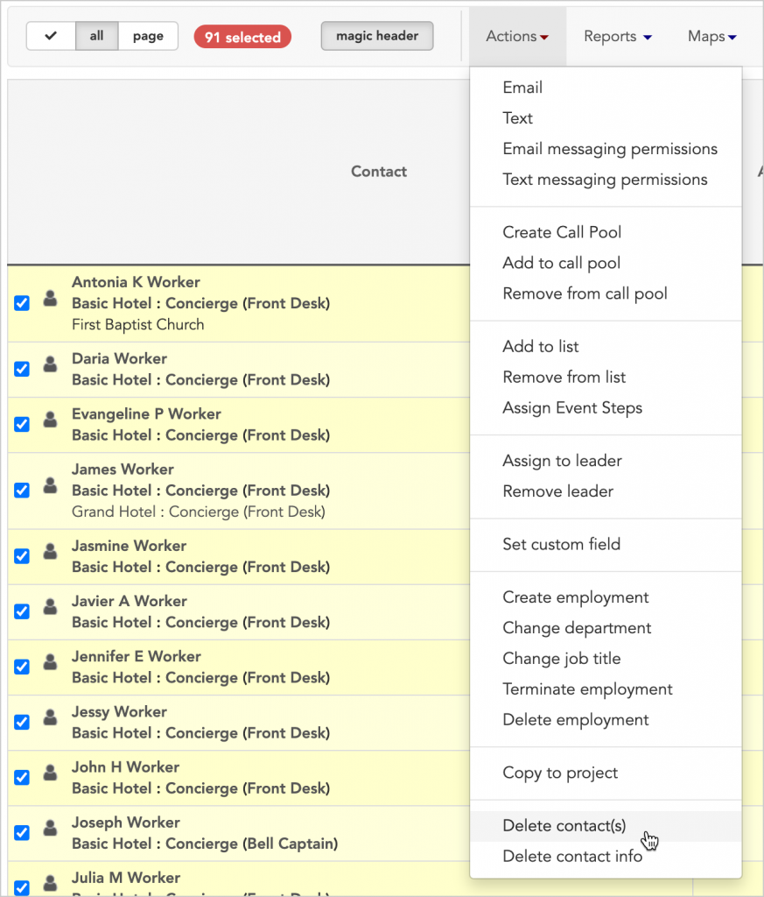
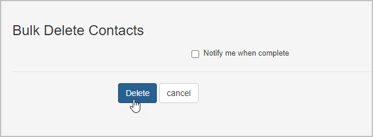
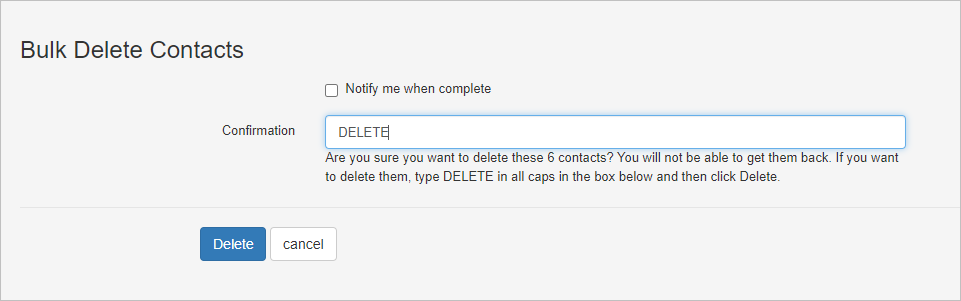

# Delete contact(s)

* * *

## Delete contact records permanently

You can use bulk actions to **permanently delete a contact or group of contacts** from your Broadstripes project. Unlike with other organizing databases you may have used, when you delete a contact in Broadstripes, the record is _completely removed_ from your Broadstripes project along with all associated data and history. After a record has been deleted, it cannot be retrieved by any user for any reason. Deleting contact records cannot be undone.

#### Cases where contacts can't be deleted

There are a few cases where contacts cannot be deleted using a bulk action. Contacts that are linked to Broadstripes users can't be deleted. You will also not be able to delete contacts that are linked to a locked external system.

If you are sure that you want to permanently delete contacts with a bulk action, here are the steps to follow:

For this example, we'll show how to permanently delete a group of workers that we no longer want in our Broadstripes project.

1. We'll start by running a search. From the **Search Results** page, we'll [select the workers](https://help.broadstripes.com/help-articles/using-broadstripes/working-with-search-results/selecting-deselecting-contacts/) whose records we are deleting. (If you need help running a search, check out the [Create and save a search](https://help.broadstripes.com/help-articles/using-broadstripes/customize/create-and-save-a-search/) article.)
2. With the contacts selected, we'll go to the **Actions** drop-down menu and choose **Delete contact(s)**.

> #### Deletion is permanent Deleting a contact will _permanently remove_ that person's record and all of their associated details from the entire Broadstripes project. The record cannot be retrieved after it is deleted. You cannot undo a deletion.

1. A panel will appear just above your search results. If you are sure that you want to continue with deletion, click Delete. 

When deleting more than five contacts at once, you'll be asked to confirm your deletion by typing **DELETE** before clicking **Delete**.

1. Broadstripes will automatically queue the process of deleting the selected records and their associated data. A **pop-up notification box** will appear in the upper right corner to confirm the deletion is queued. No further action is needed.

#### Deleting large numbers of contacts

If you are removing a large volume of contacts at one time, it may take up to a few minutes for Broadstripes to complete the process. You may choose to receive an email notification once the deletion is complete by checking the box labeled

This means that immediately after queuing the records for deletion, you may still see those records in search results or reports. You won't be notified that the deletion is complete, but Broadstripes will queue the process as soon as you confirm the deletion and finish when all selected contacts are deleted.
