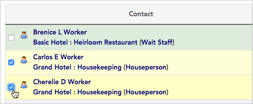
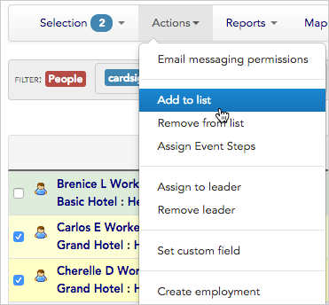
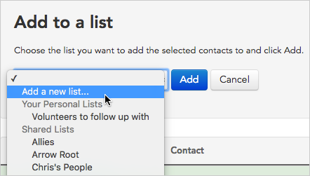
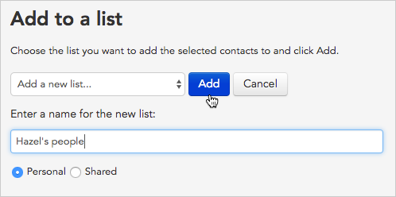
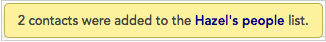
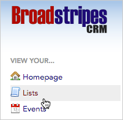
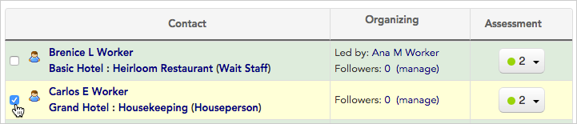
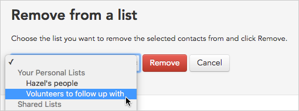
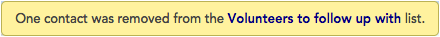

\[et\_pb\_section fb\_built="1" \_builder\_version="3.22"\]\[et\_pb\_row \_builder\_version="3.25" background\_size="initial" background\_position="top\_left" background\_repeat="repeat"\]\[et\_pb\_column type="4\_4" \_builder\_version="3.25" custom\_padding="|||" custom\_padding\_\_hover="|||"\]\[et\_pb\_text \_builder\_version="4.8.1" hover\_enabled="0" sticky\_enabled="0"\]

# Action: Add to list/Remove from list

* * *

## Add contacts to a tag list

One of the most common bulk actions applied to search results is adding contacts to a tag list. **Tag lists** give you an easy way to manually tag individuals whom you want to track as a group for any reason (for instance your key volunteers, or the people you need to follow up with this month). You can learn more about setting up and using this feature in the [Tag Lists](https://help.broadstripes.com/help-articles/admin-tools/data-tools-admin/tag-lists/) overview article.

Once you know which contacts you want to add to your list, you're ready. This article will explain how to create a new list and add contacts. It will also take you through steps to edit the list and add or remove people later.

## Add people to a tag list

1. From the **Search Results** page, [select the contacts](https://help.broadstripes.com/help-articles/using-broadstripes/working-with-search-results/selecting-deselecting-contacts/) you want to add to your list. (If you need help running a search, check out the [Use the Quick Search](https://help.broadstripes.com/help-articles/using-broadstripes/get-started/use-quick-search/), [Search by workplace](https://help.broadstripes.com/help-articles/using-broadstripes/search/search-by-workplace/), or [Create and save a search](https://help.broadstripes.com/help-articles/using-broadstripes/customize/create-and-save-a-search/) articles.)

1. With the contacts selected, go to the **Actions** drop-down menu and choose **Add to list**.

1. You can choose to add the contacts to one of your existing personal or shared lists, or add them to a new list. For this example, we'll choose to **add a new list.**

1. **Enter a name for the new list** and indicate whether you want the share the list with others (**Shared**), or have it visible only to you (**Personal**). Click **Add** to create the list and automatically add the contacts you selected in the previous step.

1. You'll see a pop-up note that your contacts have been added to the new list.

## Remove people from a tag list

1. Start by clicking the **Lists** link on the navigation panel.

1. Broadstripes will open the **Lists** page where you'll see all of your active lists (both shared and personal).

1. Clicking on the number in the **\# of Contacts** column will open a page showing all the members of that list.

1. From the list that appears, **check** any people who you want to remove from your list.

You don't have to start from the **Lists** page to remove a person from a tag list. You can check any person displayed on _any_ search results page, then remove them using the same steps outlined below.

1. From the **Actions** drop-down menu, select **Remove from list**.

####   Do not "Delete" a contact by mistake

Remember that you need to choose **Remove from list** from the **Actions** menu. Choosing **Delete** from this menu by mistake will permanently erase the contact from your _entire project_.

1. Choose the tag list you want to remove the contacts from and click the **Remove** button.

1. You'll see a pop-up note confirming that your contacts have been removed from the list.

\[/et\_pb\_text\]\[/et\_pb\_column\]\[/et\_pb\_row\]\[/et\_pb\_section\]
