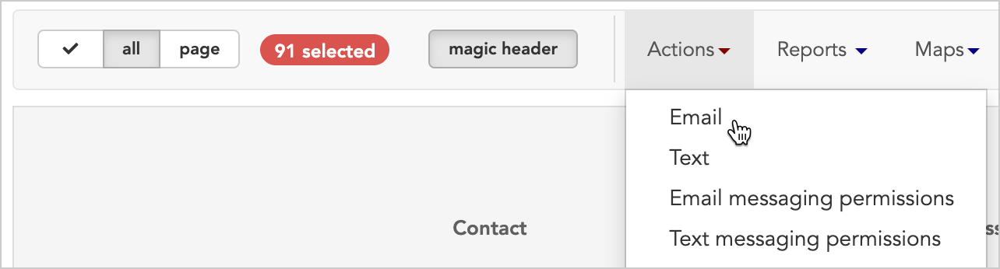

\[et\_pb\_section fb\_built="1" \_builder\_version="3.22"\]\[et\_pb\_row \_builder\_version="3.25" background\_size="initial" background\_position="top\_left" background\_repeat="repeat"\]\[et\_pb\_column type="4\_4" \_builder\_version="3.25" custom\_padding="|||" custom\_padding\_\_hover="|||"\]\[et\_pb\_text \_builder\_version="4.4.8"\]

# Email

* * *

## Send a bulk email

This bulk action is a great way to communicate with groups of workers quickly and efficiently. You can compose a single email and send it to multiple workers all at once. You can even include dynamic merge fields like "First name" so the emails sound more personal. Keep in mind that the workers will need to have a valid email address in Broadstripes which they've "opted in" to receive this kind of message.

If you don't see the **"Email"** option on your drop down menu, it means you haven't been granted permission to use the feature. Talk to your admin to get set up.

\[/et\_pb\_text\]\[/et\_pb\_column\]\[/et\_pb\_row\]\[/et\_pb\_section\]
