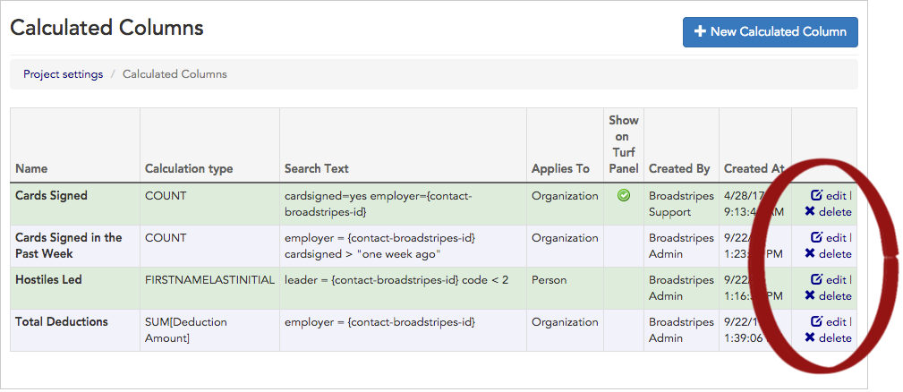

\[et\_pb\_section bb\_built="1" admin\_label="section"\]\[et\_pb\_row admin\_label="row" background\_position="top\_left" background\_repeat="repeat" background\_size="initial" \_builder\_version="3.0.105"\]\[et\_pb\_column type="4\_4"\]\[et\_pb\_text background\_position="top\_left" background\_repeat="repeat" background\_size="initial" \_builder\_version="3.0.106" background\_layout="light"\]

Calculated columns allow you to create and display custom metrics for your project. You can learn more about what calculated columns can do in the [Working with Calculated Columns](https://help.broadstripes.com/help-articles/admin-tools/running-a-project-admin/working-with-calculated-columns/) article.

Once your custom columns have been created, you can manage them from **Project settings**.

1. To get started, access **Calculated columns** by clicking **Settings** > **All settings** in the upper right corner of any page.

1. From the **Project settings page**, click the **Special features > Calculated columns** link.

1. The **Calculated columns settings index page** will open, listing all the calculated columns for your project. From this page, you can view, edit, and delete any calculated column.

\[caption id="" align="aligncenter" width="1009"\] **Edit** or **delete** a calculated column using the links at the end of the row.\[/caption\]

1. You can also add **\+ New calculated columns** by clicking the button in the upper right corner. See the [Working with Calculated Columns](https://help.broadstripes.com/help-articles/admin-tools/running-a-project-admin/working-with-calculated-columns/) article to learn more about creating new calculated columns and how to add them to status reports, saved layouts, or users' turf panels.

\[/et\_pb\_text\]\[/et\_pb\_column\]\[/et\_pb\_row\]\[/et\_pb\_section\]
