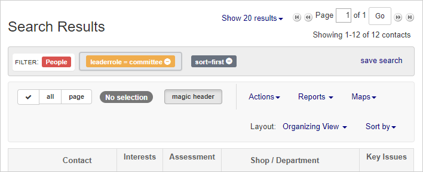
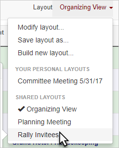
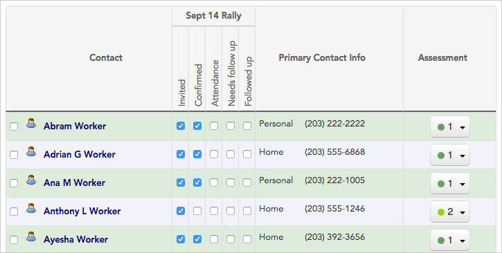
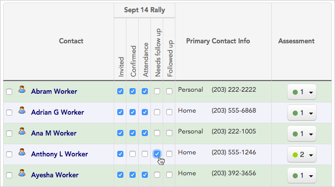
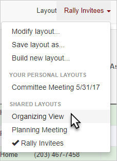

\[et\_pb\_section fb\_built="1" admin\_label="section" \_builder\_version="3.22.3"\]\[et\_pb\_row admin\_label="row" \_builder\_version="3.25" background\_size="initial" background\_position="top\_left" background\_repeat="repeat"\]\[et\_pb\_column type="4\_4" \_builder\_version="3.25" custom\_padding="|||" custom\_padding\_\_hover="|||"\]\[et\_pb\_text \_builder\_version="3.27.4" background\_size="initial" background\_position="top\_left" background\_repeat="repeat"\]

### What is a layout?

Together with searches, layouts let you see the contact information you need in the format that works best for your process. While a **_search_** filters the set of contacts displayed by the criteria you choose, a **_layout_** determines which exact information to display about those contacts.

If your project has multiple organizers entering a lot of information, a good layout can make all the difference for productivity and teamwork. A layout essentially shows you a customized view of the data that's most relevant to the work at hand. For instance:

- an **organizing layout** (used for membership drives) might show a worker's name, assessment, employment info, and how to get in touch with them.
- a **committee layout** (used to track your leadership) might show each leader's role, how many workers they organize, and what meetings they've attended this year.

If everyone on your team applies the same saved layout to their work, you'll all be viewing and updating the same set of information — making data entry (and teamwork) a snap!

For this example, let's imagine that we just held a rally, and we want to record who attended. We'll change from our usual "**Organizing view**" layout to the “**Rally Invitees**" layout. With the new layout applied, we can easily check off the attendees, and mark the records of some workers with whom we'd like to do some additional follow-up.

Here's how:

## Choose a layout

1. To choose a new layout, start on the **search results panel**. (Learn about running a search in the [Search by workplace](https://help.broadstripes.com/help-articles/using-broadstripes/search/search-by-workplace/) or [Create and save a search](https://help.broadstripes.com/help-articles/using-broadstripes/customize/create-and-save-a-search/) articles.)
2. In the upper-right area above your search results, click the **drop-down menu** next to the word **Layout** as shown below. Our drop-down menu is labeled "**Organizing view**," but yours will probably look different depending on whether you are currently using a saved layout or not.

\[caption id="" align="aligncenter" width="708"\] Click to see the saved layouts you can apply to your search results.\[/caption\]

1. A **drop-down list** will open, giving you choices to **modify, save,** or **build a layout**, or **apply a new layout** by clicking on that **layout's name**.

### Layouts: custom-made by you and your team

The **layout options** you'll see in your drop-down menu probably look different from ours. Layouts are not built by Broadstripes, but created, saved, and shared by users and project admins to meet your specific needs. What you'll see in your drop-down menu is any layouts you've created, or that other users have shared with you — not a set of pre-made, one-size-fits-all designs. Learn more about creating and saving new layouts in the [Create and save a layout](https://help.broadstripes.com/help-articles/using-broadstripes/customize/save-a-layout/) article.

1. We'll apply a new layout by clicking "**Rally Invitees**" from the SHARED LAYOUTS section.

1. Once we choose this layout, the type of information we'll see on screen will change, and we'll instantly have the benefit of a custom view of information that suits our task of recording rally attendees.

1. Using the new layout, we can quickly **update contact records** by checking boxes to show who attended our event, and who needs follow-up.

1. Once we're done updating this information, we can return to our regular "Organizing view" layout by selecting it from the **layout drop-down list** just as we did earlier.

\[/et\_pb\_text\]\[/et\_pb\_column\]\[/et\_pb\_row\]\[/et\_pb\_section\]
