\[et\_pb\_section fb\_built="1" admin\_label="section" \_builder\_version="3.0.47"\]\[et\_pb\_row admin\_label="row" \_builder\_version="3.0.105" background\_size="initial" background\_position="top\_left" background\_repeat="repeat"\]\[et\_pb\_column type="4\_4" \_builder\_version="3.0.47" parallax="off" parallax\_method="on"\]\[et\_pb\_text admin\_label="Text" \_builder\_version="3.19.3" background\_size="initial" background\_position="top\_left" background\_repeat="repeat"\]

Broadstripes uses powerful logic that helps you get the most out of the contact information you collect. Whether you are entering worker records through an import, or entering records manually, address information is key data – and you can view, enter, update, or delete any of it from the **address form**.

In this article, we'll take a closer look at how Broadstripes collects, displays, and utilizes the information in the **address form** including:

- recording and displaying **primary** and **secondary addresses**
- **geocoding** and **mapping** addresses
- tagging **bad addresses**
- tracking **address change history**

We'll start by opening the address form:

## Open the address form

1. The address **form allows** you to view or edit a person's complete address record.
2. For this example, we'll be looking at the **address form** of an **existing person** in our project. (If you want to [add a new person](https://help.broadstripes.com/help-articles/using-broadstripes/working-with-contact-records/add-a-new-person/), or [add a new organization](https://help.broadstripes.com/help-articles/using-broadstripes/working-with-contact-records/add-a-shop-or-department/), that's fine. Once they are set up, their address forms will be identical.)
3. To open the form, start by **running a search** to filter for just the contact whose address you want to work with. (Learn more about creating custom searches in the [Create and save a search](https://help.broadstripes.com/help-articles/using-broadstripes/customize/create-and-save-a-search/) article).
4. From the search results panel, **hover over** the worker's name and click the  **looking glass icon.** You'll see a pop-up window with some useful details, including their primary address information.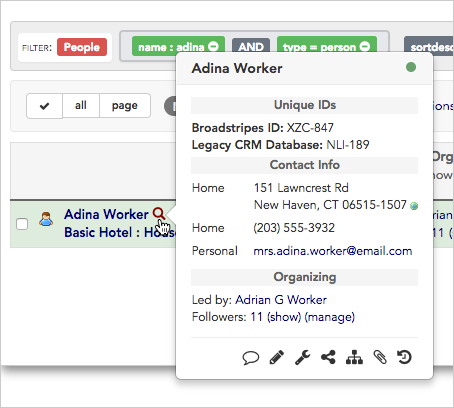
5. **Click** anywhere in the **address area** in the **Contact Info** section of the pop-up window to open the address form**.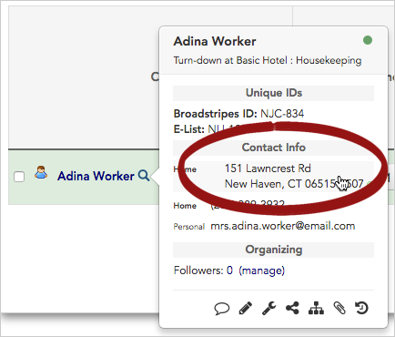**
6. The **address form** will open in its own window.

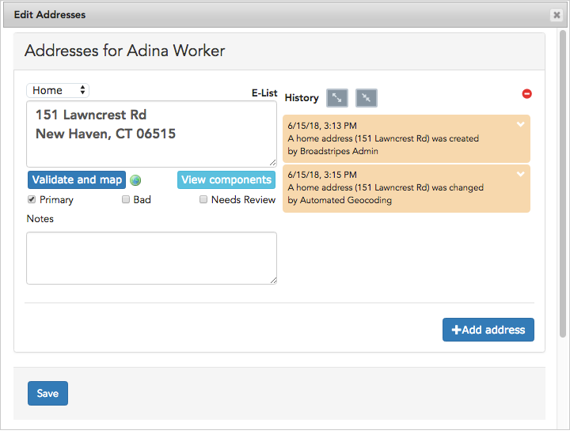

## Parts of the address form

Broadstripes gives you a lot of information to look at on the address form. Let's break it down so you know your way around.

### 1\. Address pane

Broadstripes allows you to record an unlimited number of addresses for each person in your project. Each address will be displayed in its own pane. If you're editing an address, just place your cursor in address pane and type your changes.

You can use the drop-down menu above the address pane to specify if the address is for **Home**, **Business**, or **Other**. You can also add a **No****te** below the address to help other organizers (e.g. "There's an unchained dog in the back yard" or "Lives with mother who usually answers the door").

\[caption id="attachment\_21477" align="aligncenter" width="538"\]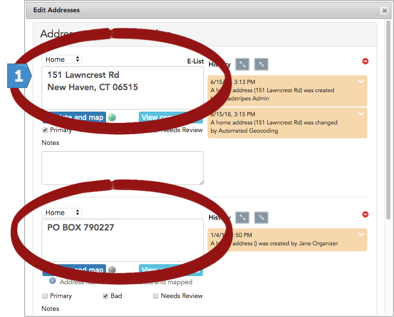          This worker has two addresses – one is complete and one is incomplete.\[/caption\]

### 2\. Validate and map

Each time you enter or edit an address, you'll need to validate and map it. Clicking the **Validate and map** button signals Broadstripes to do two important tasks:

1. **Validate** the address against a database of current US Postal Service (USPS) addresses to verify it as a deliverable address.
2. "**Geocode**" the address, essentially locating its GPS coordinates so that Broadstripes can generate highly accurate maps and driving directions. The colored globe icon next to the "Validate and map" button indicates an address that has been geocoded; a gray globe indicates one that has not.  
    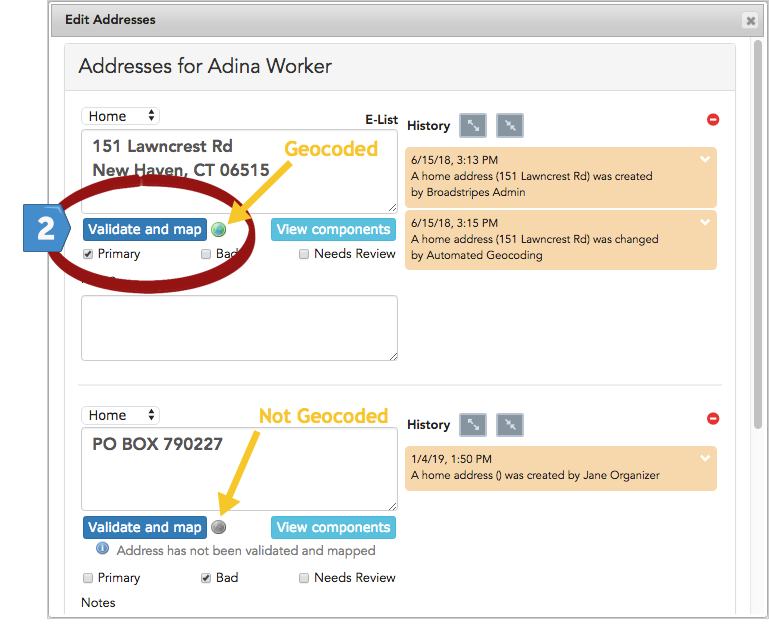

### 3\. Informational messages and flags

Broadstripes displays messages near the address pane if there's something that needs your attention.

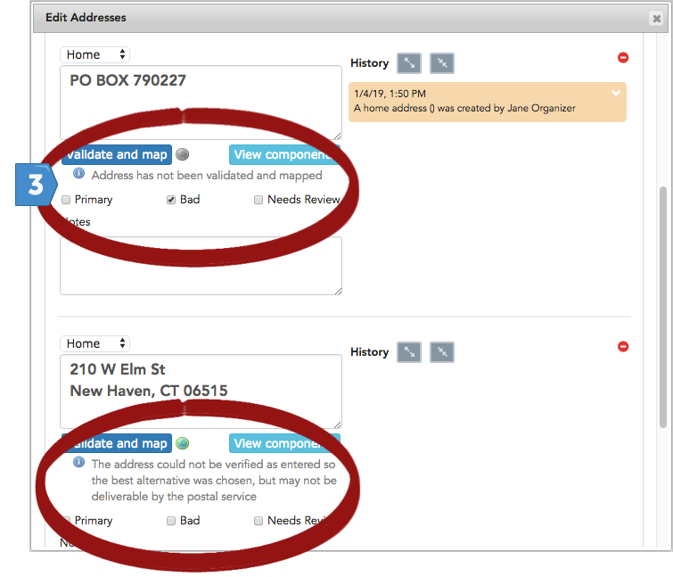

- "**Address has not been validated and mapped**": This message simply reminds the user that they have not yet clicked the **Validate and map** button, so Broadstripes has not yet processed the address. The message will disappear when the user clicks the button and Broadstripes launches its validation process.
- **Address has been mapped:** This address is valid and needs no further attention.
- **The address could not be verified as entered and may not be deliverable by the post office:** This address may contain a typo or be outdated; you may want to manually flag it by checking the "**Needs review**" checkbox to remember to correct it later. Depending on your organization's data entry policies, you may also want to flag it by checking the "**Bad**" checkbox which will cause the address to be displayed with strikethrough, and prevent it from being displayed on a map or exported to spreadsheet from the search results.
- Other validation and mapping warnings, such as "**The street was found, but not the number**" are also indications that the address you've entered is inaccurate. Follow your organization's rule of thumb to flag these correctly.
- “**Needs review**”: This flag (check box) is generally set by Broadstripes during a data import if an issue is encountered during the process of USPS-validating and geocoding an address. Sometimes an accompanying note will provide additional information about the exact issue encountered. You can also check the "**needs review"** flag **manually** to flag addresses about which you aren’t confident. The "needs review" flag has no effect on the address (it will still appear in maps and exports) — it’s simply a way to flag an address for later follow-up and verification.
- "**Primary**": This flags an address as the person's main address. If you add a new primary address, simply click the "**Primary**" checkbox next to the new address and Broadstripes will automatically deselect the old address and start using the new primary address to generate accurate layouts, maps, and exports.
- "**Bad**": In some cases, you may want to retain the details of an address even though you know it is not a valid or accurate address. For instance, this feature can be really useful in helping you catch (and disregard) the address if it ever appears again in an import or another list used by your campaign. Flagging an address as “**Bad**” will cause the address to be displayed with strikethrough, and prevent it from being displayed on a map or exported to spreadsheet from the search results (unless the export layout is specifically set up to include the column "Addresses - Bad").

### 4\. History panel and manual lock

Broadstripes knows how important address information is to your campaign. The **history panel** was introduced to help retain a record of all changes applied to a person's address data. Each time an address is created, modified, or matched during import, a new record is added to the history.

\[caption id="attachment\_21472" align="aligncenter" width="591"\]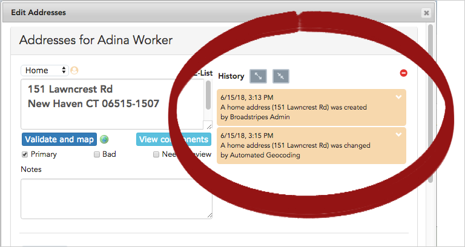 The history panel.\[/caption\]

You can **expand all the history records** by clicking on the expand icon, or **expand an individual history record** by clicking on the down arrow icon.

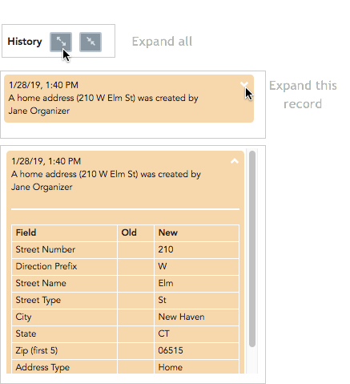

**Manual lock:** Manual changes made on the address form trigger a special feature. When a manual address change is made, the **Manual lock icon** will appear next to the address and the address becomes locked against further changes by an import.

\[caption id="attachment\_21473" align="aligncenter" width="722"\]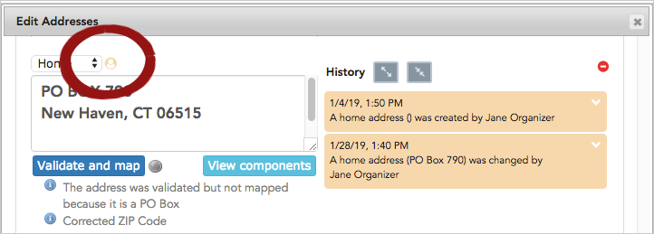 The manual lock icon indicates that this address cannot be changed by future imports, but it can be updated manually.\[/caption\]

### 5\. View components

Clicking the **View components** button opens a new window that displays each individual address component exactly as it is stored by Broadstripes (e.g. Street Name, Street Type, Street Number, Unit). In some cases, seeing the data in this format can help you troubleshoot a problematic address. You can also edit an address from this screen. Just click **Apply** to save your changes.

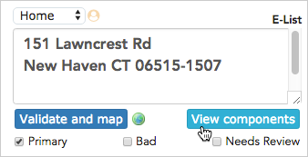

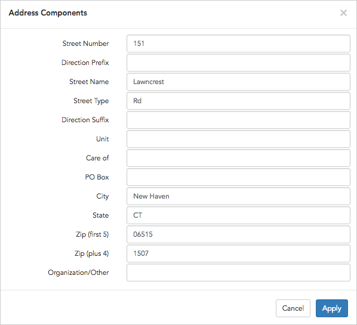

## Learn more

Now that you know your way around addresses, learn the basics of adding, editing or deleting addresses in this article:

- [Add, edit or delete addresses](https://help.broadstripes.com/help-articles/using-broadstripes/working-with-contact-records/add-edit-or-delete-an-address/)

\[/et\_pb\_text\]\[/et\_pb\_column\]\[/et\_pb\_row\]\[/et\_pb\_section\]
