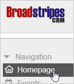
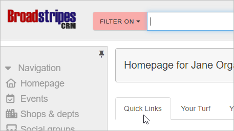
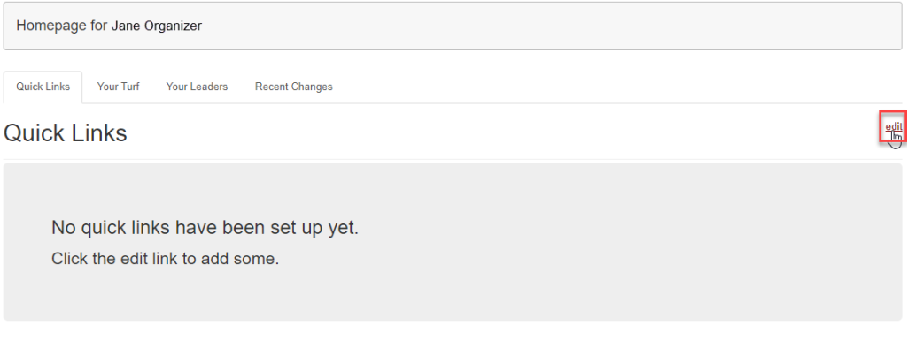
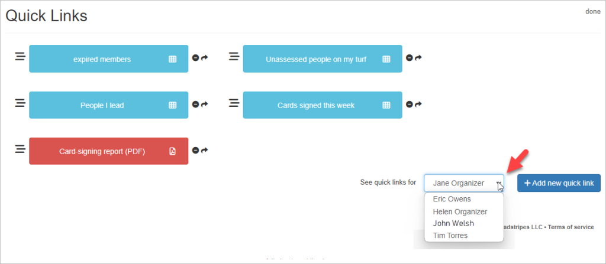
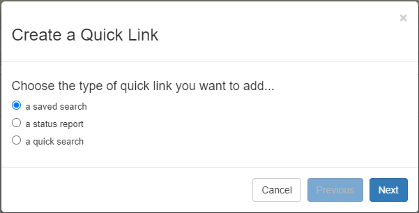

## Overview

**Quick Links** offer a simple dashboard customized to your specific needs—a fast one-click entry point to your most frequent searches or reports.

Configuring quick links is simple, and once it’s done, your customized quick links appear automatically, each time you log in. You can easily add new quick links to help you with the tasks you do most often.

To get started with quick links: Click the **homepage** link in the navigational panel.

Go to the **Quick Links** tab.

## Create a new quick link (or delete it)

1. To start, click **edit**.
2. Next, click the **Add new quick link button**.

####   Administrators only

If you are an administrator, you can create quick links for other users. Select their name from the drop-down list (as shown below) and click the **\+ Add new quick link** button. When you've finished creating the new link, it will automatically appear on that user's own quick link tab..

1. Next (all users), choose the type of quick link you want to create and click **Next**.
2. These articles provide more details on setting up each type of quick link:
    - [saved search](https://help.broadstripes.com/help-articles/using-broadstripes/customize/saved-search-quick-links/)
    - [status report](https://help.broadstripes.com/help-articles/using-broadstripes/customize/status-report-quick-links/)
    - [a quick search](https://help.broadstripes.com/help-articles/using-broadstripes/customize/quick-search-quick-links/)
3. To **delete** a quick link from your quick link tab, just click the  **icon** next to the link's name. Remember: Deleting the link will remove the link from your dashboard, but it won’t delete the underlying saved searches or reports.
    
    \[caption id="attachment\_27079" align="aligncenter" width="485"\] Delete a quick link by clicking the minus sign icon.\[/caption\]
    
    Now that you have created a quick link, you may [share the quick link with other users in a user group](https://help.broadstripes.com/help-articles/admin-tools/share-quick-links-to-a-user-group/).
