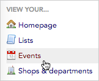
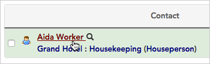

\[et\_pb\_section fb\_built="1" admin\_label="section" \_builder\_version="3.0.47"\]\[et\_pb\_row admin\_label="row" \_builder\_version="3.0.105" background\_size="initial" background\_position="top\_left" background\_repeat="repeat"\]\[et\_pb\_column type="4\_4" \_builder\_version="3.0.47" parallax="off" parallax\_method="on"\]\[et\_pb\_text admin\_label="Text" \_builder\_version="3.19.12" background\_size="initial" background\_position="top\_left" background\_repeat="repeat"\]

## Overview

**Events** are a special kind of custom field in Broadstripes. Each event can be created to contain one or more “**steps**” (checkboxes) to capture particular actions in the workflow of a given campaign activity.

Here are some examples of when to use events:

- Tracking petition signatures
- Tracking invitations, RSVPs, and attendance for a meeting or rally
- Recording whether someone has signed a membership card

## How do events work?

As you probably know, labor organizing involves answering lots of yes/no questions about the workers in the bargaining unit.

For example, imagine that you’re working on an external organizing card-signing drive. For each worker, you’d want to know:

- Have they signed a card?
- Do we have their signature on file?
- Did we email them a copy of their card?

Broadstripes lets you to capture information like this using an “**event**.” Each of the specific yes/no questions within the event is captured with a checkbox called an “**event step**.”

For the card-signing drive described above, you could create an event named “**Card**” with steps named “Signed”, “On file”, and “Email sent.” When complete, it would look like this:

## When do you use events?

Typically, events are used to capture things that are transient: important now, but possibly less so in the future. You can use events to record and track literal organized events, but you can also use events to keep track of important one-time information or occurrences.

As a rule of thumb, you should use an event to record information that occurred at a certain time, whereas you'll use [built-in fields](https://help.broadstripes.com/help-articles/admin-tools/data-tools-admin/built-in-data/) (fields that come standard in all Broadstripes projects) or [custom fields](https://help.broadstripes.com/help-articles/admin-tools/data-tools-admin/custom-fields/) (special fields created by your admin) to record information that is always true.

With most card-signing campaigns, once the election is won, that data will fade into history in the minds of the organizers, and new questions will become important. In these cases, events that are no longer relevant to your work can be made [inactive](https://help.broadstripes.com/help-articles/admin-tools/data-tools-admin/creating-an-event/#ftoc-heading-4) to keep them from cluttering the project.

## Getting started with events

The rest of this article was designed to help users understand the basics of Broadstripes' events:

- [how to view events on a contact's record](https://help.broadstripes.com/help-articles/using-broadstripes/customize/create-events-to-track-goals/#ftoc-heading-5)
- [how to create a simple single-step event](https://help.broadstripes.com/help-articles/using-broadstripes/customize/create-events-to-track-goals/#ftoc-heading-7) (for example, to track who will attend a committee meeting)
- how to [search by event-related data](https://help.broadstripes.com/help-articles/using-broadstripes/customize/create-events-to-track-goals/#ftoc-heading-9)
- More: check out the [Events article](https://help.broadstripes.com/help-articles/admin-tools/data-tools-admin/creating-an-event/) in our Admin Guide to learn how to create a multi-step event as well as deactivate, edit, or delete an event.

## Viewing events

Once you've set up an event, that event and all its steps will be visible and can be edited by your users from the contact record's **Events Panel** on their **Overview tab**.

## Understanding check-offs and steps

Each **event** can be created to contain one or more "**steps**" (checkboxes) to capture particular actions in the workflow of a given campaign activity. You have quite a bit of freedom in Broadstripes to format events in the most useful way for your project. Depending on what information you are looking to capture, you may want to create a **single check-off event** or a **multi-step event**.

**Single check-off events** allow you to customize a simple yes/no checkbox for each contact in your project. They are best used when you need to capture only the most basic information about an event: for example, whether a worker is attending a meeting or not. This **Events Panel** (located on a contact record's **Overview tab)** shows a single check-off event called "**Organizing meeting**" with a single event step called "Attended".

\[caption id="attachment\_2428" align="aligncenter" width="196"\] This **Events Panel** shows a single check-off event called "**Organizing meeting**."\[/caption\]

**Multi-step events** allow you to capture more detailed and specific information about a contact with multiple checkboxes. Here are some example situations in which you might want to create an event with multiple steps:

- To closely track organizers' turnout: for instance, when promoting a meeting, steps called **Mailer**, **Direct invitation**, **Confirmed**, **Attended**, and **Follow up** give you a more precise picture of what organizers' efforts looked like than a single **Attended** check-off would.
- For events that have several options: for instance, a petition drive might have the steps **Signed** and **Refused** so organizers know whether someone was contacted, even if they didn't end up signing.
- To record attendance to an event for several different dates: for instance, an event called **Committee meeting** could have three steps labeled **3/1**, **3/8**, and **3/15**.\[caption id="attachment\_2429" align="aligncenter" width="408"\] This **Events Panel** shows events with multiple "**steps**" (checkboxes).\[/caption\]

## How to create a single check-off event

For this example, we will track whether a group of workers is attending a committee meeting with the simplest method possible – the single check-off. (Read more about creating multiple-step events in the [Event](https://help.broadstripes.com/help-articles/admin-tools/data-tools-admin/creating-an-event/) article.)

1. Get started by clicking the **Events** link on the left-hand navigation panel.
2. That will take you to your project's **events index page**, which lists the active events in the project.
3. Click the **\+ New event** button in the upper-right corner of the page. A **new event entry row** will appear at the top of the list.
4. In the box, change the text from "new event 1" to "**Committee meeting**".
5. Next, create a single step under this new event. Click on the text area labeled **"new event step 1"** below "Committee meeting." Edit the text to create a step called "**Attending.**"
6. Click **Save** to add the event to your project.

#### Events can have multiple check-offs

If you want multiple checkboxes for a single event – for instance "**Invited," "Attended,"** and "**Followed up"** that's no problem. Just hover over the event and click the blue "**a****dd step**" button that appears. Create a new step for each checkbox you want to see. Learn more in the [Event](https://help.broadstripes.com/help-articles/admin-tools/data-tools-admin/creating-an-event/) article.

## "Single choice" and "Timeline tracked" events

After creating an event, you have the option to make that event "Single choice" and/or "Timeline tracked" using the checkboxes displayed on each event’s row.

**Single choice –** A "Single choice" event is not the same as a "single check-off" event. Whereas a single check-off event has only one event step, a single choice event can have multiple steps. Checking "**Single choice**" means that only one event step can be checked at any given time. This can be useful when you want to record only a single current status rather than track your progress through a string of steps (for instance, you could check "Single choice" in the case of a petition drive event where the steps are "Signed," or "Refused"). 

**Timeline tracked –** selecting this will require the user to enter a timeline note whenever the event’s value is changed during data entry (for instance, when a user checks or un-checks any event step). This can help your organization capture more information about why the event step was updated, including the name of the person updating the record and a time-stamp recording when it was changed.

## View and update a contact's event data

Now that the event is set up, it's ready for users to record their data. For this example, we'll open Aida Worker's record and check the **Committee meeting** checkbox to show she's attending the meeting.

1. First, we'll do a [quick search](https://help.broadstripes.com/help-articles/using-broadstripes/get-started/use-quick-search/) for Aida's record.
2. We'll click on her name in the search results to open her record.
3. On the **Overview tab** of Aida's record, we'll scroll down to the **Events Panel** and click the checkbox to show she's attending the committee meeting.
4. If you plan to **update multiple records** at once, Broadstripes can greatly simplify that process with **customized layouts**.

Just like it sounds, a customized layout is a way for you to choose exactly which fields are displayed on-screen. For instance, you can add the attendance checkbox for the event you just created. This lets organizers easily check "Attending" for multiple workers all from a single data entry screen.

Customized layouts are simple to create and apply to your project. Learn about applying customized layouts in the [choose a layout](https://help.broadstripes.com/help-articles/using-broadstripes/get-started/choose-a-layout/) article, or create your own by reading the [create and save a layout](https://help.broadstripes.com/help-articles/using-broadstripes/customize/save-a-layout/) article.

## View key event data with a search

You've created your event and users are updating records with event data. Now you may be wondering how to see event-related information – for instance, a list of all the people attending the upcoming committee meeting.

With Broadstripes, accessing this information is simple. Using the search bar at the top of any page, simply type "**\[name of your event\]=attending".** A list of all the people you have marked "Attending" will pop up in your search results.

To search for the people you haven't yet gotten to attend, search "**\[name of your event\]=none"**

To learn about saving or sharing either of these lists with other users, check out the [create and save a search](https://help.broadstripes.com/help-articles/using-broadstripes/customize/create-and-save-a-search/) article.

## Learn more

Want to learn more about working with events, like how to create a **multi-step event** or how to **deactivate, edit,** or **delete** an event?

- Check out the [Events article in our Admin Guide](https://help.broadstripes.com/help-articles/admin-tools/data-tools-admin/creating-an-event/)

\[/et\_pb\_text\]\[/et\_pb\_column\]\[/et\_pb\_row\]\[/et\_pb\_section\]
