\[et\_pb\_section bb\_built="1" admin\_label="section" \_builder\_version="3.0.47"\]\[et\_pb\_row admin\_label="row" \_builder\_version="3.0.105" background\_size="initial" background\_position="top\_left" background\_repeat="repeat"\]\[et\_pb\_column type="4\_4"\]\[et\_pb\_text \_builder\_version="3.10" background\_size="initial" background\_position="top\_left" background\_repeat="repeat"\]

## Intro

Social groups are a feature that let you group and view workers by anything they have in common – whether it's the sports teams they follow, a common native language, or a shared break time.

## Why use social groups?

Social groups can be a great organizing tool for your campaign.

With social groups, you can add and remove the workers you are tracking, and view them all on a single screen – even if they don't work in the same department, or share other formal attributes in their organization. You can create as many social groups as you want, and just delete them when they're no longer useful.

Once you've set up social groups, you can also tag their leaders (optional). With leaders in place, social groups can become a tool for building organizing structures in Broadstripes. From any existing social group, it's just a few more clicks to [convert the group's structure into an organizing leadership tree.](#use-social-groups-to-create-leadership-structure)

Here are some examples of when to use social groups:

- To track unique social connections between workers
- To follow up with a group of people you've talked to during a break time or rally
- To connect people who might influence each other's decision making, even if they have no formal ties in the workplace

## Create a social group and add or delete members

For this example, we'll add a new social group called **Knicks fans** at **Basic Hotel.** Here's how:

1. Click the **Social Groups** link in the navigational panel. 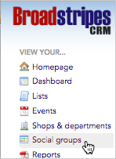
2. Select the **organization** where you want to add the new social group. 
3. This will take you to the **social groups index page** which shows the social groups that have already been created for the selected organization. 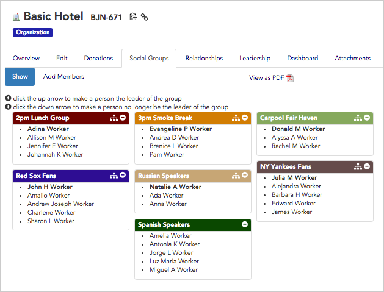
4. To create your new social group, click the "**Add members**" tab. 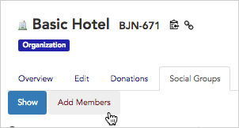
5. You'll see a **list of all the workers** at the organization. Scroll to one of the workers you want to include in your new group, and **click the plus icon** next to their name. 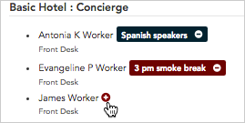
6. In the text box, **type the name of the new group** you want to create and then click **Save**.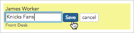
7. Broadstripes will create a new social group and automatically add the new member.
8. You can continue to **add more workers** to the new social group in the same way. If you just **type the first few letters of the social group** you want, it will appear in a drop-down list, so you don't have to type the group's full name each time.
9. When you're done adding workers, **click the "Show" tab.** 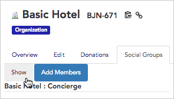
10. You'll see your completed social group. 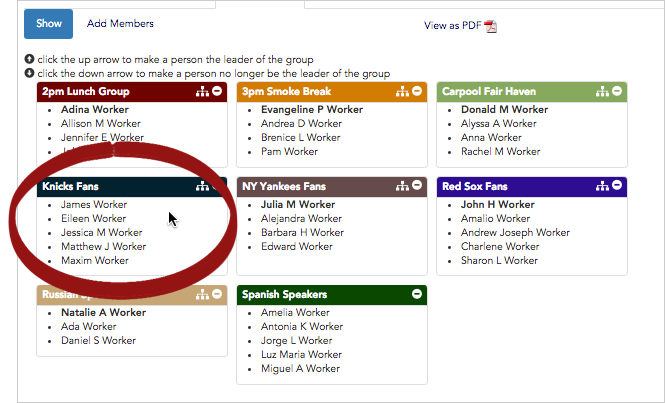
11. To **delete a member** of the group, just **hover over** their name and **click the minus sign icon** that appears. 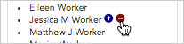

## Select (or remove) the leader of a social group

In the last section, we created a new social group and added workers to it. Now we'll give the social group a leader and show how to turn that leader and their followers into Broadstripes organizing leadership:

1. To **select** a certain worker as a leader, they must already be a member of the group they're going to lead (see above for how to add a member). Once they are part of the group, hover over and **click the up arrow icon** next to their name. 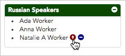
2. The new leader will appear at the top of the social group in **bold**. 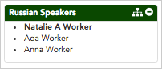
3. To **remove** the leader, hover and **click the down arrow** next to their name. They will remain in the group, but no longer be the leader. 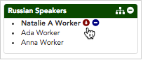

## Use social groups to create a leadership structure

Social groups can be a great shortcut for creating a lasting leadership structure in your project. Here's how:

1. In any social group where you've identified a leader, you'll see the **leadership tree icon** .
2. **Click the leadership icon** to open a dialog box that will walk you through creating a leadership structure. 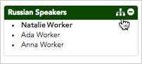
3. When the dialog box opens, you can choose from several options:
    - By default, Broadstripes will set the social group leader as the new leader of any workers in the group **who do not already have a leader**.
    - Select "**all**" to set the social group leader as the new leader of **all workers** in the social group, overriding their previous leadership settings.
    - Select "**none**" to deselect all workers in the social group, then individually check the workers you would like the social group leader to lead. 
4. Click **Create Structure** to save your changes.
5. Broadstripes will automatically make updates to the Leadership structure based on your choices. Click the "**Leadership**" **tab** to see the new structure you've created. 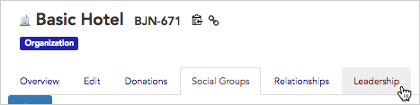
6. On the Leadership index page, click the **"View Tree" tab**. 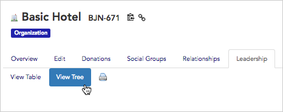
7. **Double-click** any tree node to expand the branches and see your updates. 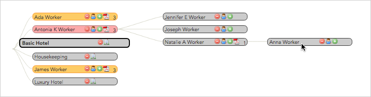

## Delete or rename a social group

1. To **delete** **the social group** entirely, **click the minus sign icon** in the upper right corner of the social group and click **OK** to confirm the deletion. The members of the group will remain in your project as contacts, but will no longer be associated with the deleted social group. 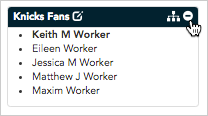
2. To **rename** the social group, **click the edit icon** next to the group's name. **Type the new name** in the dialog that appears and click **OK**. 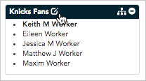

\[/et\_pb\_text\]\[/et\_pb\_column\]\[/et\_pb\_row\]\[/et\_pb\_section\]
