\[et\_pb\_section fb\_built="1" admin\_label="section" \_builder\_version="4.16" global\_colors\_info="{}"\]\[et\_pb\_row admin\_label="row" \_builder\_version="4.16" background\_size="initial" background\_position="top\_left" background\_repeat="repeat" global\_colors\_info="{}"\]\[et\_pb\_column type="4\_4" \_builder\_version="4.16" custom\_padding="|||" global\_colors\_info="{}" custom\_padding\_\_hover="|||"\]\[et\_pb\_text admin\_label="Text" \_builder\_version="4.17.4" background\_size="initial" background\_position="top\_left" background\_repeat="repeat" global\_colors\_info="{}"\]

## Overview

**Events** are one type of custom field in Broadstripes. Each event can be created to contain one or more “**steps**” (checkboxes) to capture particular actions in the workflow of a given campaign activity.

Some examples of when you might use events include recording a worker’s involvement in rallies and marches, or the the signing of a petition or union card.

\[caption id="attachment\_2429" align="aligncenter" width="300"\]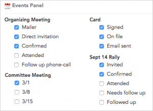 Once **events** and **steps** have been created for a project, they will appear on the Events Panel.\[/caption\]You should use events to record information that occurred at a certain time, whereas you’ll use [built-in fields](https://help.broadstripes.com/help-articles/admin-tools/data-tools-admin/built-in-data/) or [custom fields](https://help.broadstripes.com/help-articles/admin-tools/data-tools-admin/custom-fields/) to record information that is always true.

If you'd like to learn more about what events are and exactly when they should be used, take a look at the [Create events to track your goals](https://help.broadstripes.com/help-articles/using-broadstripes/customize/create-events-to-track-goals/) article in the User Guide.

If you're ready to get started with events, here's how to create, deactivate, edit, or delete an event:

## Create an event

Together, events and event steps let you track information that's important to your organizing efforts.

In this example, we'll set up an event for an external organizing card-signing drive named "**Card**" with steps named "Signed," "On file," and "Email sent."

(If you want to understand when it's appropriate to use events and when it's better to use another data object, please review the [Data tools overview](https://help.broadstripes.com/help-articles/admin-tools/data-tools-admin/data-tools-overview/) article or the [Create events to track your goals](https://help.broadstripes.com/help-articles/using-broadstripes/customize/create-events-to-track-goals/) article.)

1. Click on the **Events** link on the left-hand navigation panel.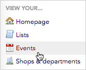

1. That will take you to your project's **events index page**, which lists the active events in the project. (See inactive events by clicking the "Inactive" tab.)
2. Click the **\+ New Event** button in the upper-right corner. A **new row** will appear at the top of the list.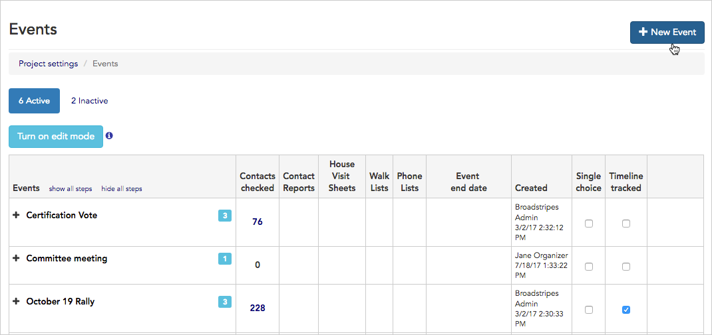

1. Enter the **Name** of the event (e.g. "Card"), and a **description** if appropriate.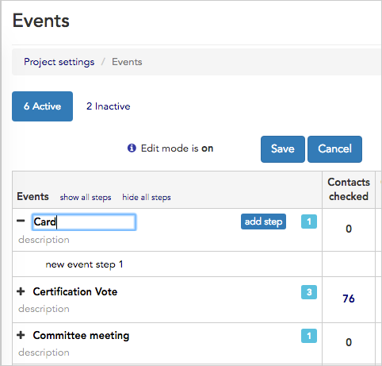
2. Next, add the checkboxes or "**event steps**" you want to see for your event. Click on the text area labeled **“new event step 1”** to add the first step. Click the blue **add step** button to create as many additional **steps** as you need for the event (following our example, this event will have the steps "Signed", "On file," and "Email sent").
3. When you're done, click **Save** to add the event to the project.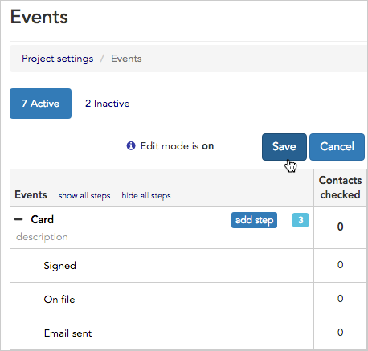

1. Just follow the steps above to create as many events as you want for each project (there is no limit to how many events you have).

## View an inactive event

When an event ceases to be relevant to the active organizing work, you can [make the event inactive](https://help.broadstripes.com/help-articles/admin-tools/data-tools-admin/creating-an-event/#ftoc-heading-5). Inactive events are grouped separately on many forms so that they don't get in your way. You can click the **Inactive tab** to see only inactive events.

\[caption id="attachment\_21649" align="aligncenter" width="292"\]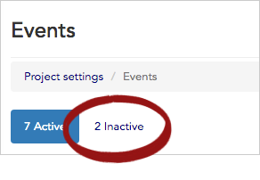 Click the **Inactive tab** to see only inactive events.\[/caption\]

After creating an event, you can use the checkboxes displayed on each event's row to indicate whether the event is **Single choice** (so that only one step can be checked at a time), and whether the event is **Timeline tracked** (requires the user to enter a timeline note whenever the event's value is changed).

You can read more about event options (single vs multiple choice, timeline tracking, and so on) in the [Create events to track your goals](https://help.broadstripes.com/help-articles/using-broadstripes/customize/create-events-to-track-goals/) article.

## Make an event inactive

If you have an event that's no longer important to your current work, but you aren't ready to delete the information it tracks, the event (and all its steps) can be deactivated. Deactivating an event means it is hidden from your users' view; you also won't be able to search or report on it. If you ever want to retrieve the data from an inactive event, just make it active again.

Here's how:

1. 1. Click on the **Events** link on the left-hand navigation panel. That will take you to your project's event index page, which lists the active events in the project. (Inactive events are available on the other tab.)

[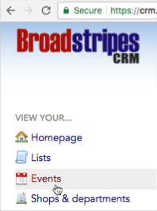](https://help.broadstripes.com/wp-content/uploads/2018/03/9806f7d-EventNavigation.png)

1. 1. First, click the **Turn on edit mode** button to access additional editing features.

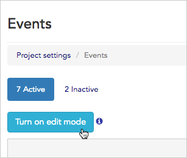

1. 1. Next, find the event you want to deactivate in the list, and click the **deactivate** link at the end of that event's row.

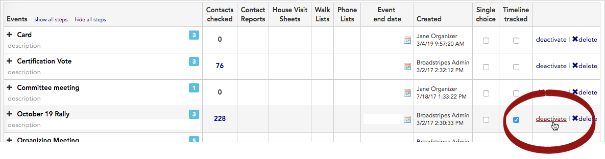

1. 1. 1. The event is now inactive.

### Calculated columns and inactive events

If you have a calculated column whose search text refers to an inactive event or any of that inactive event's steps, the column's calculations will still display. To hide the column, delete the column from your layout or report.

### What if I want to see the event data again?

The data in a deactivated event remains in Broadstripes' database. Because it's inactive, the event and all its steps will disappear from data-entry forms, and they won't show up on reports. You also won't be able to search using values from that event as your search criteria.

If you decide that you need to see the data again (or use it for a search or in a report), you can simply re-activate the event. Here's how:

## Re-activate an inactive event

1. 1. Click on the **Events** link on the left-hand navigation panel to get to your project's event index page.
    2. Click the **Inactive** tab to see all your project's inactive events.
    3. Click the **Turn on edit mode** button to show additional features.
    4. Find the event you want to reactivate in the list, and click the **activate** link at the end of that event's row.
    5. The event and all its associated steps are now active, and the data will be viewable just as it was before being deactivated.

## Edit an event

1. Click on the **Events** link on the left-hand navigation panel.

1. That will take you to your project's **events index page**, which lists the active events in the project. (Inactive events are available on the other tab.)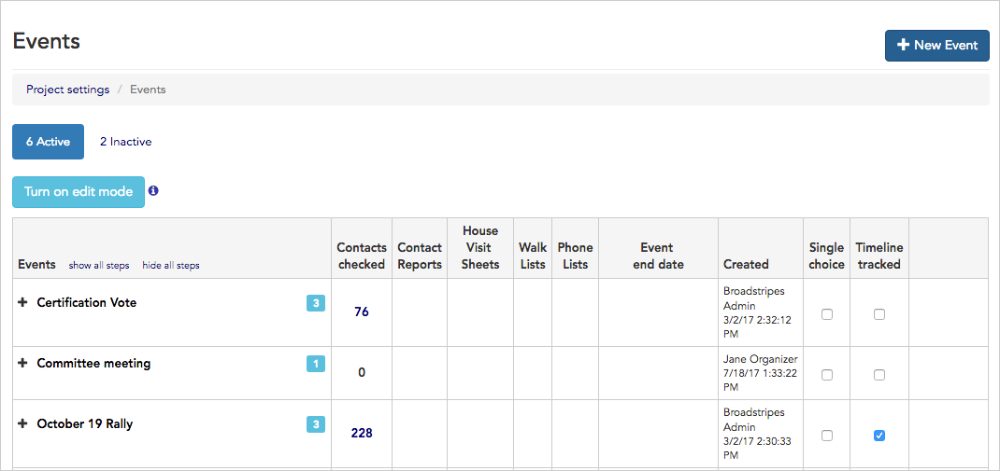

1. First, click the **Turn on edit mode** button to access additional editing features.
2. To edit an **event**, just click in the text area of the event name you want to edit and make your changes.
3. To edit **event steps**, click the plus sign to the left of the event name to expand the steps, then click in the text area of the step you want to edit. To **delete** a step, click the red "**delete step"** button.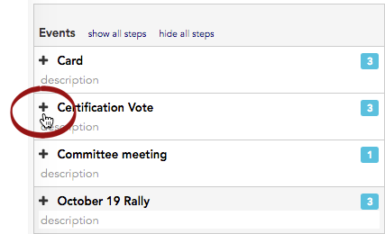
4. Save your changes.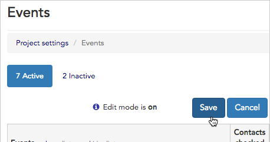

## Delete an event

###   Deleting an event is permanent

Deleting an event removes the event _and all its associated steps and history_ permanently from your project.

If you want to keep an event and its associated data in your project, but want it hidden from your users' view, you should **deactivate** the event rather than delete it. Read more in the "Make an event inactive" section of this article. You can also delete just the steps of an event by editing the event (see the "Editing an event" topic directly above).

1. To permanently delete an event, first make sure edit mode is on by clicking the "**Turn on edit mode"** button.
2. Next, click the "**delete**" link at the end of the row for the event you want to remove from your project.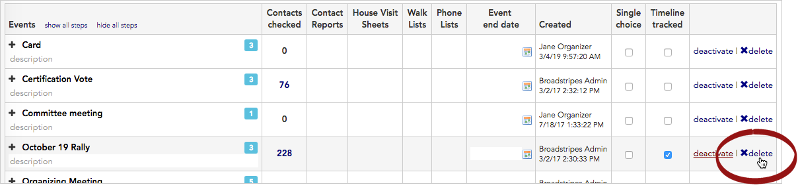
3. Broadstripes will prompt you to click **OK** to confirm the deletion.
4. The event and all its associated steps will be removed from your project. After deletion, the event and its steps will no longer show on any contact's record, and all history of the event will be gone.

## Learn more

You and members of your team can also read the [Create events to track your goals](https://help.broadstripes.com/help-articles/using-broadstripes/customize/create-events-to-track-goals/) article to learn about how different types of events work and how to add events to your data entry layouts.

\[/et\_pb\_text\]\[/et\_pb\_column\]\[/et\_pb\_row\]\[/et\_pb\_section\]
