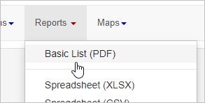
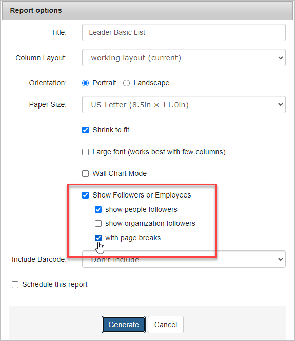
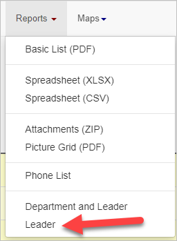
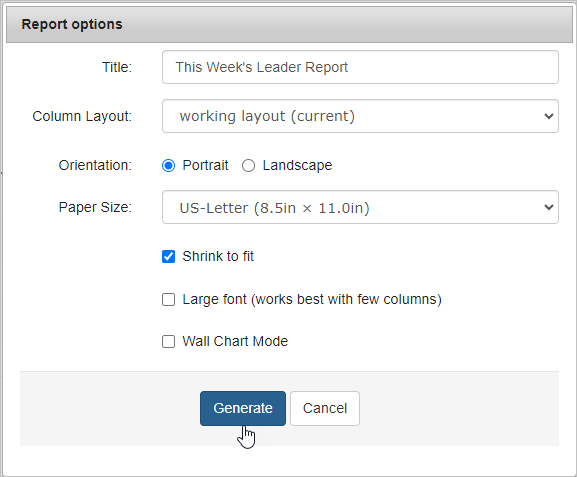

Creating reports for the organizing leaders in your project is essential for organizing efficiency. You can generate these reports in a couple of different ways, and this article will guide you through the process for each:

### The **Basic List Report** Method

1. Modify your search layout to include all the data you want to see in this report
2. Search for a list of your leaders in the search box. (e.g. leads = any)
3. Select all search results. From the Reports menu, choose the "Basic List (PDF)".
4. When the Report Options pop-up window appears, name your spreadsheet and select the "Show Followers or Employees" option.
    - For a list of the people that the organizer leads, select "show people followers"
    - For a list of organizations that the organizer leads, select "show organization followers"
    - The "page breaks" option ensures that leader groups are separated onto distinct pages, facilitating the easy separation and distribution of the printed report to leaders.
        
        
5. Click the Generate button, and your report will be ready shortly.

 

 

### The **Leader Report** Method

1. Modify your search layout to include all the data you want to see in this report
2.  Use the search to pull a list of people who have a leader (e.g. leader = any)
3. Select all search results. From the Reports menu, choose the "Leader".
4. When the Report Options pop-up window appears, name your spreadsheet and select your output options. Broadstripes will group the people by Leaders and separate these groups into pages for easy distribution of printed reports.
5. Click the Generate button, and your report will be ready shortly.
