\[et\_pb\_section fb\_built="1" admin\_label="section" \_builder\_version="4.16" global\_colors\_info="{}"\]\[et\_pb\_row admin\_label="row" \_builder\_version="4.16" background\_size="initial" background\_position="top\_left" background\_repeat="repeat" global\_colors\_info="{}"\]\[et\_pb\_column type="4\_4" \_builder\_version="4.16" custom\_padding="|||" global\_colors\_info="{}" custom\_padding\_\_hover="|||"\]\[et\_pb\_text \_builder\_version="4.19.4" background\_size="initial" background\_position="top\_left" background\_repeat="repeat" hover\_enabled="0" global\_colors\_info="{}" sticky\_enabled="0"\]

## Overview

Data that is permanently relevant about the worker (such as "Shift" and "Issues of Concern") – but can’t logically be mapped to one of [Broadstripes’ built-in fields](https://help.broadstripes.com/help-articles/admin-tools/data-tools-admin/built-in-data/) – is best captured in a **custom field**.

## How is a custom field different from an event?

A custom field differs from an [event](https://help.broadstripes.com/help-articles/using-broadstripes/customize/create-events-to-track-goals/) in a few ways.

**Events** (which are covered in their own articles – [Using Events to Track Goals](https://help.broadstripes.com/help-articles/using-broadstripes/customize/create-events-to-track-goals/) and [Creating an Event](https://help.broadstripes.com/help-articles/admin-tools/data-tools-admin/creating-an-event/)) are probably the most widely-used custom data tool in Broadstripes. Use them to:

- record data that is being tracked for a **certain period of time** (such as a worker's involvement in rallies and marches)
- record important **one-time information** or **occurrences** (like the signing of a petition or union card).
- record information that can be captured using a **checkbox** (events do not allow any other data types)

**Custom Fields** may not be as commonly used as events, but custom fields have two key advantages:

- They can **capture a wide variety of data types** (text, date, checkbox, memo (long text), dropdown box, multi-select dropdown), whereas events can only use checkboxes to capture data.
- They are **more directly and permanently associated with the worker** (or organization) for which they are created than events, which are typically used to capture time-sensitive data.

## Examples of custom fields

Here are some examples of what custom fields often record:

- the date a worker signed a card
- a checkbox to indicate that a union member is in good standing with dues
- a multi-select dropdown box that allows you to indicate which issues are most important to each worker

Broadstripes allows you to create an unlimited number of numeric, date, checkbox, radio button true/false, text, and memo (longer text) custom fields. Custom fields can apply to people, organizations, or both.

Read on to learn more about working with custom fields:

## Create a new custom field

This section describes the process of creating one type of custom field called a "drop-down box." Custom fields can be set up to capture other data, too (dates, checkboxes and so on).  If you're still unclear about what custom fields are, or whether you need them to capture your data, please read [Data tools overview.](https://help.broadstripes.com/help-articles/admin-tools/data-tools-admin/data-tools-overview/)

For this example, we are going to capture the top area of interest (e.g. contracts, scheduling, or grievances) for a potential leader in a new custom field called "**Interests**":

1. Get started by logging in to your project as a user with admin permissions. Go to **Settings > Custom fields** in the upper right-hand corner of the page. That will take you to your project's custom field index, a page listing any custom fields already created in the project.

1. Create a new field by clicking the **\+ New Custom Field** button.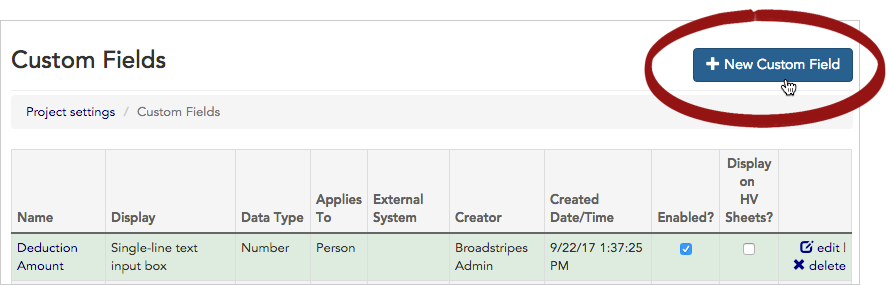

### Configure the custom field

Use the form that opens to create your new custom field.

1. **Name** the custom field. Use a clear and concise name, and avoid punctuation if you can help it — it makes searching on the field trickier.
2. Give the field a **Description**. The description will be displayed in a pop-up box as guidance for your users.
3. Check **Enabled**. If a custom field's data ever becomes irrelevant, but you are not ready to delete it, you can uncheck this box to disable the field.
4. (Optional) Link your field to the correct **External system**. A custom field linked to an external system is updated when you import a new spreadsheet. If no external system is selected, the field will need to be updated manually by users via data entry. For this example, we'll choose **Legacy CRM Database** as the external system since that is where our worker records will be imported from.
5. Next, for **Applies to**, select the **type of contact** the field will be used for (Person, Organization, or All contacts). For our example, we'll choose **Person**, since we are tracking a person's interests.
6. Choose the **Field type** to determine how your data choices will be displayed (e.g. radio buttons, check boxes, multiple-selection chooser, text input, etc). For our example, we'll choose **Drop-down Chooser** because we want users to choose from one of several pre-selected options.
7. Click **Save Custom Field** to advance to the next screen and customize your field type options (in our example, this means adding the choices that show up in the drop-down list we're creating).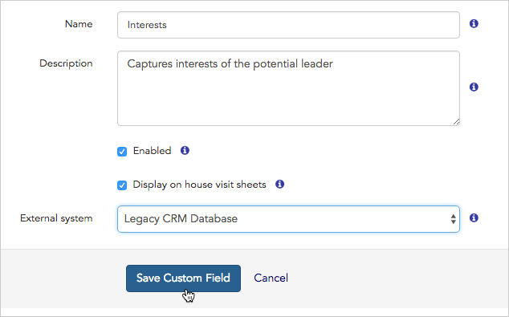
8. After saving, you'll have the chance to add your drop-down list options on a new screen.

### Add field value options

1. After clicking **Save**, you'll go to a new panel where you can begin to add the options you want to appear in the drop-down chooser.
2. Scroll to the bottom of the page where it says "**Add a new option:**" and type the **Name** of the first option (for instance, "Contracts") and click **Add Option**. Repeat this to add additional choices.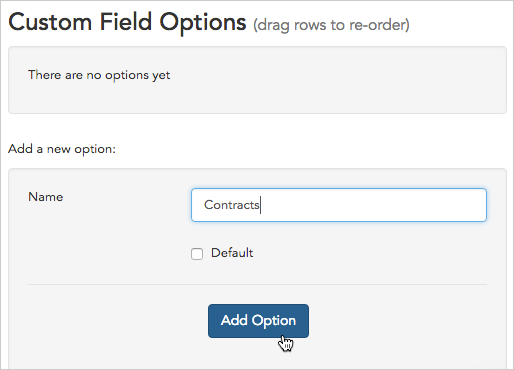

#### Indicating a default option

If you want a certain option to be selected automatically by default when your end users are entering a new contact in Broadstripes, check **Default** before saving that option.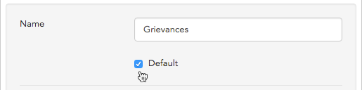

### Change the order of the drop-down values

1. Once you are done adding all of your options, you can **click and drag** to re-order the way they will appear in the drop-down.
2. Just **click and hold** the row you want to move. When the correct row is selected (it will be highlighted in yellow), **hold and drag** it to the new spot. **Release** to drop it in place.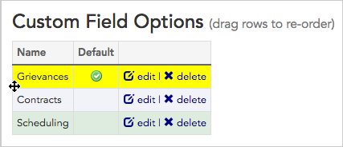
3. When you are done adding and rearranging your custom field options, click **Custom Fields** to see the new field you've created on the **Custom Fields overview** page.​

[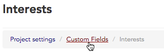](https://help.broadstripes.com/wp-content/uploads/2018/03/8033d11-CustDone.png)

## Edit, disable, or delete a custom field

1. Go to **Settings > Custom fields** in the upper right-hand corner of the page.

[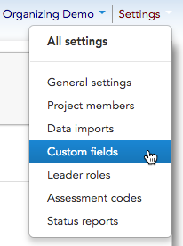](https://help.broadstripes.com/wp-content/uploads/2018/03/0605b74-CustomCustomFields.png)

1. From the **custom fields index page**, you can see all the custom fields that have been created for your project.
2. You can also edit, disable, or delete a custom field from this page by clicking **edit** (to edit or disable) or **delete** at the end of that field's row.

## Edit a custom field

1. Click **edit** on the right-hand side of the row of the field you want to modify.
2. First, you'll be shown the **configuration options page**.
3. Here you can edit the **name**, **description**, whether or not the field is **enabled**, or choose to link the field to an **external system**. If you need more details, all these configuration options are covered in the "Create a custom field" section above.

#### Field type cannot be edited

You will not be able to change the field type of your custom field — field type is chosen when the field is created and cannot be altered later.

1. You can make changes to the configuration options, or leave the configuration as-is and advance to field options, by clicking **Save Custom Field**.
2. You'll be shown a second panel, where you can **add**, **edit**, **delete**, or **rearrange** the **Custom Field Options.** Field options are the actual choices shown in the field's drop-down list, or the labels next to its checkboxes, radio buttons, etc.
3. Any changes you make will be saved as soon as you make them.
4. When your edits are complete, click the **Custom Fields** menu link to return to the custom field index page and see the changes you've made.

## Disable a custom field

If a custom field's data is no longer relevant, but you aren't ready to delete it, the field can be disabled. Disabling a field means it is hidden from your users' view; you also won't be able to search or report on it. If you ever want to retrieve the data from a disabled field, just re-enable the field. The data will be viewable again and nothing will be lost.

In this example, we'll be disabling a custom field named "Interests."

1. Start at the project's custom field index page by choosing **Settings > Custom fields** in the upper right-hand corner of any page.
2. Find the custom field you want to disable in the list, and click the **edit** link at the end of that field's row.

[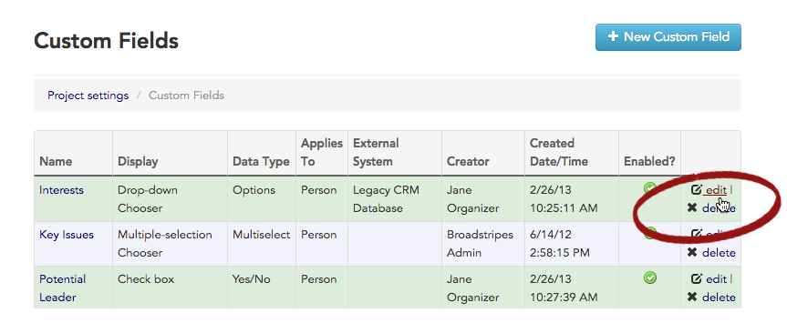](https://help.broadstripes.com/wp-content/uploads/2018/03/e67788b-CustAllEdit.png)

1. This will take you to the custom field's edit page.
2. Locate the **Enabled checkbox** and **uncheck** it.

[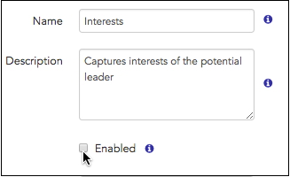](https://help.broadstripes.com/wp-content/uploads/2018/03/e4da610-CustDeselectEnabled.png)

1. At the bottom of the page, click **Save Custom Field**.
2. You'll be shown a second panel — just leave this as it is.
3. Click the **Custom Fields tab** to return to the custom field index page.

1. On the index page, you can see that your custom field is no longer enabled.

[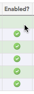](https://help.broadstripes.com/wp-content/uploads/2018/03/71f85da-CustDisabledDone.png)

### What if I want to see the data again?

The data in a disabled custom field remains in Broadstripes' database. Because it's disabled, it will disappear from data-entry forms, and it won't show up on reports. You also won't be able to search using values from that custom field as your search criteria. If you decide that you need to see the data again (or use it for a search or in a report), you can simply repeat the steps above. When you get to the custom field edit page (step 3), check **Enable** and save your change. The custom field's data will be viewable (and searchable) again.

### What if I have a calculated column based on a disabled custom field?

If you have a calculated column whose search text refers to a disabled custom field, its results will be inaccurate because search criteria involving that custom field will not work as they used to. The column should be changed or deleted.

## Delete a custom field

####  Deleting a custom field is permanent

Deleting a custom field removes the field _and all its associated data_ permanently from your project.

If you want to keep a custom field and its associated data in your project, but want it hidden from your users' view, you should **disable** the field rather than delete it. Read more in the "Disable a custom field" section above.

1. Start at the project's custom field index page by choosing **Settings > Custom fields** in the upper right-hand corner of any page.
2. To permanently delete a custom field, click **delete** on the right-hand side of the row of the custom field you want to delete.
3. Broadstripes will warn you that both the custom field and all data records held in the field will be deleted, and that the deletion cannot be undone.
4. Click **Delete** to remove the custom field and all associated data from your project.

[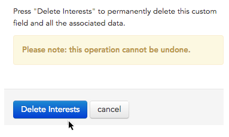](https://help.broadstripes.com/wp-content/uploads/2018/03/b09ee8f-CustDelete.png)

\[/et\_pb\_text\]\[/et\_pb\_column\]\[/et\_pb\_row\]\[/et\_pb\_section\]
