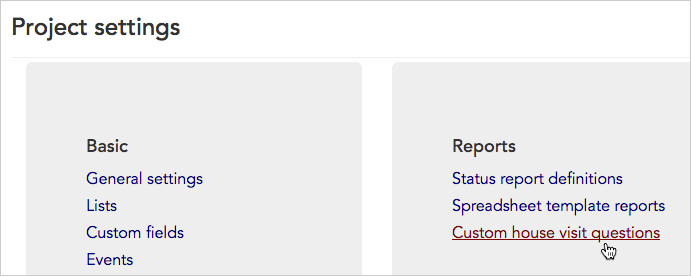
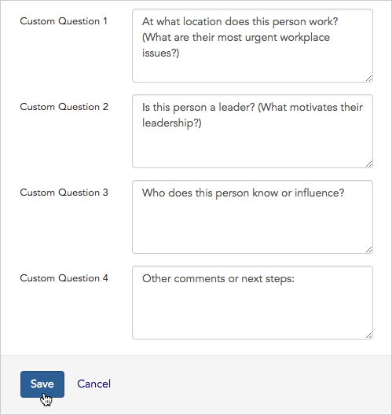
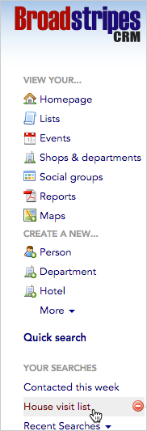
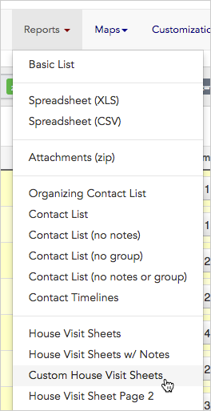
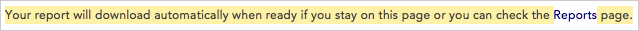
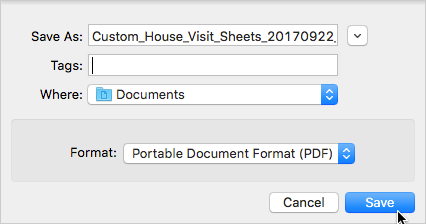

\[et\_pb\_section fb\_built="1" admin\_label="section" \_builder\_version="3.22"\]\[et\_pb\_row admin\_label="row" \_builder\_version="3.25" background\_size="initial" background\_position="top\_left" background\_repeat="repeat"\]\[et\_pb\_column type="4\_4" \_builder\_version="3.25" custom\_padding="|||" custom\_padding\_\_hover="|||"\]\[et\_pb\_text \_builder\_version="3.27.4" background\_size="initial" background\_position="top\_left" background\_repeat="repeat"\]

Broadstripes can automatically print individual question sheets for each person on your house visit (house call) list. As an organizer, you can use the sheets to prompt you and help you record answers to the questions that are most important to your campaign.

1. To get started, access **Custom house visit questions** by clicking **Settings** > **All settings** in the upper right corner of any page.

1. From the **Project settings page**, click the **Reports > Custom house visit questions** link.

1. Use the form that opens to enter up to four questions or talking points that organizers should cover during a house visite.
2. Click **Save** to record your work. A completed form might look like this:

1. Now that the questions are saved, we'll look at how to **print the house visit sheets**.
2. Since Broadstripes doesn't know who is on our house visit list, first, we'll need to search for and select the people to include before we can print our sheets.

We'll **run a saved search** to bring up our house visit list. If you don't already have a saved search like this, you can learn about creating your own saved searches in the [Create and save a search](https://help.broadstripes.com/help-articles/using-broadstripes/customize/create-and-save-a-search/) article.

1. Next, we'll select everyone in our **House visit list** search results by choosing **all** in the from the toolbar. (You could also select just a few people by checking the box next to their names.)

1. Finally, we'll select **Custom House Visit Sheet** from the **Reports drop-down menu**. This will generate a separate sheet for each person we've selected from the search results, and save it as a single PDF document.

1. After you give your report a **custom title** and click **OK**, you'll see a message explaining that your house visit sheets are being created and will download automatically.

1. To **view** and **print** your custom house sheets, you have two choices:
    
    1. 1. You can **stay on the current page** and wait for the **download dialog** to appear. When the dialog box appears, **name** your PDF file, choose **where** to save it and click **Save** to download the sheets immediately.
    
    
    
    1. You can **leave the current page** and download the sheets at a later time.  
        If you choose to download and print your house visit sheets later, click the **Reports** link in the left-hand navigation panel. That link brings you to the **Requested Reports index page**.

\[/et\_pb\_text\]\[/et\_pb\_column\]\[/et\_pb\_row\]\[/et\_pb\_section\]
