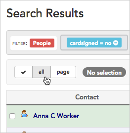
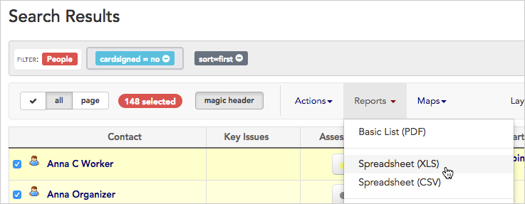
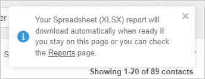
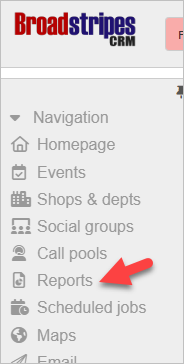

 

## Overview

The Broadstripes **Reports** function allows you to download a list to your local machine as a spreadsheet (.xls or .csv) where it will be accessible to you even if you are offline.

Once the information is in a spreadsheet format, you can manipulate and edit it as you see fit. Changes made to the downloaded spreadsheet will have no effect on the data in your Broadstripes project.

Your Broadstripes admin must grant you the **proper permission** to be able to download report files. See your admin if you need your **project member permission settings** edited to allow downloading CSV / Excel files.

## Download a spreadsheet list

1. To download a list in spreadsheet format, start by **running a search** for the workers on your list. (Learn about running a search in the [Search by workplace](https://help.broadstripes.com/help-articles/using-broadstripes/search/search-by-workplace/) or [Create and save a search](https://help.broadstripes.com/help-articles/using-broadstripes/customize/create-and-save-a-search/) articles.)
2. When your search results appear, click **all** to select all the results in the list below.

1. 1. All contacts will be selected (indicated by a **check** next to their name). **Uncheck** any person you want to _exclude_ from your list.
    2. Once your contacts are selected, click the **Reports** menu and choose the spreadsheet format you want: either **Spreadsheet (XLS)** or **Spreadsheet (CSV)**.

1. A **Spreadsheet options** window will open.
2. Give the file a **Title** and choose a **Column Layout** to determine which columns of data (fields) will be included in your printed list. (For more information about using layouts, see the [Choose a layout](https://help.broadstripes.com/help-articles/using-broadstripes/get-started/choose-a-layout/) or [Create and save a layout](https://help.broadstripes.com/help-articles/using-broadstripes/customize/save-a-layout/) articles.)
3. Choose additional options as needed:
    - Checking **One row per contact** will create one spreadsheet row for each contact; if a contact has multiple addresses they will each be listed together in the address column, separated by dashes (the same will happen for multiple employments or any other field that allows multiple values).
        - Leaving this **unchecked** will create a spreadsheet where multiple addresses are each on a separate row.
    - Checking **One column per contact info type (phone, email, address)** will consolidate data into separate columns for phones, emails, and addresses. This consolidation process will group all phone numbers into a single column, all email addresses into another column, and all physical addresses into a third column. You have the option to specify the separator that will distinguish each item within these columns. Choices include using a group of dashes (**\-----**) or a pipe character (**|**). You will also need to choose an option for your metadata (external systems, opt-in/out data, etc):
        - To include the metadata in the same columns as the phone number, email, or address, select **Yes, in the same column as the contact info.**
        - If you would prefer the metadata in a separate column, select **Yes, in a separate column**.
        - To not exclude the metadata, select **No, do not include**.
    - Checking **Seperate contact info columns by external system** will generate additional columns with contact info that was imported with an external system id.
    - Checking **Show Followers or Employees** will create a spreadsheet row for each person (or organization), and additional rows for each of their followers (or employees).
    - Checking **Schedule this report** will enable an additional section in which you can schedule future and recurring report generation and automatic delivery to specified users or user groups.
4. Click **Generate**. This will create the spreadsheet "report" you can download.
5. You'll see a message explaining that your spreadsheet report is being created and will download automatically.
6. To download your spreadsheet now, you have two choices:

1\. You can **stay on the current page** and wait for the report's **download confirmation** to appear in your browser.

2\. You can **leave the current page** and **check in later** to see if the report is ready (larger reports may take some time). To check for the report later, click the Reports link in the navigation panel. That link brings you to the Requested Reports page, where you can select and download the report.

\[caption id="attachment\_2249" align="aligncenter" width="333"\] Click the file's name to download it from the **Requested Reports page.**\[/caption\]

1. Once you've downloaded your spreadsheet list, you can **open** and **edit** it as you would any other .XLS or .CSV document.
