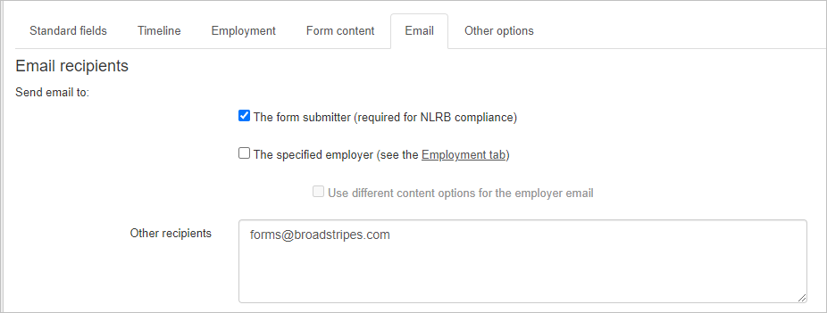
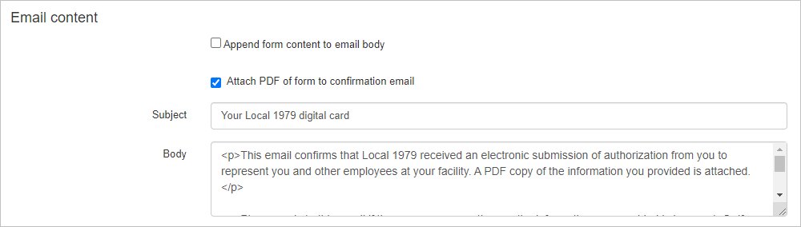
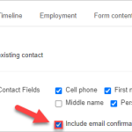
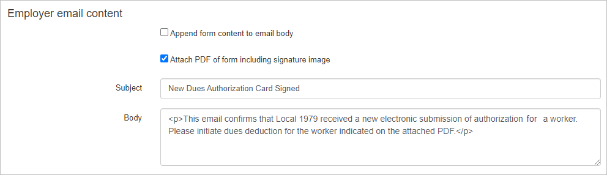

## Overview

As an admin, you can send copies of completed public forms to third parties, such as employers, or directly to the form submitters. This article will walk you through how to set up email recipients and customize the confirmation emails that are sent upon form submission.

1. To get started, select the **Email** **tab** in the [public form editor](https://help.broadstripes.com/uncategorized/standard-fields-tab-in-public-form/).
    
    \[caption id="attachment\_27140" align="aligncenter" width="926"\]
    
    _**Email recipient section**_
    
    \[/caption\]
2. In the **Email recipients** section, check the box labeled **"The form submitter"** if you want the form submitter to receive a copy of their form submission.
3. If you need to send a confirmation email to the employer indicated on the form, check the box labeled **"The specified employer."** You can also choose to create a custom subject and body for the employer’s email by selecting the **"Use different content option for the employer email"** checkbox.
4. In the **"Other recipients"** field, add any additional email addresses that should receive a copy of the confirmation email.
5. The **Email content** section allows the form editor to create a custom subject line and message for the confirmation email recipient.
    
    \[caption id="attachment\_27141" align="aligncenter" width="1000"\]
    
    _**Email content section**_
    
    \[/caption\]
    - The details of the form submission can be included in the email as a part of the body or as an attachment. To attach the form input as part of the email body, check **"Append form content to email body"**. If you would prefer the form input as a printable PDF attachment, click **"Attach PDF of form to confirmation email."**
    - Enter your desired custom subject line in the Subject field and the message in the Body field. The body field will accept basic HTML tags for styling and adding links.
        
        > **Note:** If it's legally required that the form submitter receives a copy of their submission, consider adding an email confirmation field to the form to ensure they enter their correct email address. You can set this up in the **Standard Fields** tab. (Learn more about enabling email confirmations [here](https://help.broadstripes.com/help-articles/admin-tools/public-forms/standard-fields-tab-in-public-form/#emailconf))
        
        
6. If you selected the "Use different content option for the employer email" in the Email Recipients section, the **Employer Email Content** section will become available. Here, you can create a unique subject line and message specifically for the employer’s confirmation email.
    
    \[caption id="attachment\_27144" align="aligncenter" width="992"\]
    
    **_Employer email content_**
    
    \[/caption\]
7. Once you've finished setting up your email recipients and content, click **Save** or proceed to the next tab to continue customizing your public form.

 

1. [Create a new contact type](https://help.broadstripes.com/help-articles/admin-tools/public-forms/first-step/) 
2. [The "Standard fields" tab](https://help.broadstripes.com/help-articles/admin-tools/public-forms/standard-fields-tab-in-public-form/)
3. [The "Timeline" tab](https://help.broadstripes.com/help-articles/admin-tools/public-forms/timeline-tab/)
4. [The "Employment" tab](https://help.broadstripes.com/help-articles/admin-tools/public-forms/employment-tab/)
5. [The "Form content" tab](https://help.broadstripes.com/help-articles/admin-tools/public-forms/form-content-tab/)
6. [The "Other options" tab](https://help.broadstripes.com/help-articles/admin-tools/public-forms/other-options-tab/)
7. [Viewing and Downloading public forms](https://help.broadstripes.com/help-articles/admin-tools/public-forms/viewing-and-downloading-public-forms/)
