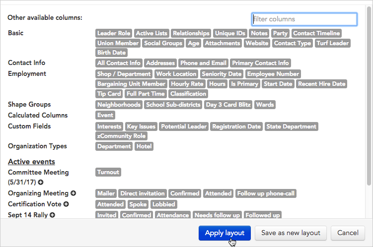
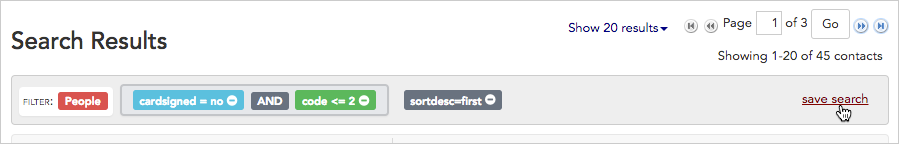
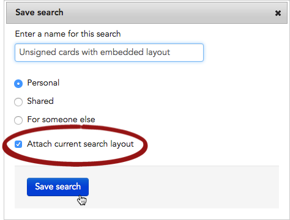
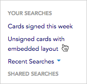

\[et\_pb\_section fb\_built="1" admin\_label="section" \_builder\_version="3.22"\]\[et\_pb\_row admin\_label="row" \_builder\_version="3.25" background\_size="initial" background\_position="top\_left" background\_repeat="repeat"\]\[et\_pb\_column type="4\_4" \_builder\_version="3.25" custom\_padding="|||" custom\_padding\_\_hover="|||"\]\[et\_pb\_text \_builder\_version="4.4.8" background\_size="initial" background\_position="top\_left" background\_repeat="repeat"\]

Embedding a layout with your saved search means you'll see the same columns of data each time you run the search – without added steps.

1. To start, **run the search** that you want to embed with a new layout. (Learn more about creating searches in the [Search by name](https://help.broadstripes.com/help-articles/using-broadstripes/search/search-by-name/) or [Search with the search builder](https://help.broadstripes.com/help-articles/using-broadstripes/search/search-builder-build-an-advanced-search/) articles.)
2. **Add or remove columns** from the search results panel until you've created a layout that meets your needs.
    - Remove columns by clicking the  icon next to the column header.

- Add columns by going to the **Customization** drop-down menu and selecting "**Modify layout...**".

1. From the list of columns that appears, **single-click** on the name of any column you want to add to your layout, then click **Apply layout**.

\[caption id="attachment\_2593" align="aligncenter" width="751"\] Single-click any gray column name block to add it to your layout, then click "**Apply layout.**"\[/caption\]

1. Next, save the search. Click the **save search** link in the upper right corner of the search panel.
2. To embed the layout you just created, check "**Attach current search layout**" before saving. Each time the search is run in the future, Broadstripes will automatically display exactly the same columns of data that are in the current layout.
3. Click **Save search**. The search (with its embedded layout) will now appear in the **YOUR SEARCHES** list in the navigational panel on the left-hand side of the page.

\[/et\_pb\_text\]\[/et\_pb\_column\]\[/et\_pb\_row\]\[/et\_pb\_section\]
