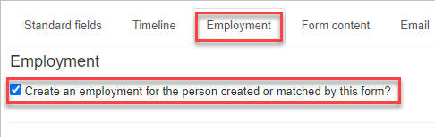
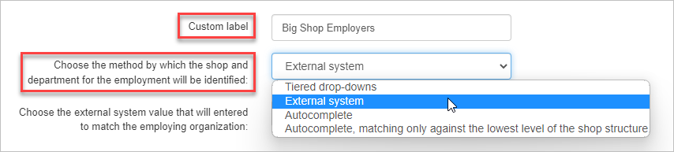
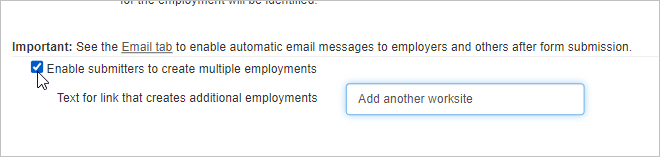

## Overview

The **Employment** tab allows you to create an employment relationship for each form submission. If you prefer not to, you can skip this tab and use the default settings.

## Create an employment relationship on your public form

1. To get started, select the **Employment** **tab** in the [public form editor](https://help.broadstripes.com/uncategorized/standard-fields-tab-in-public-form/).
2. To include employment information, check the **"Create an employment for the person created or matched by this form?"** checkbox. The record connected to the form submission will now be **associated with an employer**. 
3. Create a descriptive label for the employment input section using the **Custom label** field.
4. Next, **choose the method by which employment will be identified and matched**.
    - **Tiered drop-downs**: The form recipient will select their employment information via drop-down menus, starting with the highest level of employment and then department and subdepartment, if applicable.
    - **External system**: Broadstripes will use the [external system](https://help.broadstripes.com/help-articles/admin-tools/data-tools-admin/external-systems/) you choose to make an employment association. You will also choose which external system value will be matched.
    - **Autocomplete:** Broadstripes will automatically match existing shops/departments to recipients' input.
    - **Autocomplete, matching only against the lowest level of shop structure:** A form of auto-matching that will only match on departments at the lowest level(works best for projects with unique departments names). 
5. A form can be set to automatically send the employer a copy of the recipient's form submission. You will configure this option on the Email tab.
6. Check the "Enable submitters to create multiple employments" box to e**nable form recipients to create multiple employment** relationships. In the "Text for link that creates additional employments" field, enter a custom label for the link that allows them to add additional employments. 
7. Once you've configured your employment options, click **Save** or move on to the next tab to continue customizing your form.

- [Create a new contact type](https://help.broadstripes.com/help-articles/admin-tools/public-forms/first-step/) 
- [The "Standard fields" tab](https://help.broadstripes.com/help-articles/admin-tools/public-forms/standard-fields-tab-in-public-form/)
- [The "Timeline" tab](https://help.broadstripes.com/help-articles/admin-tools/public-forms/timeline-tab/)
- [The "Form content" tab](https://help.broadstripes.com/help-articles/admin-tools/public-forms/form-content-tab/)
- [The "Email" tab](https://help.broadstripes.com/help-articles/admin-tools/public-forms/email-tab/)
- [The "Other options" tab](https://help.broadstripes.com/help-articles/admin-tools/public-forms/other-options-tab/)
- [Viewing and Downloading public forms](https://help.broadstripes.com/help-articles/admin-tools/public-forms/viewing-and-downloading-public-forms/)
