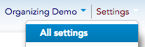
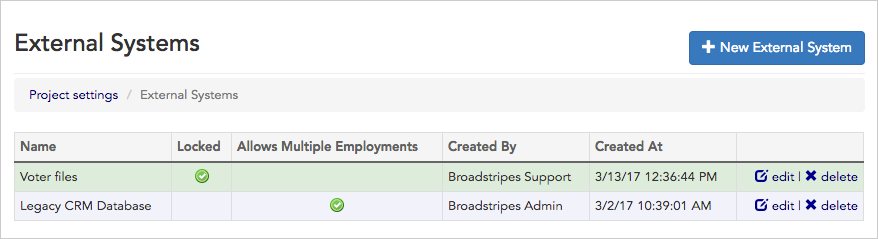
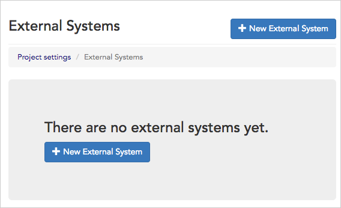

\[et\_pb\_section bb\_built="1" admin\_label="section"\]\[et\_pb\_row admin\_label="row" background\_position="top\_left" background\_repeat="repeat" background\_size="initial" \_builder\_version="3.0.105"\]\[et\_pb\_column type="4\_4"\]\[et\_pb\_text background\_position="top\_left" background\_repeat="repeat" background\_size="initial" \_builder\_version="3.0.106" background\_layout="light"\]

**External systems** capture unique IDs from other database systems. Created prior to import, external systems are useful for retaining IDs that you don't want to lose when you bring your records into Broadstripes.

External systems are also crucial if you plan to update worker records through the process of re-importing. As an administrator, you can easily view, edit, delete, or define new external systems for your Broadstripes project at any time from the **Project settings page**.

1. To get started, access **External systems** by clicking **Settings** > **All settings** in the upper right corner of any page.

1. From the **Project settings page**, click the **Basic > External systems** link.

1. The **External systems index page** will open, displaying all of the external systems you have set up. You can view and manage your project's external systems from this page.

If you haven't yet set up any external systems, your index page will open with a button to create a **\+ New External System.**

1. For details on how to edit, delete, or create new external systems, go to the [External systems](https://help.broadstripes.com/help-articles/admin-tools/data-tools-admin/external-systems/) section of the knowledge base.

\[/et\_pb\_text\]\[/et\_pb\_column\]\[/et\_pb\_row\]\[/et\_pb\_section\]
