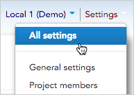
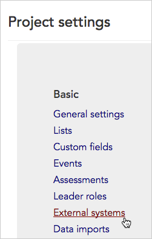
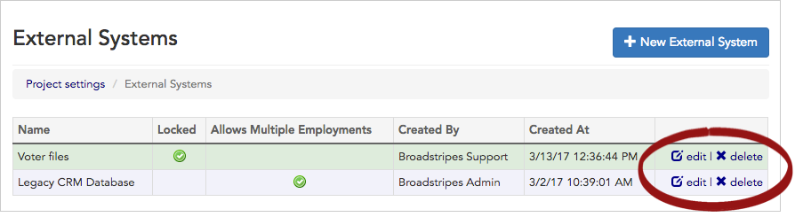
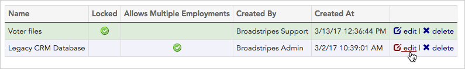
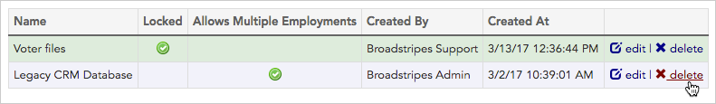
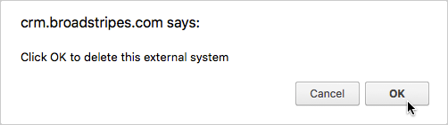

## Overview

Importing or updating from another database? Do you plan to re-import from that same database again in the future? An **external system** can be a big help.

If your worker list is from another database and contains a **unique ID** for each worker (for example, an employee ID from an employer's "excelsior list" or a member ID from a union membership system), Broadstripes allows you to import that ID along with the worker record.

To do that, you need to first create an "**external** **system**" in Broadstripes.

Here's how it works:

## Create a new external system

Creating an external system and storing its IDs is crucial when the same workers are likely to be updated in Broadstripes in the future through re-importing.

1. Go to **Settings > All settings**

1. In the **Basic** group, choose **External systems**
2. Click on the button to add **\+ New External System**
3. Give your system a **System Name** that will be memorable—this is the name you'll see when you choose an external system for future imports.
4. **Locked:** Locking the external system prevents the data associated with that system from being edited or deleted in Broadstripes.

#### Check "Locked" if ...

you want to have all of the data you import be “read only”.

_Example:_ You **check Locked** because you are importing political affiliation information from voter files. You want to be able to view this data in Broadstripes, but you don’t want users to alter critical information that is essential to voting (like their exact registered name). You plan to update the voter file annually from a list provided by the state.

* * *

#### Leave "Locked" unchecked if ...

you want the ability to edit or delete the data using the Broadstripes app. (Note that if you re-import data from the External System, your edits will still be overwritten).

_Example:_ You **leave Locked unchecked** because you are importing your entire worker file for the first time. You expect to use Broadstripes to maintain most aspects of the records moving forward. However, you want to maintain the legacy ID numbers from your previous system because you plan to update which workers have paid dues from a list provided by HR.

1. **Enforce uniqueness:** Check this option if two records should not share an external system ID. External systems with **Enforce uniqueness** enabled can not be used on a public form.
2. **Allows multiple employments:** Uncommon. Check this if the external system tracks employment data and at least one worker has more than one employment recorded in the system. Importing multiple employments is an advanced task. Documentation on that process is in the works.
3. **Autosubmit:** Checking this option enables the app to identify the unique identifiers in the search box. It then automatically looks for records linked to the identifier without requiring a full search submission or clicking the search button.
4. Click the button to **Save External System**
5. You’ll see your newly created External System in the list of registered external systems on the **external systems index page**.

### Next steps

You've given Broadstripes all the info it needs to be aware of your external system.

When you're ready to import your data, you'll simply **map the column** containing the unique IDs on your spreadsheet to the correct column in Broadstripes. As a rule of thumb, the correct column in Broadstripes will use this naming convention: the name of  your external system plus the letters "ID". For example, if you've created an external system named "Big Shop," you'll map to "Big Shop ID."

## Edit or delete an external system

After an external system is created, you can always go back and make changes. You can even delete it if you decide it won't be used again for future data updates.

1. Go to **Settings > All settings**

1. In the **Basic** group, choose **External systems**

1. That will take you to your project's **External systems index page**, which lists all the external systems created for the project.

1. You can edit or delete an external system from this page by clicking **edit** or **delete** at the end of that field's row.

## Edit an external system

1. Click **edit** on the right-hand side of the row of the external system you want to modify.

1. Make changes to the external system (including whether or not it is "locked").
2. Click the **Save External System** button when your changes are complete. You'll be returned to the **External system index page** where you can see the changes you've made.

## Delete an external system

#### Deleting an external system is permanent

Deleting an external system removes it (and all the unique IDs associated with it) permanently from your project.

This action **can't be undone.**

1. To permanently delete an external system, click **delete** on the right-hand side of the row of the event you want to delete.

1. Broadstripes will prompt you to click **OK** to confirm the deletion.

1. The external system will be removed from your project.
