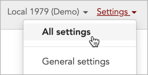
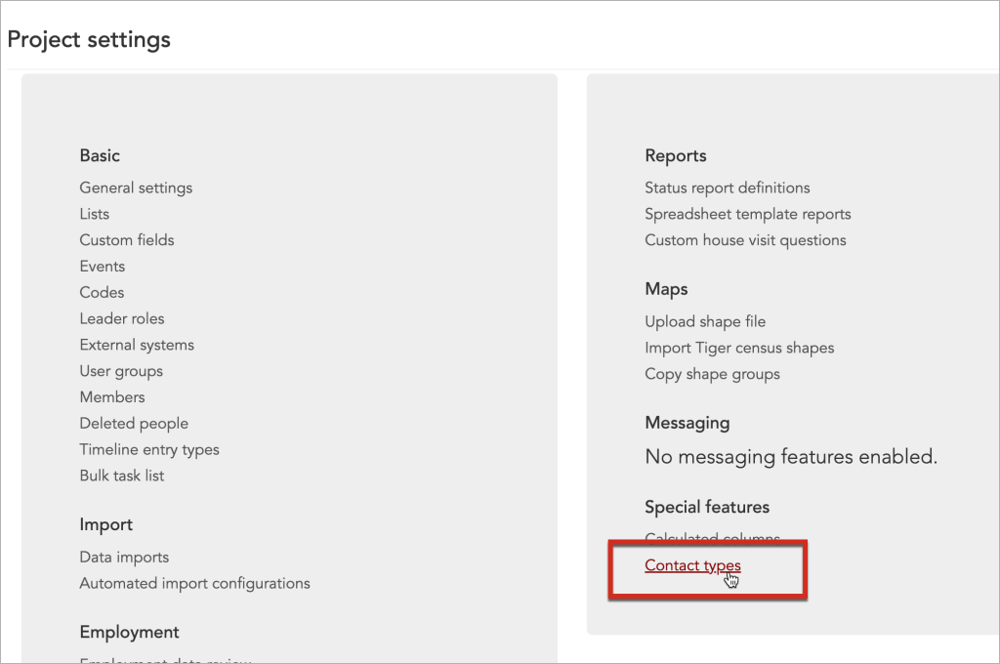
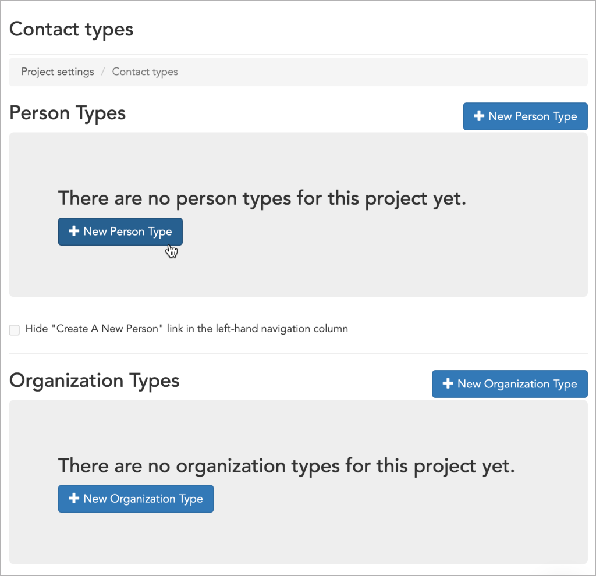
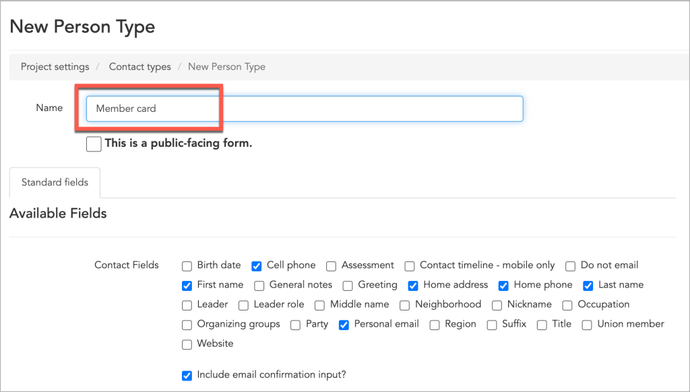
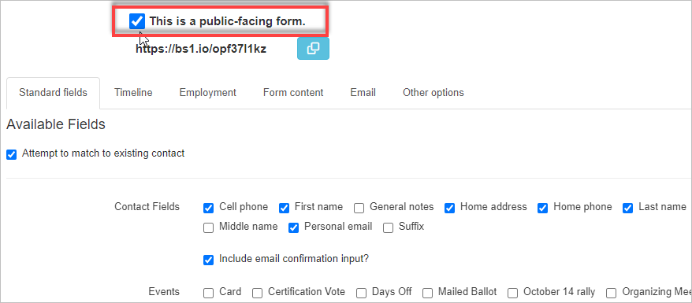

## Public forms are built on contact types

On the first page in this series, the [public forms overview page](https://help.broadstripes.com/help-articles/admin-tools/public-forms/public-forms-overview/), we looked at some of the different ways public forms could be used.

In this documentation, we'll create a public form to capture signed digital cards submitted by the members of a bargaining unit. To accomplish this we will need to:

1. Navigate to the Public forms page.
2. Click the New Public Form button for a person.

**NOTE:** Before we start, think about whether the form you want to build will, when submitted, create or update a person record or an organization record (i.e. a shop or department) in Broadstripes. In most cases, public forms are used to create or update people, not organizations. Therefore, this documentation describes the creation of a digital card public form for a person.

## Create a new contact type

To create a contact type or a public form, you must be an admin in your project. As with most admin-only functionality, Broadstripes' **Public forms** page is accessible via the Settings dropdown in the upper right corner of your screen.

1. Click **Settings** and then choose **All settings** to open the **Project settings** page. 
2. On the **Project settings** page, go to the **Special features** section and select **Contact types.**
    
    \[caption id="attachment\_25360" align="alignnone" width="1024"\] Your **Project settings** page may look slightly different depending on the features you have enabled for your project.\[/caption\]
3. On the **Contact types** page, click the **New Person Type**. (If you were creating a form to create or update an organization, you would, of course, click **New Organization Type**. As mentioned above, most forms are set up to create or update person records, so that's what we'll be describing here.) 
4. You should now see the contact type editor form.

## Turn your contact type into a public form

The next step in building our form is to name it and to switch from the standard contact type editor (where we left off in the last section) to the public form editor.

1. Type the name of your form into the "Name" field input box.
    
    ## 
    
2. \>Next, click the **"This is a public-facing form"** checkbox to switch the interface to the public form editor**.** Two things will happen when you do this:
    1. The permanent URL for your public form will appear below the checkbox. Anyone with this link will be able to open, complete, and submit the form. You don't need to copy it yet, but the blue button will allow you to do that when you want.
    2. The editor interface will change significantly — a set of tabs will appear below the checkbox.
3. At this point, you might want to click the "Save" button. This will take you back to the main **Contact types** page, but it will ensure that your form is saved under the name you want.

Your form has been created and is ready to be customized. The next step is to indicate which fields you want on your form. The best place to start is the "Standard fields" tab.

The following articles discuss the functional details of each tab on the public form editor.

- [The "Standard fields" tab](https://help.broadstripes.com/help-articles/admin-tools/public-forms/standard-fields-tab-in-public-form/)
- [The "Timeline" tab](https://help.broadstripes.com/help-articles/admin-tools/public-forms/timeline-tab/)
- [The "Employment" tab](https://help.broadstripes.com/help-articles/admin-tools/public-forms/employment-tab/)
- [The "Form content" tab](https://help.broadstripes.com/help-articles/admin-tools/public-forms/form-content-tab/)
- [The "Email" tab](https://help.broadstripes.com/help-articles/admin-tools/public-forms/email-tab/)
- [The "Other options" tab](https://help.broadstripes.com/help-articles/admin-tools/public-forms/other-options-tab/)
- [Viewing and downloading public forms](https://help.broadstripes.com/help-articles/admin-tools/public-forms/viewing-and-downloading-public-forms/)
