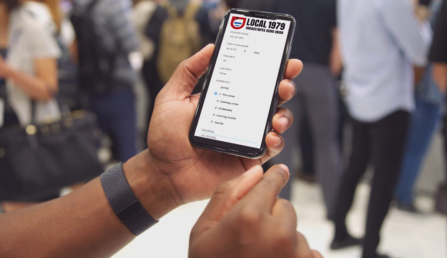
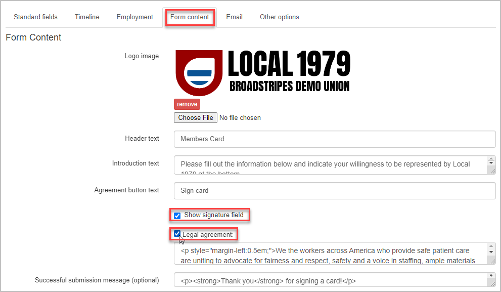

## Overview

## 

On the **Form content tab**, you can add additional content and fields to a public form including your organization's **logo**, **website** **links** and **custom style elements**.

## Add a logo and other content

1. To get started, select the **Form content** **tab** in the [public form editor](https://help.broadstripes.com/uncategorized/standard-fields-tab-in-public-form/).
2. Add a **logo image** by clicking the **"Choose File"** button and uploading your organization's logo. This will appear at the top of your public form. Horizontal banners tend to look best. The image file size should be under 100 kb for the best public form experience on a mobile device.
3. Below the logo, you can enter **Header Text**. This could be your organization's tagline or any title of your choosing.
4. In the **Introduction** field, add a brief explanation or instructions for the form recipients. This is a good place to tell them what actions to take with the form.

#### Customize your form with links and HTML styling

The **Introduction** text, **Agreement button** text, **Legal agreement,** and **Successful submission** message fields support hyperlinks and HTML tags, allowing you to format and style your text. (For additional styling needs, please contact us in-app support or support@broadstripes.com)

1. Customize your form's **submission button** with a call to action. Create your custom text for submitting in the **"Agreement button text"** field. The default label for the button is **Submit**.
2. Select the **"Show signature field"** checkbox to allow submitters to sign the form using their mouse or finger.
3. You also have the option of including a section for a **Legal agreement** that a recipient must check before submitting the public form. Check the Legal agreement checkbox and enter the **text** of your agreement in the box below.
4. In the **"Successful submission message field,"** enter the message that will appear after the recipient submits a public form. This could be a simple thank you or additional instructions.
5. **Save** or move on to the next tab to continue customizing your public form.

- [Create a new contact type](https://help.broadstripes.com/help-articles/admin-tools/public-forms/first-step/) 
- [The "Standard fields" tab](https://help.broadstripes.com/help-articles/admin-tools/public-forms/standard-fields-tab-in-public-form/)
- [The "Timeline" tab](https://help.broadstripes.com/help-articles/admin-tools/public-forms/timeline-tab/)
- [The "Employment" tab](https://help.broadstripes.com/help-articles/admin-tools/public-forms/employment-tab/)
- [The "Email" tab](https://help.broadstripes.com/help-articles/admin-tools/public-forms/email-tab/)
- [The "Other options" tab](https://help.broadstripes.com/help-articles/admin-tools/public-forms/other-options-tab/)
- [Viewing and Downloading public forms](https://help.broadstripes.com/help-articles/admin-tools/public-forms/viewing-and-downloading-public-forms/)
