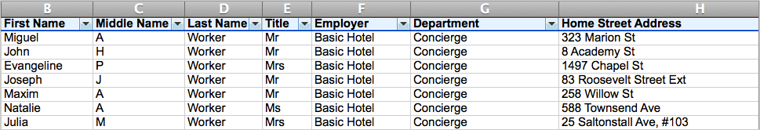

\[et\_pb\_section bb\_built="1" admin\_label="section"\]\[et\_pb\_row admin\_label="row" background\_position="top\_left" background\_repeat="repeat" background\_size="initial" \_builder\_version="3.0.105"\]\[et\_pb\_column type="4\_4"\]\[et\_pb\_text background\_position="top\_left" background\_repeat="repeat" background\_size="initial" \_builder\_version="3.0.106" background\_layout="light"\]

This article has headers, but needs content. NOTE: Headers should not be altered, as they are referred to in other linked articles.

START OF ARTICLE:

Prepare for a smooth import by making adjustments to your import spreadsheet.

## Naming column headers

Column headers are found in the first row of your import spreadsheet – they act as labels for the data in the rows below.

Your import files' **column headers** are the first row of your the spreadsheet (above, in blue). Column header names should match Broadstripes' built-in fields.

During the import process, Broadstripes will automatically try to match your import data to the fields that are built in to Broadstripes. It does this based on your spreadsheet's column headers in a process called "mapping." For the smoothest import, you'll want to take the time to name your spreadsheet's headers (in the first row of the spreadsheet) the same as Broadstripes' built-in field names.

Throughout this article, we'll be helping you by providing many of the build-in field names. Any of the words shown in **_bold italic_** refer to actual **built-in fields** in Broadstripes. A comprehensive list of additional built-in words can be found in the [Built-in data](https://help.broadstripes.com/v2018/docs/built-in-data) article.

## Formatting data

Each topic below includes some tips about formatting your data prior to the import process. Following these suggestions will make the import process smoother, but if you're having trouble following these best practices, please reach out to Broadstripes support for guidance.

### Names (required)

* * *

Each contact in your spreadsheet needs to have a name, whether it is a person or an organization.

**People** Broadstripes gives you a lot of flexibility when importing people's names, but it is important to store each part of a person's name in a separate column. For people, name fields include:

- **_Title_** A person's preferred title. e.g. Dr., Mrs., Ms., and so on. This is useful for mass mailings. **Correct inconsistencies** in the use of abbreviations and periods (e.g. Dr., Dr, Doctor) before importing.
- **_First name_**, **_Middle name_**, **_Last name_** Be sure that each name is in its own column.
- **_Suffix_** Any suffixes such as Jr., Senior, II, III. Importing these where available is particularly useful when multiple family members work for the same employer.
- **_Nickname_** Here you can put any nicknames that could help you identify or keep track of your workers. This allows you to retain the worker's legal name in your data while allowing people to search for them by the name they are commonly called.

**Organizations** Orgs have just two fields for storing name information:

- **_Name_** The official name of the organization.
- **_Nickname_** If the organization is commonly called something other than its official name, input it here. For instance, Saint Vincent Hospital's nickname could be SVH.

**Duplicates in name fields** Importing duplicate names for people is perfectly fine (and sometimes unavoidable), but for organizations, it is not recommended.

### Addresses and geocoding

* * *

Learn some formatting tips and tricks so Broadstripes will correctly map and geocode your address data during import.

### Phone numbers and email

* * *

What you need to know about formatting and cleaning up phone numbers, addresses, and preferred contact methods prior to import.

### Events

* * *

The term “**Event**” in Broadstripes is a little misleading, because events are a tool that has more flexibility and functionality than the name implies. You can use events to record and track literal union-organized events, like rallies and marches, but you can also use events to keep track of important one-time information or occurrences, like petition signatures or signing a union card. You can even use events for answering multiple yes/no questions about the workers in the bargaining unit.

In Broadstripes, an "Event" is simply a collection of named checkboxes. Broadstripes calls these checkboxes "Event Steps" because they help track one or more tasks within the event.

Labor organizing often involves tracking multi-step tasks like participation in a rally, card signings, or just answering multiple yes/no questions about the workers in the bargaining unit. Broadstripes allows you to capture information like this using a special kind of custom field called an **event**.

Broadstripes Events are intended to be both simple and flexible, to allow organizers to capture the huge variety of custom data that is involved in an organizing project. Despite the name, events are not used only for time-sensitive data. If you were already tracking information like this in your old system, you can easily import it; you'll just need to use the right format.

For example, if you're in the midst of following up with workers after holding an organizing meeting at a shop, your data might contain the following information:

• who was invited • confirmations to attend • who attended the event • whether individual follow-up is needed • a record that follow-up occurred

What this will look like one your spreadsheet:

Importing event data requires that you create an event, and then create as many "steps" under the event as you need to capture your data.

([http://docs.broadstripes.com/v2017/docs/capturing-custom-data](http://docs.broadstripes.com/v2017/docs/capturing-custom-data)).)

### Custom Fields

* * *

### Lists

* * *

### Employment info

* * *

### Leader roles

* * *

### Assessments

* * *

### User IDs

OLD: Use a data tool

## Creating a header row

## Naming columns

link to built-in field names For an easier import, re-label the column headers of your spreadsheet to match Broadstripes' built-in field names.

## Cleaning columns

- fix typos (link to excel help)

## Remove duplicates

link to excel help

FROM SARAH's EXCEL DOC: Using the Filter function in Excel

The Excel Filter function is an invaluable tool for finding errors and inconsistencies in your data. We’ll use this filter function to correct misspellings and enforce naming consistency.

\[/et\_pb\_text\]\[/et\_pb\_column\]\[/et\_pb\_row\]\[/et\_pb\_section\]
