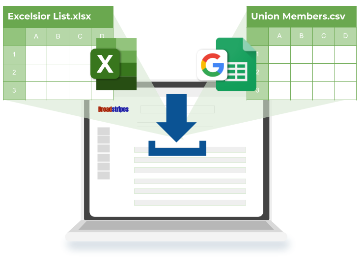
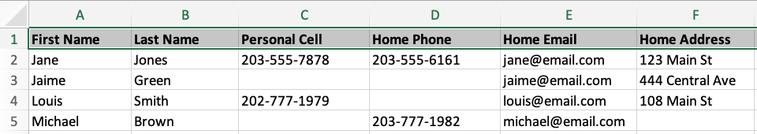

\[et\_pb\_section fb\_built="1" admin\_label="section" \_builder\_version="4.16" global\_colors\_info="{}"\]\[et\_pb\_row admin\_label="row" \_builder\_version="4.16" background\_size="initial" background\_position="top\_left" background\_repeat="repeat" global\_colors\_info="{}"\]\[et\_pb\_column type="4\_4" \_builder\_version="4.16" custom\_padding="|||" global\_colors\_info="{}" custom\_padding\_\_hover="|||"\]\[et\_pb\_text \_builder\_version="4.17.4" background\_size="initial" background\_position="top\_left" background\_repeat="repeat" global\_colors\_info="{}"\]

## Introduction

Congratulations! You've got a new Broadstripes project and you want to bring in your list to start organizing.

The easiest way to get a lot of worker data into Broadstripes quickly is through the import of one or more spreadsheets. Naturally enough, Broadstripes calls this process "**Data Import**."

Here’s a detailed list of the steps you’ll need to take to do your first data import:

1. [**Locate your data.**](#ftoc-heading-2) Try to identify and gather all the data you hope to import from any source. This may mean you have multiple data files in a folder on your computer.
2. [**Review and "clean up" your data.**](#ftoc-heading-3) Make sure the values in each column are valid and consistent across all rows. In addition, it's often necessary to "massage" the work location data to fit into the Broadstripes structure.
3. **[Name your spreadsheet columns](#ftoc-heading-4).** Importing a spreadsheet is faster and easier if the column headers already have names that Broadstripes recognizes and knows what to do with.
4. [**Set up the project to hold your data.**](#ftoc-heading-5) In your Broadstripes project, create any custom data fields necessary to contain the spreadsheet data.
5. [**Import your spreadsheet.**](#ftoc-heading-6) Using Broadstripes' data import tool, upload the file, map the columns, preview, run the import and examine the results.

Each of these steps will be discussed in detail in the sections below (and in the videos that accompany them). After a few times through, this process becomes second nature for most admins.

## 1\. Locate your data

Any organizing data you have (e.g. an excelsior list, BU list, an informal Google Sheet kept by the organizing team, or an existing organizing database) will likely be useful in Broadstripes. The trick is to get that data into spreadsheet form for import.

#### Spreadsheets with data on multiple tabs

If your spreadsheet contains multiple tabs, Broadstripes will only look at the first. If you need to import data from multiple tabs, you'll want to create separate files containing the data for each tab as the first tab in each file.

Broadstripes can import Excel (XLS, XLSX) or comma-separated value (CSV) files. Data from other spreadsheet apps (e.g. Google Sheets) can usually be exported or converted to one of those formats.

#### Importing contacts from the cloud

Do you have organizers or supporters with a lot of worker info in their phone’s contacts app or on a computer or the cloud? That data can often be exported to spreadsheet, and then imported to Broadstripes. Just be sure to get the data into one of the accepted formats (XLS, XLSX or CSV).

With Broadstripes, you can import as many spreadsheets as you want. If you have multiple spreadsheets, in most cases you should import them one-at-a-time rather than trying to merge them prior to import.

It’s been our experience that taking the time to merge spreadsheets isn’t worth the effort. This is true even with lists containing information about the same people. It’s usually easier to “clean up” a single sheet, import it, and then do additional imports using the Broadstripes “matching” feature – which allows you to match on a unique identifier, or on a combination of fields like name, work location, phone, or email address.

Matching is a powerful tool that we cover in another knowledge base article. In the meantime, if you need to import data about people who are already in your project, get in touch with your Broadstripes point person for a walk-through.

## 2\. Review and "clean up" your data

Once you've identified your different sources of organizing data and gotten them into spreadsheet form, you're going to want to review and "clean up" that data.

We walk you through each step of this process in the Knowledge Base page "Clean up a spreadsheet for import." Please review that page and the video it contains.

## 3\. Name your spreadsheet columns

The first row of your import spreadsheet is the "header row" (selected below). The text in the header row tells the import process where to put the data in that column for all the following rows.

The process of deciding where to put the data in each column is called "mapping." Broadstripes will automatically map a column whose header it "recognizes," and it will recognize both built-in and custom field names. The import process is faster and easier if the column headers are recognized and mapped automatically, so we suggest that you name your spreadsheet columns with this in mind before uploading it.

#### Learn about Broadstripes' built-in data and how to name headers

To understand what data fields are built-in to Broadstripes, and how to name your headers to be recognized as such, please refer to this Knowledge Base page: [Broadstripes data fields](https://help.broadstripes.com/help-articles/admin-tools/data-tools-admin/built-in-data/). Custom fields will also be recognized by Broadstripes as long as they're created in Broadstripes prior to import. This is covered in the next step.

If the text in the header cell of a column doesn't match anything Broadstripes recognizes, the import will default to skipping that column.

## 4\. Set up the project to hold your data

Now that you have your spreadsheet ready, it’s time to set up Broadstripes to accept your data.

This means customizing the app to your team's needs. Below is a list of all the areas you can customize to make Broadstripes a good fit for your data and for the way you plan to organize.

If you are new to Broadstripes, we suggest clicking each numbered link below. For each link, an article will open explaining what the customization is, how it can be used, and how to set it up for the first time to be used in your project. 

1. [Assessment/code values](https://help.broadstripes.com/help-articles/admin-tools/data-tools-admin/assessment-codes/)
2. [Leader roles](https://help.broadstripes.com/help-articles/admin-tools/data-tools-admin/leadership-roles/)
3. [Custom fields](https://help.broadstripes.com/help-articles/admin-tools/data-tools-admin/custom-fields/)
4. [Events](https://help.broadstripes.com/help-articles/admin-tools/data-tools-admin/creating-an-event/)
5. [External systems](https://help.broadstripes.com/help-articles/admin-tools/data-tools-admin/external-systems/) (aka "unique IDs")
6. [Tag lists](https://help.broadstripes.com/help-articles/admin-tools/data-tools-admin/tag-lists/)
7. Custom contact timeline types
8. Custom contact types

These customizations can be set up in any order, and you don't need to use all of them. You'll just need to customize the app for the fields for which you have data to upload.

Once all the necessary customizations are made, you're ready to upload your spreadsheet.

## 5\. Import your spreadsheet

You're now ready to upload your spreadsheet, map your columns, preview and run your import.

This important process is covered in detail in this Knowledge Base page: [Import a spreadsheet](https://help.broadstripes.com/help-articles/admin-tools/data-import-admin/import-a-spreadsheet/).

### Next steps

Go to**: [Import a spreadsheet](https://help.broadstripes.com/help-articles/admin-tools/data-import-admin/import-a-spreadsheet/)**

\[/et\_pb\_text\]\[/et\_pb\_column\]\[/et\_pb\_row\]\[/et\_pb\_section\]
