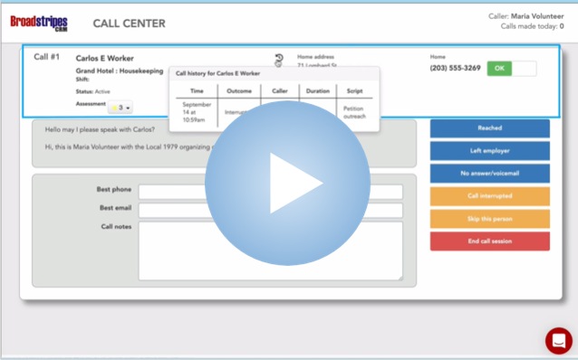

\[et\_pb\_section fb\_built="1" admin\_label="section" \_builder\_version="3.22"\]\[et\_pb\_row admin\_label="row" \_builder\_version="3.25" background\_size="initial" background\_position="top\_left" background\_repeat="repeat"\]\[et\_pb\_column type="4\_4" \_builder\_version="3.25" custom\_padding="|||" custom\_padding\_\_hover="|||"\]\[et\_pb\_text admin\_label="Text" \_builder\_version="4.9.4" background\_size="initial" background\_position="top\_left" background\_repeat="repeat" hover\_enabled="0" sticky\_enabled="0"\]

Hi there!

You've probably arrived at this page because you've been asked to help with a phone banking campaign.

The Broadstripes Call Center is a phone-banking app that makes phone outreach simple and effective.  This video will walk you through exactly how to get started including:

- who to call
- how to make your first call
- exactly what to say when you reach someone
- how to save the responses you get in the cloud to be shared with other organizers working on the campaign (spoiler: don't worry, Broadstripes handles this part automatically)

## Video: How to Use the Call Center for Phone Banking

\[/et\_pb\_text\]\[et\_pb\_code admin\_label="Call Center video" \_builder\_version="4.9.4" \_module\_preset="default" global\_module="23870"\]

### Using the Call Center

\[/et\_pb\_code\]\[/et\_pb\_column\]\[/et\_pb\_row\]\[/et\_pb\_section\]
