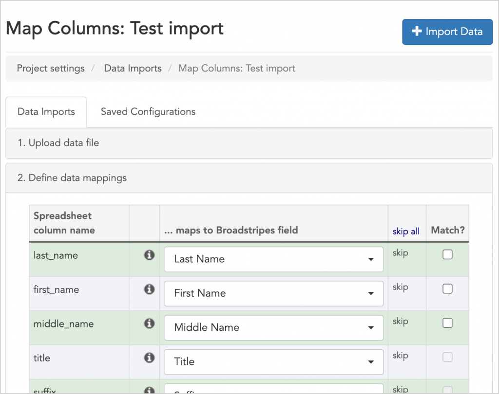
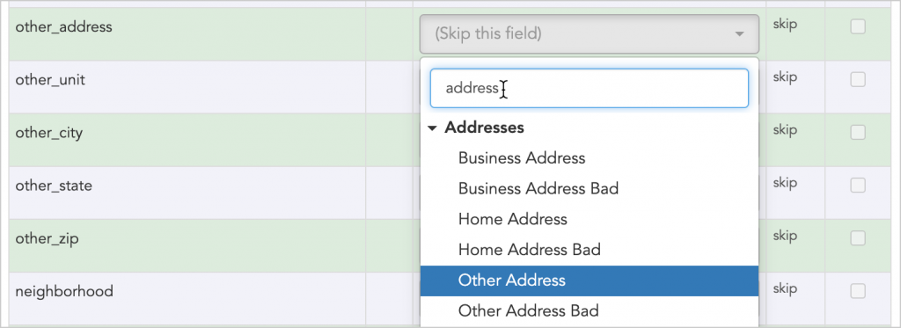
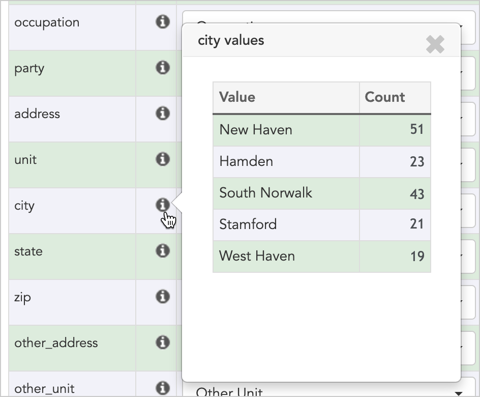
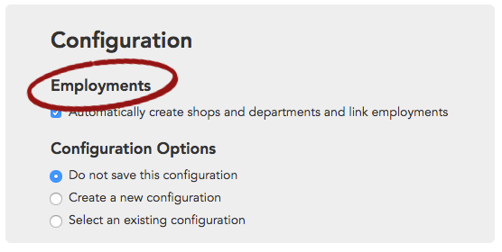
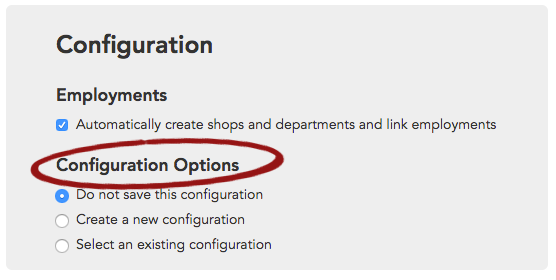
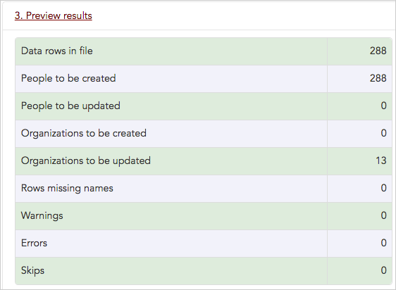
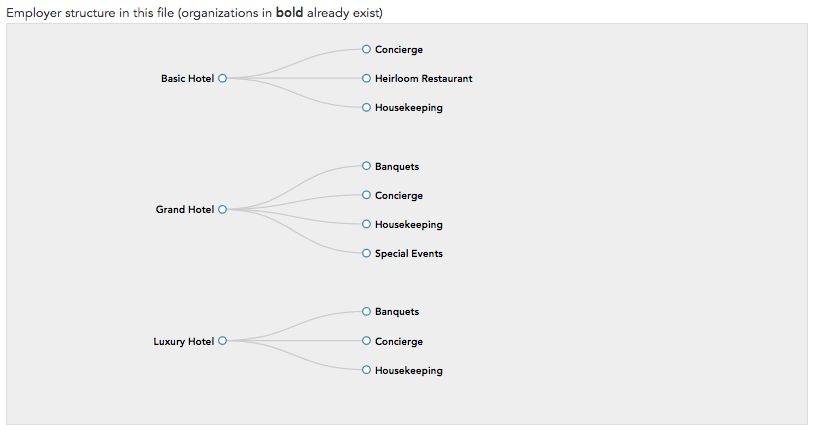
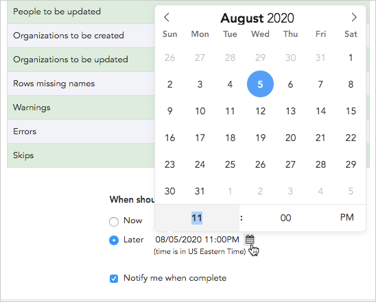

\[et\_pb\_section fb\_built="1" admin\_label="section" \_builder\_version="3.22"\]\[et\_pb\_row admin\_label="row" \_builder\_version="3.25" background\_size="initial" background\_position="top\_left" background\_repeat="repeat"\]\[et\_pb\_column type="4\_4" \_builder\_version="3.25" custom\_padding="|||" custom\_padding\_\_hover="|||"\]\[et\_pb\_text \_builder\_version="4.9.4" hover\_enabled="0" sticky\_enabled="0"\]

#### Required steps before you import a spreadsheet

If you haven't already done so, review the [Get ready to import data](https://help.broadstripes.com/help-articles/admin-tools/data-import-admin/get-ready-to-import-data/) guide. The guide will walk you through a number of essential steps to prepare your spreadsheet for import and set up your project to receive new imported data. Come back to this page when those prerequisites are in place.

Congratulations! Your project and your spreadsheet are ready to meet each other.

Here's how you to start the import:

1. If you're an admin for your project (and you must be an admin to run a data import), in the top-right corner of your page you'll see a drop-down link labeled **Settings**.
2. Click **Settings > Data Imports**.
3. This takes you to the **data imports index page**, which lists any data imports already run in the project.
4. Create a new data import by clicking the **\+ Import Data** button.
5. If you want, type a **name** for the import.

####   Should I name the import?

**Naming an import** is optional, but it allows you to provide a description that can jog your memory (for instance, "All Workers with Employments").  
**Unnamed imports** will be given the name of the import file (for example, "contact\_list\_01.csv").

1. Click **Choose file** to locate your spreadsheet on your computer and upload it to Broadstripes.

## Map your columns

1. Once you've uploaded your spreadsheet, Broadstripes will process it for a moment (time depending on file size), and open the **Data mapping panel**.

#### What is mapping?

 "Mapping" means that the data in a spreadsheet column will be transferred into a selected field in Broadstripes – during the mapping process, Broadstripes is learning which fields in your spreadsheet relate to fields in Broadstripes.

1. In the panel below, you'll see that Broadstripes has recognized some of your spreadsheet columns and automatically "mapped" them to the appropriate fields. Automatic mapping is based on the name of the column (the text in the first row of the spreadsheet).

1. With the **Data mappings panel** open, you can correct any mappings Broadstripes got wrong, and link any columns that weren't mapped automatically. Use the filter to focus your search (e.g. typing "address" will show only address-related Broadstripes fields).

\[caption id="attachment\_24186" align="aligncenter" width="743"\] Manually map any fields that haven't been automatically mapped using the drop-down list.\[/caption\]

### Some things to keep in mind when mapping your columns:

> - - Columns with **employment information** need to be mapped to the corresponding turf level fields to create a turf structure.
>     - Clicking the info icon that appears next to a spreadsheet column name will open a pop-up box that lists the unique values for that column along with a count of their frequency. This info can be useful for ensuring that your data is clean and properly mapped.\[caption id="attachment\_24224" align="aligncenter" width="491"\] Click the info icon to preview the actual data you are importing.\[/caption\]
>         - Any rows marked "**(Skip this field)**" will need to be manually mapped by you. If you don't want that data brought in, you can leave "**(Skip this field)**" as the selection for that column.
>         - We're going to ignore the "**Match?**" column for now. This is covered in a separate article about updating data via import.

1. Once you've mapped (or skipped) all the columns in your spreadsheet using the mapping panel, scroll down the page to the **Configuration panel**.

## Configuration options

The **Configuration panel** offers you some choices about how Broadstripes should handle your imported data. Depending on how you've mapped your data in the previous step, you may see different options in the panel.

### Employments

1. Choose how you would like Broadstripes to handle **Employments**.

Broadstripes can automatically create a new turf tree structure based on your employment columns.

- Check **Automatically create shops and departments and link employments** if your import file includes workers and information about their employments (job positions). This creates a new turf tree structure and automatically places employees in that structure during import.

#### Example: Automatically create shops and departments...

I'm importing workers and their employments for the first time, so I want Broadstripes to automatically set up the turf structure. I'll check **Automatically create shops and departments and link employments**.

### Configuration options

1. Choose a **Configuration option**.

Configuration Options addresses how Broadstripes will handle your field mappings.

- **Do not save this configuration** — select this if you don't need Broadstripes to remember the mappings you've just defined for future imports.
- **Create a new configuration** — select this if you want to save the mapping scheme you've just created.

#### Example: Create a new configuration

I'm importing data from an external system for the first time, and plan to re-import it in the future. I'll choose to **Create a new configuration**, then select the correct external system from the list. I'll also give the configuration a name that will be easy to remember when I need to use it again.

- **Select an existing configuration** — select this if you want to _overwrite_ all the mappings in the **Data Mapping panel** (at the top of your import page) with mappings from a _previously-saved_ mapping configuration.

####   Example: Select an existing configuration

I'm importing to update an external system that already has an existing mapping configuration. I'll choose **Select an existing configuration** and pick the configuration I want from the list.

1. After selecting your configurations, click the **Preview** button. In the next step, you'll have a chance to check for errors before you finalize your import.

## Preview the import

In the previous steps, you mapped your columns and selected your configuration options. Now we'll look at what happens after you've clicked the data import **Preview** button.

1. When you click data import's **Preview** button, Broadstripes will review and analyze your file for a moment (time depending on size), then open the **preview results panel**.
2. The **preview results panel** has two sections:
    - an upper section where you'll see statistics about the import, and any errors or warnings you need to know about
    - a lower section showing the way Broadstripes plans to create your employer structure (if you are not importing employment info, this area will be gray)
3. Let's look at the upper section first.

Here's a breakdown of the results you're looking at:

> **Data rows in file** is the number of rows Broadstripes has found in your spreadsheet (if you are comparing the number to your spreadsheet, remember that Broadstripes isn't counting the header row).
> 
> **People to be created** is often the same as "Data rows in file". A few cases where it might be different are if you're re-importing to update existing records, or if your spreadsheet has rows for organizations, not just people.
> 
> **People to be updated** is the number of people (who already exist in Broadstripes), who will have new data written to their records (for instance when you re-import workers from an external system). Sometimes an import file will have a combination of new records ("People to be created") and updates to existing records ("People to be updated.")
> 
> **Organizations to be created** is the number of new organizations Broadstripes found in your spreadsheet and will create during the import.
> 
> **Organizations to be updated** is the number of organizations (that already exist in Broadstripes), that will have new data written to their records (for instance, this might happen when you are re-importing from an external system).
> 
> **Rows missing names** is an alert to let you know you are trying to import rows where a worker is missing both a first and last name (records missing just a first name or just a last name will be imported and not trigger this warning).
> 
> **Warnings** show you where Broadstripes expected certain information in your spreadsheet, but didn't find it (for instance, if a sub-department is given but the department above it isn't). Warnings can be expanded to show more detail (just click on the arrow, or the word "Warnings.") In the expanded pane, you'll see an explanation of what's triggering the warning, and also the exact row number where the problem exists on your spreadsheet--so you can take a closer look and fix it if needed.
> 
> **Errors** (applies only to imports that use matching) This shows you where Broadstripes ran into matching issues (like multiple records that met your matching criteria). The error pane can be expanded to show more detail (just click on the arrow, or the word "Warnings.") In the expanded pane, you'll see an explanation of what's triggering the error, and also the exact row number where the problem exists on your spreadsheet.
> 
> **Skips** (applies only to imports that use matching) This shows the number of records that were not imported because they didn't meet your matching criteria.

1. Now let's take a look at the **lower portion** of the preview results panel—the **Employer structure**.

\[caption id="" align="aligncenter" width="814"\] The employer structure panel allows you to preview the turf structure Broadstripes will create during the import process.\[/caption\]

1. The lower portion of the panel is just for imports that include employments. Broadstripes takes all the turf structure information you've provided in your spreadsheet and presents it as a simple graphic (this section will be gray if you don't have any employer data).
2. In the example above, you can see that our import will include two levels of turf. The structure will have three hotels at the top level of turf, and, below each of them, three or four departments. If this graphic did not match our intended structure, we'd need to make changes to our spreadsheet before importing.

## Run the import (or make some changes first)

### Run the import

If you are totally satisfied with the results of your preview, it is time to import.

Here's how:

1. At the bottom of the preview panel, you'll be asked **"When should the import run?"**
    - Clicking **Now** will start the import as soon as you click the **Submit** button.
    - Clicking **Later** will open a dialog box where you can schedule the import to run at a time that is better for your organization (for instance at 11:00 pm when users aren't as active). Just click the calendar icon to adjust the date and time. 
2. Depending on the size of your import, it may take a bit of time before the import is complete. You can check **"Notify me when complete"** to receive an email message when the import is done.
3. Finally, click the **Submit** button.
4. You'll see a notification informing you that your file has been scheduled for import.
5. You can check on the import to see if it's done by returning to the **data import index page**. Find your import in the list of imports and look at the **Status** column. The import is complete when the status reads "**Imported**." If the status of your import reads "**Scheduled**", try refreshing the browser. For spreadsheets with thousands of records, you may want to wait 5 minutes or so before checking the status of the import.

### Cancel the import

If you're having doubts about some of your data, that's no problem. It's easy to cancel your import to make changes to your spreadsheet, and then start the import again.

Here's how:

1. Go to the bottom of the preview import page and click the **Cancel** button.
2. Open your spreadsheet in Excel or another program that lets you edit the data. **Make your changes** and **save** the spreadsheet.
3. In Broadstripes, return to the **Data import page** and upload the new spreadsheet, just like you did above.
4. Review your **column mappings** and **configuration** once more, and click **Preview** again.
5. Look over the import preview and then run the import when you are ready (just follow the steps above).

\[/et\_pb\_text\]\[/et\_pb\_column\]\[/et\_pb\_row\]\[/et\_pb\_section\]
