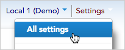
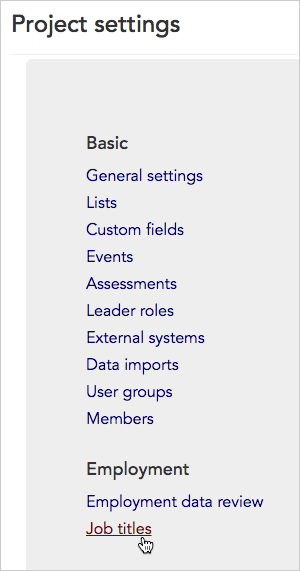
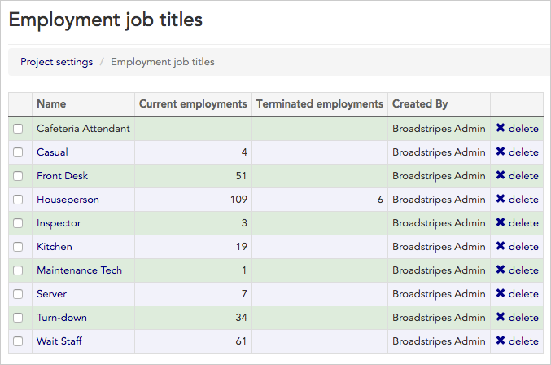
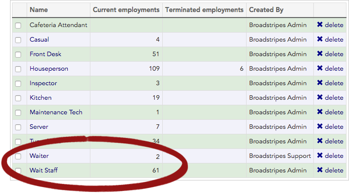
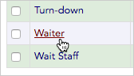
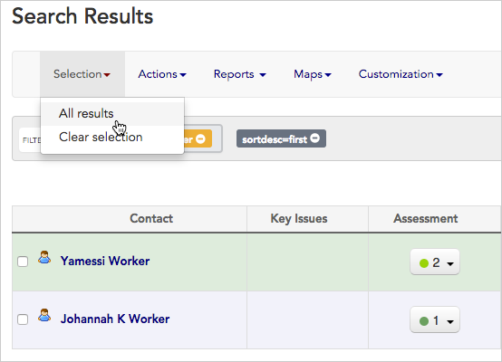
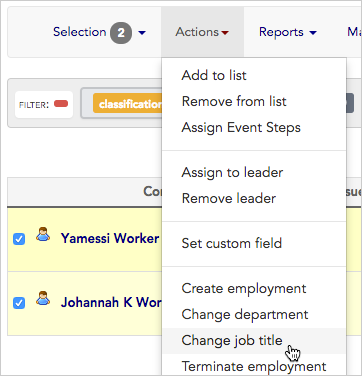
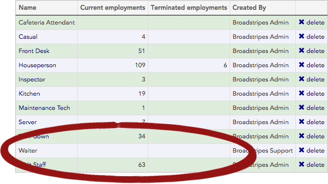
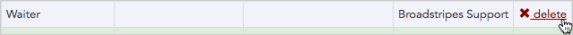
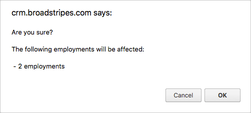

\[et\_pb\_section fb\_built="1" admin\_label="section" \_builder\_version="3.0.47"\]\[et\_pb\_row admin\_label="row" \_builder\_version="3.0.105" background\_size="initial" background\_position="top\_left" background\_repeat="repeat"\]\[et\_pb\_column type="4\_4" \_builder\_version="3.0.47" parallax="off" parallax\_method="on"\]\[et\_pb\_text \_builder\_version="3.0.106" background\_size="initial" background\_position="top\_left" background\_repeat="repeat"\]

### View all the job titles (AKA classifications) you've created for your project in a single list.

#### What's the difference between "Job titles" and "Classifications"?

To give a short answer – nothing! "Job title" and "Classification" refer to the exact same piece of employment information in Broadstripes; it's just a matter of how it is labeled. In fact, you may use "Job title" in one Broadstripes project and "Classification" in another.

You can change this label at any time in your [General settings](../general-settings/).

For this article, we'll be referring to "Job titles," but if your project uses Classifications instead, just substitute "Classification" wherever "Job title" is mentioned.

1. To get started, access **Job titles** by clicking **Settings** > **All settings** in the upper right corner of any page.

1. From the **Project settings page**, click the **Employment > Job titles** link (depending on your settings, this might be labeled "Classifications" rather than "Job titles."

1. The **Job titles settings index page** will open, displaying a list of all the job titles created for your project.

The list includes job titles from current and terminated employments, as well as those which were used at one time, but are no longer associated with any employments (such as "Cafeteria Attendant" in the list below).

## Identify and fix job title errors

Job titles are created through the process of assigning employments to workers. As with any data entry work, sometimes errors or duplicate entries are made during the process. You can use the **Job title index page** to quickly find (and fix) mistakes in your job titles.

In this example, we've found a duplicate entry on our Job titles index page: there are people assigned the job of "**Wait Staff**" and "**Waiter**," but they should have all been called "**Wait Staff**".

We'll look at which workers are affected, and how to properly clean up this mistake.

1. Since the job title "**Waiter**" is a duplicate of "**Wait staff**," we want to delete it from our list. But first, we need to re-assign any associated workers to a valid job title. You can see from the list that there are two workers we'll need to update.

1. Click the "**Waiter**" link to view the workers associated with that job title.

1. Now we'll re-assign them in bulk to the "**Wait staff**" job title. (Bulk actions were designed to update large numbers of records at one time – read more in the [Bulk actions](../../../using-broadstripes/working-with-search-results/bulk-actions/) section of the knowledge base.)
2. First, we'll **select** all the workers.

1. Next we'll choose **Change job title** from the **Actions** menu, and change their job title to "**Wait staff**". You can read detailed instructions on changing job titles in the [Update employment information](../../../using-broadstripes/working-with-search-results/bulk-actions/) section of the Bulk Actions article.

1. When the job titles are corrected, you can return to the **Job title index page** by clicking **Settings** > **All settings** in the upper right corner of the page.
2. You'll see that there are now no workers associated with the "**Waiter**" job title.

1. We'll click the  **delete** link to remove "**Waiter**" as a job title in our project.

1. Broadstripes will ask for confirmation to delete, then notify us that the job title has been deleted.

Note that if we had not re-assigned the associated workers to new job titles first (before trying to delete the job title), Broadstripes would have warned us that employments would be affected.

\[/et\_pb\_text\]\[/et\_pb\_column\]\[/et\_pb\_row\]\[/et\_pb\_section\]
