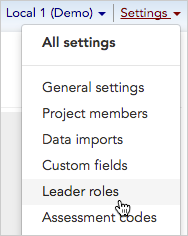
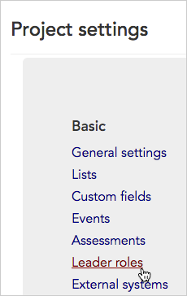
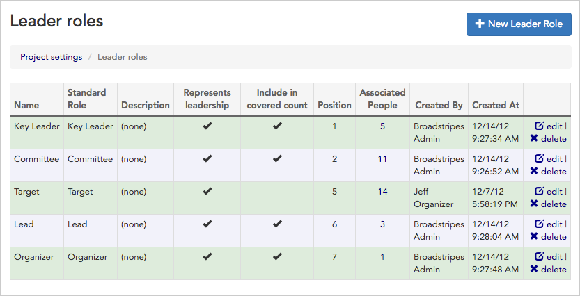
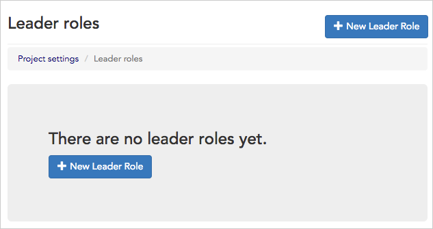

\[et\_pb\_section bb\_built="1" admin\_label="section"\]\[et\_pb\_row admin\_label="row" background\_position="top\_left" background\_repeat="repeat" background\_size="initial" \_builder\_version="3.0.105"\]\[et\_pb\_column type="4\_4"\]\[et\_pb\_text background\_position="top\_left" background\_repeat="repeat" background\_size="initial" \_builder\_version="3.0.106" background\_layout="light"\]

Whether your project is designed for internal, external, or community organizing, your users probably have a need to identify the leaders within the bargaining unit or worker group. As an administrator, you can easily view, edit or define new leadership roles for your Broadstripes project with **leader roles**.

1. To get started, you can access **leader roles** in one of two ways: Click **Settings** > **Leader roles** in the upper right corner of any page.

1. Or, from the **Project settings page**, click the **Basic > Leader roles** link.

1. The **Leader roles index page** will open, displaying all of the roles you have set up. You can view and manage your project's leader roles from this page.

1. If you haven't yet set up any roles, your index page will open with a button to create a **\+ New Leader Role.**

1. Instructions on how to edit, delete, or create new leader roles, are covered in detail in the [Leadership roles](https://help.broadstripes.com/help-articles/admin-tools/data-tools-admin/leadership-roles/) article.

\[/et\_pb\_text\]\[/et\_pb\_column\]\[/et\_pb\_row\]\[/et\_pb\_section\]
