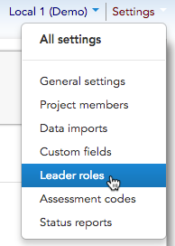
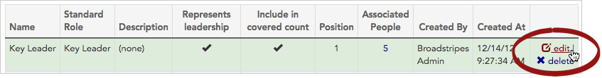
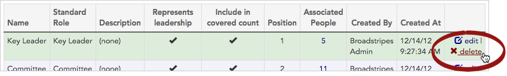
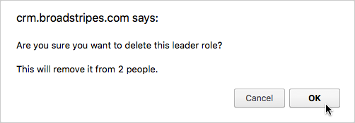

\[et\_pb\_section fb\_built="1" admin\_label="section" \_builder\_version="4.16" global\_colors\_info="{}"\]\[et\_pb\_row admin\_label="row" \_builder\_version="4.16" background\_size="initial" background\_position="top\_left" background\_repeat="repeat" global\_colors\_info="{}"\]\[et\_pb\_column type="4\_4" \_builder\_version="4.16" custom\_padding="|||" global\_colors\_info="{}" custom\_padding\_\_hover="|||"\]\[et\_pb\_text \_builder\_version="4.16" background\_size="initial" background\_position="top\_left" background\_repeat="repeat" global\_colors\_info="{}"\]

## Overview

An important part of many kinds of organizing is the identification of **leaders** within the bargaining unit or worker group. Leadership is usually defined by roles.

Labor organizing (internal or external) often uses "Committee" and "Key Leader," while "Activist" or "Mobilizer" are more common in community organizing.

With Broadstripes, it is simple to set up leader roles to suit the style of organizing you're doing.

## Set up new leader roles

1. Go to **Settings > Leader roles**.  
    This takes you to the **leader role index page** that lists any existing roles in your project.
2. Click on the button to add **\+ New Leader Role**.
3. Select the **Standard leader role** from the drop-down chooser that's the best match for the role you're creating.

Selecting a **standard leader role** _is required_ if you plan to generate cross-project reports that can aggregate roles with different names but equivalent function. If that's not relevant to you, you can skip the standard leader role input.

1. Give the new role a one- or two-word **name** that's meaningful to the organizers on your campaign. (This is the text that will appear on-screen and in reports.)
2. Add a **description** (optional). If your project has many roles, it can be useful to create a short descriptive sentence for each.
3. Enter a **position number**. The position number conveys where the role fits in the hierarchy of leadership. It determines where the role will appear in the leader role drop-down chooser as seen by your end users.

When setting **position numbers**, a lower number means a higher position in the hierarchy, so a role with position 1 will appear at the top of the list, and so on. Leaving the number value as "0" will make Broadstripes automatically assign the next available number, placing your new role at the bottom of the list.

1. Check **Represents leadership** if you are creating some roles that do not represent leadership and wish to have the ability to distinguish between people in leadership roles and those with non-leadership roles. An example of a non-leadership role is a "Target," a person who may have influence in the bargaining but who has not yet committed to using that influence to support your campaign's goals.
2. Check **Include in covered count** if you want leaders with this role to be included in Broadstripes' automatic calculation of coverage within the shop/department turf. (This organizing metric can be shown on the Turf Panel and added to status reports at your discretion.)
3. Click **Save Leader Role**. You'll be returned to the leader role index page where all your roles are listed.
4. Repeat these steps until you've created the roles you need.

Your finished leader role list might look something like this:

## Edit or delete your leader roles

### Edit

1. To **edit** a leader role, click the  **edit** link at the end of the row for the role you want to change.

1. Make the changes you want, and click the **Save Leader Role** button.
2. You'll be returned to the **Leader role index page** where you can see your changes.

### Delete

1. To permanently **delete** a leader role, click the **delete** link at the end of the row for the role you want to remove.

1. Click **OK** when Broadstripes prompts you to confirm the deletion.

1. The leader role will be removed from your project, and all contacts who were previously assigned that role will have no role (i.e. their leader role field will now be blank).

\[/et\_pb\_text\]\[/et\_pb\_column\]\[/et\_pb\_row\]\[/et\_pb\_section\]
