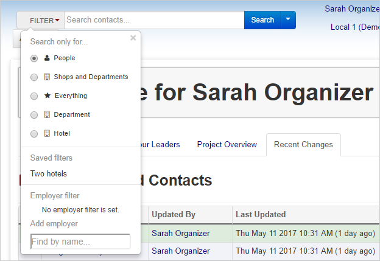
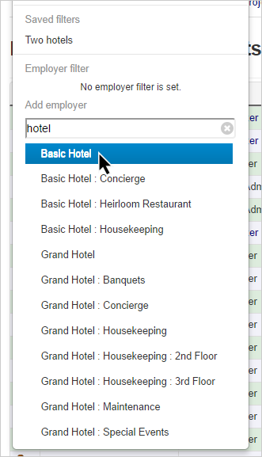
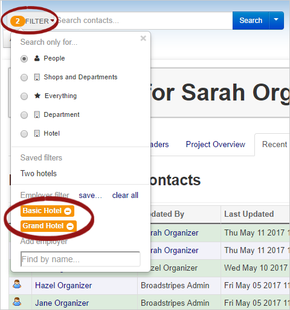
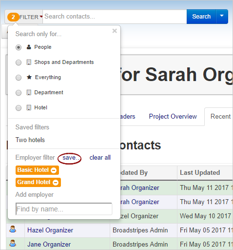
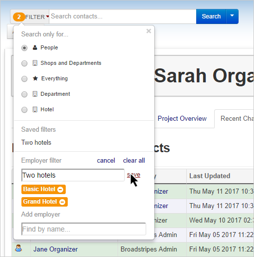
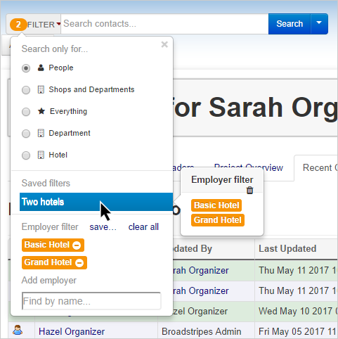

\[et\_pb\_section fb\_built="1" admin\_label="section" \_builder\_version="3.22.3"\]\[et\_pb\_row admin\_label="row" \_builder\_version="3.25" background\_size="initial" background\_position="top\_left" background\_repeat="repeat"\]\[et\_pb\_column type="4\_4" \_builder\_version="3.25" custom\_padding="|||" custom\_padding\_\_hover="|||"\]\[et\_pb\_text \_builder\_version="3.27.4" background\_size="initial" background\_position="top\_left" background\_repeat="repeat"\]

## Intro

One of the most helpful features of Broadstripes is how it can help organizers and other union leaders quickly find people they're looking for.

The **Employer filter** tool makes that even easier for you to do by narrowing your search to a certain group of workplaces or employments.

## Use the employer filter

1. Get started by finding the **Filter drop-down menu** on the left side of the homepage's search bar.
2. Clicking on it will produce the following menu:
3. At the bottom of the Filter drop-down is a section called **Employer filter**. To filter by employer, search for an employer by name in the text box, then click on the correct suggestion.

1. The workplace(s) you select will be added to the list of workplaces under the Employment Filter heading. The Filter dropdown will also display an orange flag letting you know that your search is filtered, with a number indicating the number of workplaces you have selected to filter.

## Save your employer filter

You can save your Employer filter choices for a later search.

1. Start by clicking the **save button**.

1. Type a **name** for your saved filter in the box that appears and click **save** again.

1. The filter you just named and saved will now appear under a list of **Saved filters**. When you mouse over the filter's name, a pop-up will display, telling you that the filter is an Employer filter, and showing you which workplaces it includes.

\[/et\_pb\_text\]\[/et\_pb\_column\]\[/et\_pb\_row\]\[/et\_pb\_section\]
