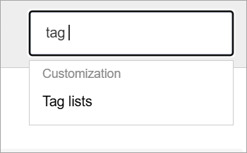
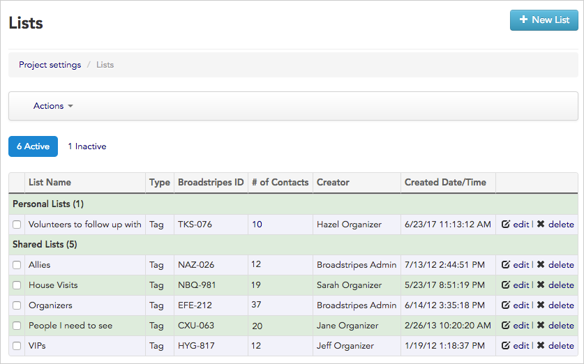
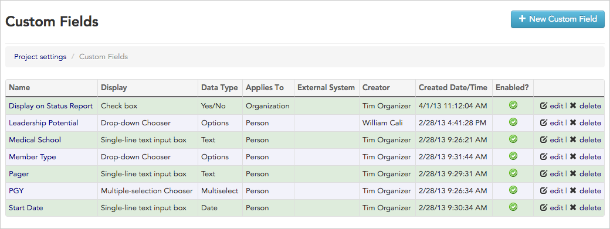
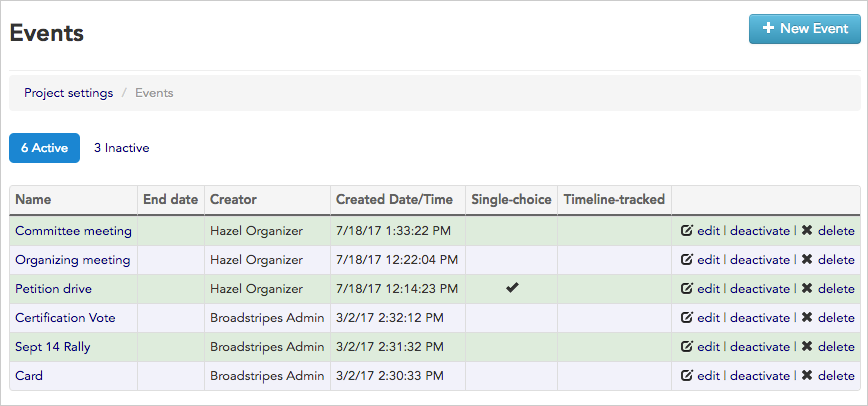

\[et\_pb\_section fb\_built="1" admin\_label="section" \_builder\_version="4.16" global\_colors\_info="{}"\]\[et\_pb\_row admin\_label="row" \_builder\_version="4.16" background\_size="initial" background\_position="top\_left" background\_repeat="repeat" global\_colors\_info="{}"\]\[et\_pb\_column type="4\_4" \_builder\_version="4.16" custom\_padding="|||" global\_colors\_info="{}" custom\_padding\_\_hover="|||"\]\[et\_pb\_text \_builder\_version="4.27.4" background\_size="initial" background\_position="top\_left" background\_repeat="repeat" global\_colors\_info="{}"\]

This article covers how to work with the project settings **Tag lists** and **Custom fields.**

1. To get started, click the **Settings** menu in the upper right corner of any page. Type the menu option that you want to access in the filter box. Then click the desired option in the menu.

### Tag Lists

Tag lists give users an easy way to manually tag people they want to track as a group – for instance, their most dedicated volunteers or the people they consider their top targets.

Clicking the **Lists** link from the Project settings page will open the **Lists index page** where you can view and make changes to your tag lists. Since tag lists are created not just by administrators, but by individual users, you will see only the tag lists you've created, and those that have been shared with you.

\[caption id="" align="aligncenter" width="837"\] The Tag Lists index page.\[/caption\]

To learn more about creating, editing, sharing and deleting lists, read the [Tag lists](https://help.broadstripes.com/help-articles/admin-tools/data-tools-admin/tag-lists/) section of the knowledge base.

### Custom fields

As you probably know, **custom fields** are special fields an administrator can create to hold data that can't logically be mapped to one of Broadstripes' built-in fields. Specifically, custom fields contain data that is _permanently_ relevant about the worker (such as "Shift" and "Issues of Concern"), while **Events**, another type of user-defined field, capture particular actions in the workflow of a given campaign activity.

Clicking the **Custom fields** link from the Project settings page will open the **Custom fields index page** where you can view and manage all of the project's custom fields. You can also open this page from the **Settings** menu:

\[caption id="" align="aligncenter" width="1040"\] The Custom Fields index page.\[/caption\]

To learn more about creating, editing, and deleting custom fields, read the [Custom fields](https://help.broadstripes.com/help-articles/admin-tools/data-tools-admin/custom-fields/) section of the knowledge base.

### Events

Like custom fields, **events** are customizable fields that allow you to track information that is specific to the way you do your organizing. Unlike custom fields, events can be set up to include multiple components or "steps," making them a useful tool for tracking the specific actions your users need to complete during the course of a campaign.

Clicking the **Events** link from the Project settings page will open the **Events index page**where you can view and manage all of your project's events and event steps.

\[caption id="" align="aligncenter" width="868"\] The Events index page.\[/caption\]

To learn more about **creating, editing, deactivating,** and **deleting** events, read the [Events](https://help.broadstripes.com/help-articles/admin-tools/data-tools-admin/creating-an-event/) section of the knowledge base.

\[/et\_pb\_text\]\[/et\_pb\_column\]\[/et\_pb\_row\]\[/et\_pb\_section\]
