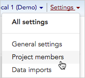
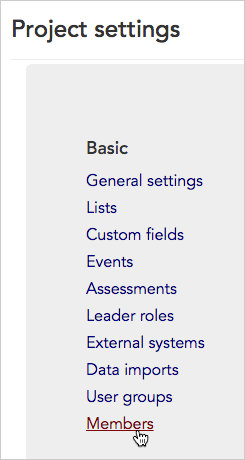
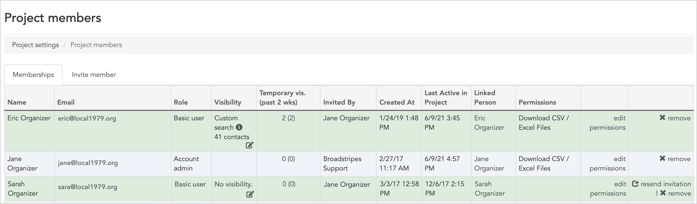
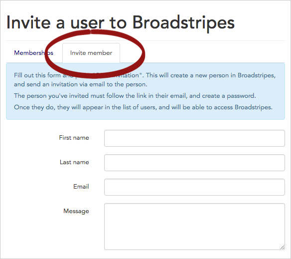

\[et\_pb\_section fb\_built="1" admin\_label="section" \_builder\_version="3.22"\]\[et\_pb\_row admin\_label="row" \_builder\_version="3.25" background\_size="initial" background\_position="top\_left" background\_repeat="repeat"\]\[et\_pb\_column type="4\_4" \_builder\_version="3.25" custom\_padding="|||" custom\_padding\_\_hover="|||"\]\[et\_pb\_text \_builder\_version="4.9.4" background\_size="initial" background\_position="top\_left" background\_repeat="repeat"\]

See details about your **members** – the users who have been invited to have a role in your project.

## View your project's users

1. To get started, you can access **Members settings** in one of two ways:  
    Click **Settings** > **Project members** in the upper right corner of any page.

Or, from the **Project settings page**, click the **Basic > Members** link.

1. The **Members index page** will open, showing all of the people who have been invited to be part of your Broadstripes project.

1. From the index page, you can see a range of information about each member (or invited member):
    - **Name**, **Email address**, and **Role** of the member (see the [Edit user permissions](https://help.broadstripes.com/help-articles/admin-tools/running-a-project-admin/user-and-membership-overview/) section of the Users and Membership article for more details on specific roles).
    - **Visibility (optional)** – this column is only shown if you have enabled the "Limited visibility" feature in your project. If Limited visibility is enabled, this column lists the shops and departments you've assigned (or made "visible") to each member (see the [Limited Visibility article](https://help.broadstripes.com/help-articles/admin-tools/project-settings/limited-visibility/) for more information about enabling and configuring this feature)
    - **Temporary vis. (past 2 wks)** **(optional)** – this column is only shown if you have enabled both the "Limited visibility" and "Temporary visibility" features in your project. If these are enabled, this column lists the people this member has requested to view temporarily in the past two weeks (see the [Temporary visibility article](https://help.broadstripes.com/help-articles/admin-tools/project-settings/temporary-visibility/) for more information about enabling this feature and how it works)
    - **Invited By** – the name of the user who invited the member to join the project
    - **Created At** – the date they were invited
    - **Permissions** – the specific permissions the member was granted
    - **edit permissions** – you can change a project member's permissions by clicking the **edit permissions** link (see the [Edit user permissions](https://help.broadstripes.com/help-articles/admin-tools/running-a-project-admin/user-and-membership-overview/) section of the Users and Membership article for more details on setting permissions).
    - **resend invitation** – members who have not yet accepted their invitation to join your project will display a link to  **resend invitation**. Clicking the link will automatically send a duplicate invitation. This link will not be visible if an invitee has accepted the invitation and created a Broadstripes account.
    - **remove** a member – to remove any member or invitee from your project, click the  **remove** link (see the [Remove a user](https://help.broadstripes.com/help-articles/admin-tools/running-a-project-admin/user-and-membership-overview/)  section of the Users and Membership article for full instructions on removing members).

## Invite new users

You can invite new people to join your project by clicking on the **Invite member tab**.

See the [Create and invite a new user](https://help.broadstripes.com/help-articles/admin-tools/running-a-project-admin/user-and-membership-overview/) section of the Users and Membership article article for step-by-step instructions on adding new members to your project.

\[/et\_pb\_text\]\[/et\_pb\_column\]\[/et\_pb\_row\]\[/et\_pb\_section\]
