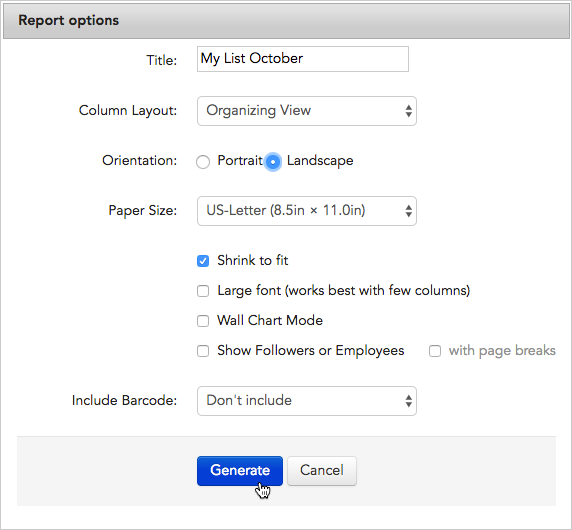

\[et\_pb\_section fb\_built="1" admin\_label="section" \_builder\_version="3.22.3"\]\[et\_pb\_row admin\_label="row" \_builder\_version="3.22.3" background\_size="initial" background\_position="top\_left" background\_repeat="repeat"\]\[et\_pb\_column type="4\_4" \_builder\_version="3.0.47"\]\[et\_pb\_text \_builder\_version="3.0.106" background\_size="initial" background\_position="top\_left" background\_repeat="repeat"\]

## Overview

With Broadstripes, it's easy to print your organizing information as a list using the reports feature. Here are a few reasons you might want to print a list:

- you can bring your information with you in hard copy to house visits and check-in meetings
- for quick reference or to record information when you don't have a computer
- as a tool for non-Broadstripes users to view and collect information

There are different types of lists that you can choose from: the most flexible is the **Basic List**.

The Basic List is just a printed version of your records using whatever layout you choose for your organizing project. For instance, if your layout includes name, home address, and a checkbox indicating attendance at an upcoming event, that is what your printed list will display.

If you were to take that list on a house visit, you'd use the name and address columns to find your people. If your house visits turned out three additional people, you'd keep track of that by checking their attendance checkboxes on your printed list. Then, after your house visits, you could use the annotated printed list to update your contacts' attendance plans in Broadstripes.

## Print a basic list

1. To print a basic list, start by **running a search** for the workers on your list. (Learn about running a search in the [Search by workplace](https://help.broadstripes.com/help-articles/using-broadstripes/search/search-by-workplace/) or [Create and save a search](https://help.broadstripes.com/help-articles/using-broadstripes/customize/create-and-save-a-search/) articles.)
2. When your search results appear, click **all** to select all the results in the list below.
3. All contacts will be selected (indicated by a **check** next to their name). **Uncheck** any person you want to _exclude_ from your list.
4. Once your contacts are selected, click the **Reports** menu and choose **Basic List (PDF)**.
5. When the **Report options** window opens, give the file a **Title** and choose a **Column Layout** to determine which columns of data (fields) will be included in your printed list. (For more information about using layouts, see the [Choose a layout](https://help.broadstripes.com/help-articles/using-broadstripes/get-started/choose-a-layout/) or [Create and save a layout](https://help.broadstripes.com/help-articles/using-broadstripes/customize/save-a-layout/) articles.)
6. Click **Generate**. This will create a PDF report you can download and print.
7. You'll see a message explaining that your PDF report is being created and will download automatically.
8. To view and print your PDF, you have two choices:
    - you can **stay on the current page** and wait for the report's **download dialog** to appear asking you where to save your PDF list.
        
        \[caption id="attachment\_2235" align="aligncenter" width="426"\] When the report is ready, a dialog box will appear.\[/caption\]

- you can **leave the current page** and **check in later** to see if the report is ready. To check for the report later, click the **Reports** link in the navigation panel. That link brings you to the **Requested Reports** page where you can download any requested list at any time.
    
    \[caption id="attachment\_2236" align="aligncenter" width="202"\] Click the **Reports** link in the navigation panel to open a list of reports.\[/caption\]
    
    \[caption id="attachment\_2237" align="aligncenter" width="371"\] Choose the report you want from the **Requested Reports page**.\[/caption\]

1. Once you've downloaded your PDF list using one of these methods, **open** and **print** it just as you would any other PDF document.

\[/et\_pb\_text\]\[/et\_pb\_column\]\[/et\_pb\_row\]\[/et\_pb\_section\]
