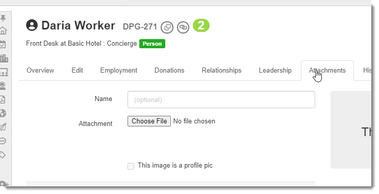
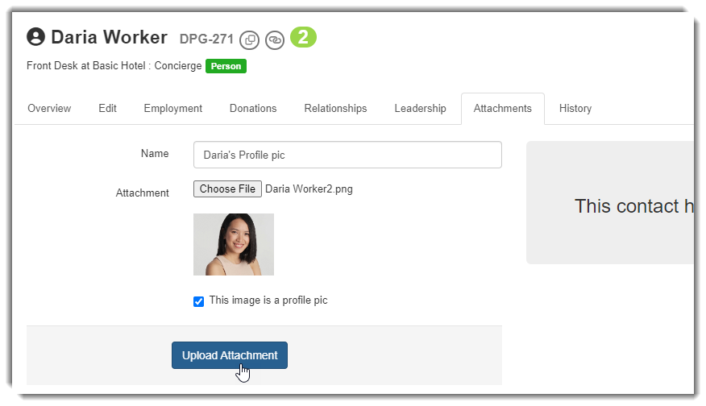
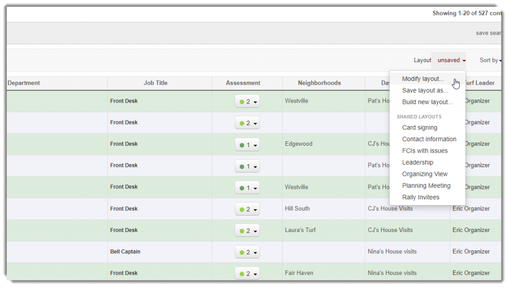
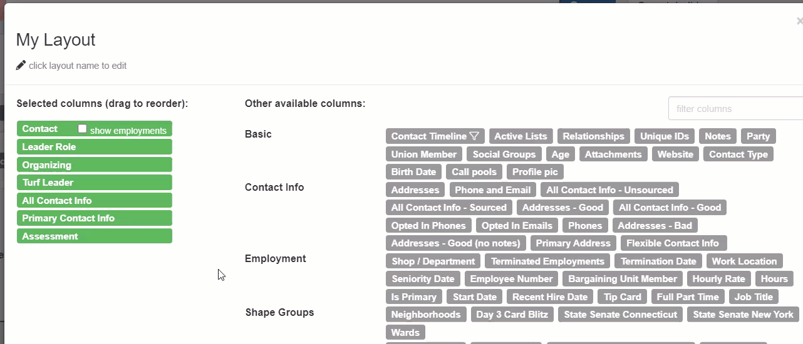
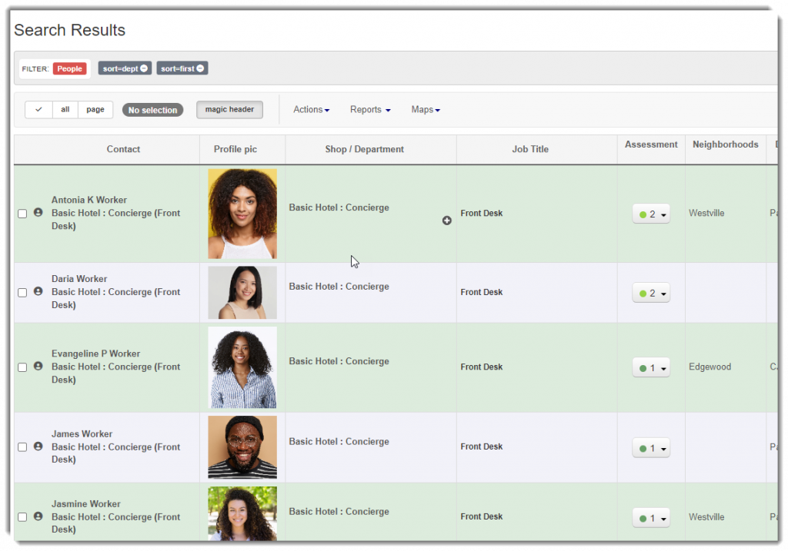
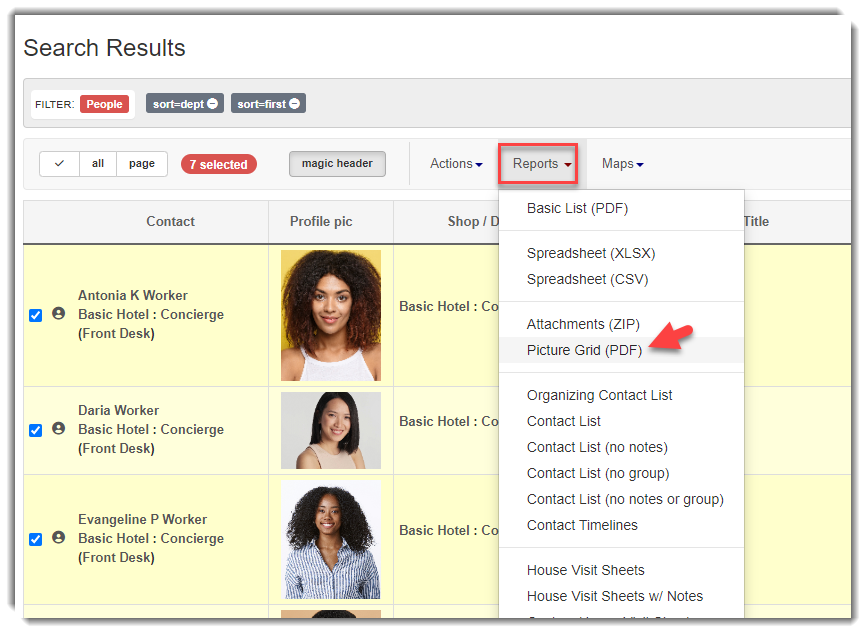

\[et\_pb\_section fb\_built="1" admin\_label="section" \_builder\_version="4.16" global\_colors\_info="{}"\]\[et\_pb\_row admin\_label="row" \_builder\_version="4.16" background\_size="initial" background\_position="top\_left" background\_repeat="repeat" global\_colors\_info="{}"\]\[et\_pb\_column type="4\_4" \_builder\_version="4.16" custom\_padding="|||" global\_colors\_info="{}" custom\_padding\_\_hover="|||"\]\[et\_pb\_text \_builder\_version="4.19.4" background\_size="initial" background\_position="top\_left" background\_repeat="repeat" hover\_enabled="0" global\_colors\_info="{}" sticky\_enabled="0"\]

## Overview

Broadstripes allows users to add a profile picture to a person’s record. You can attach an image to go along with the person’s information. Broadstripes will even produce a picture grid to take with you for house visits and events.

### Upload a profile pic

Go to a person’s record and select the **Attachments** tab.

Choose the image file you want to use as the person’s profile pic(images with a portait orientation tend to display better). Check the box that says **“This image is a profile pic,”** then click the **“Upload Attachment”** button.

The image will now appear as an attachment and marked as a profile pic.

### Add profile pics to search layout

Now that you have added profile pics to your people, you may view them in your search results. You must modify your search layout to include the profile pic column.

Select **Modify layout** from the **Layout** drop-down menu on the Search Results page.

Click on **Profile pic** to add the column to your layout. The Profile pic column will be added to the end of your current layout. Click and drag to reorder the column placement.  You may apply the change to your current layout without saving or save as a new layout.

Now that your layout has been applied, you can view a person’s profile pic in the search results.

### Picture Grid

Broadstripes will produce a printable **Picture Grid** report that includes the person’s photo, the full name of the person, the associated shop & department, and the classification/job title.

Select the people you want to be included in your Picture Grid from the search results. Select **Picture Grid** from the Reports drop-down menu.

A PDF containing your selected contacts’ photos and corresponding information will be generated.

\[/et\_pb\_text\]\[/et\_pb\_column\]\[/et\_pb\_row\]\[/et\_pb\_section\]
