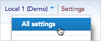
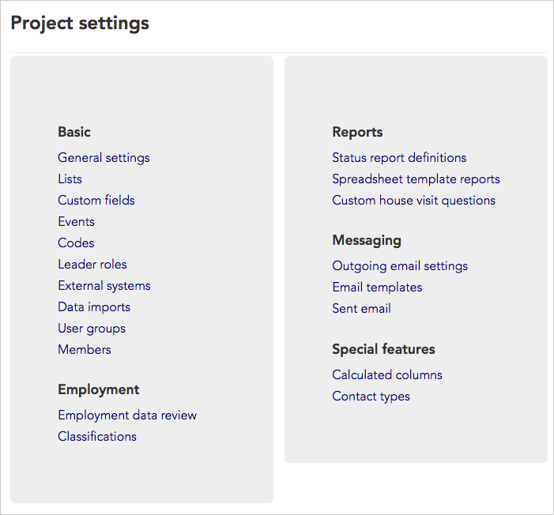

\[et\_pb\_section fb\_built="1" admin\_label="section" \_builder\_version="3.22.3"\]\[et\_pb\_row admin\_label="row" \_builder\_version="3.22.3" background\_size="initial" background\_position="top\_left" background\_repeat="repeat"\]\[et\_pb\_column type="4\_4" \_builder\_version="3.0.47"\]\[et\_pb\_text \_builder\_version="3.0.106" background\_size="initial" background\_position="top\_left" background\_repeat="repeat"\]

## Intro

As the admin of your Broadstripes project, you may find that you have a lot of information you want to keep track of – data imports, custom fields, report formats, and user permissions, just to name a few. Thankfully, Broadstripes provides the tools you need to make your job more simple.

One tool you should know about is the **Project settings page** – a single access point for all of your admin tools.

In the upper right corner of any page, click **Settings** > **All settings** to open the **Project settings page**.

When the **Project settings page** opens, you'll see a list of all your project settings in one convenient place. From there, just click a link to view or modify that setting.

Your **Project settings page** may look slightly different depending on the features you have enabled for your project.

## Project settings 

Click any project settings topic below to get an in-depth description:

### Basic

[General settings](../../project-settings/general-settings/)  
[Lists](../../project-settings/lists-custom-fields-events/)  
[Custom fields](../../project-settings/lists-custom-fields-events/)  
[Events](../../project-settings/lists-custom-fields-events/)  
[Assessments/Codes](../../project-settings/assessment-settings/)  
[Leader roles](../../project-settings/leader-roles/)  
[External systems](../../project-settings/external-systems-settings/)  
[Data imports](../../project-settings/data-imports/)  
[User groups](../../project-settings/user-group-settings/)  
[Members](../../project-settings/members-settings/)

### Employment

[Employment data review](../../project-settings/employment-data-review/)  
[Job titles/Classifications](../../project-settings/job-titles-settings/)

### Reports

[Status report definitions](../../project-settings/status-report-definitions/)  
[Spreadsheet template reports](../../project-settings/spreadsheet-template-reports/)  
[Custom house visit questions](../../project-settings/custom-house-visit-questions/)

### Messaging

[Outgoing email settings](../../project-settings/outgoing-email-settings/)  
[Email templates](../../project-settings/email-templates/)  
[Sent email](../../project-settings/sent-email/)

### Special features

[Calculated columns](../../../../uncategorized/calculated-columns-settings/)  
[Contact types](../../project-settings/contact-types/)

\[/et\_pb\_text\]\[/et\_pb\_column\]\[/et\_pb\_row\]\[/et\_pb\_section\]
