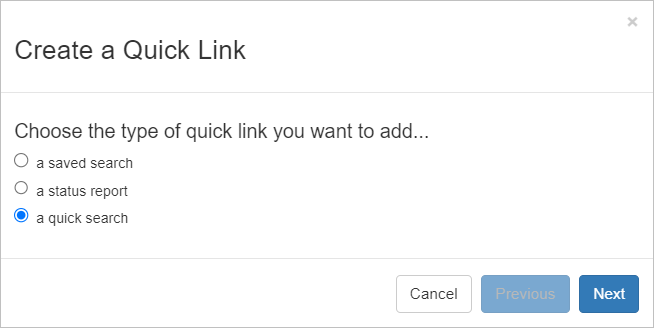
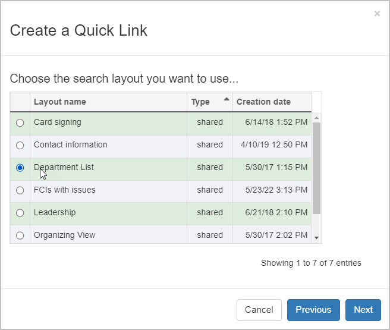
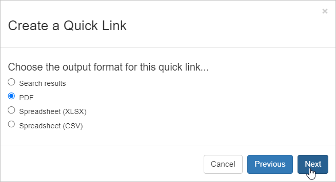
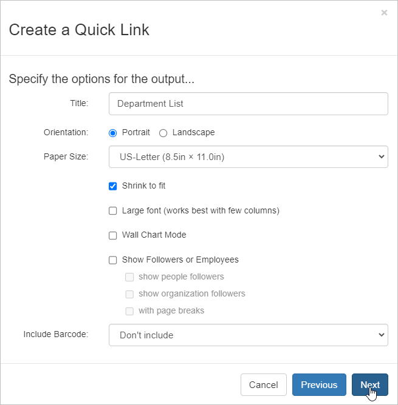
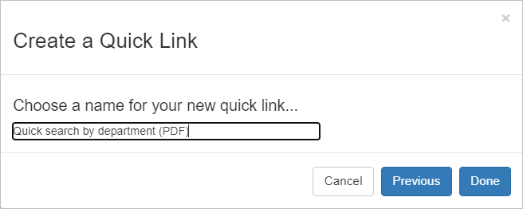
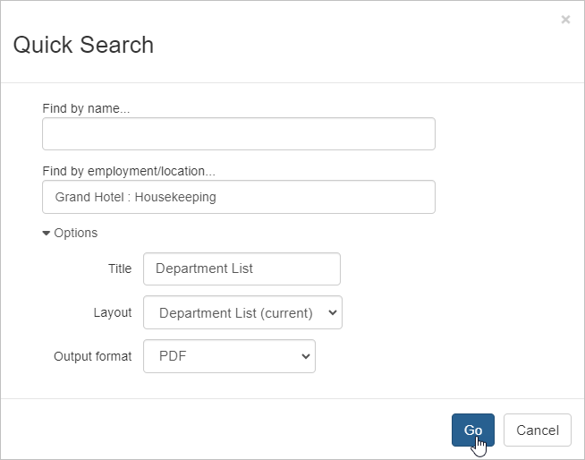
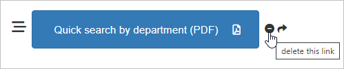

## Why add a quick search link?

Since **quick search** is already easy to access and simple to use, you may wonder why you’d need to add it to your quick links tab.

What you might not know is that adding a **quick search quick link** allows you to have all the advantages of quick search’s fast, dynamic search while allowing you to set fixed layout and output preferences – you’ll still be able to run a dynamic search, but Broadstripes will automatically present the results in the right format with no extra steps.

### Example

Imagine that I frequently run the same quick search to create lists of workers from each of the various departments at the shops I organize. After running a department search, I always apply the same “Department list” layout, and always export the list to PDF so I can print it and keep it with me when I’m away from my computer.

If I used the basic quick search to create these printed lists, I’d need to select the layout and output format _each time_ I ran the search. Alternatively, if I used a saved search with a saved layout, I’d have to create a _separate search_ for every single department list I wanted to print.

By creating a **quick search quick link**, I can keep the search flexible but specify the “Department list” layout and the PDF output format. The best part is that I can set it up once, and run the search over and over (choosing any department I want to see) without ever having to specify those output settings again.

Here’s how:

1. Start on the quick links tab and follow the steps outlined in the article [Create quick links](https://web.archive.org/web/20240422121505/https://help.broadstripes.com/help-articles/using-broadstripes/customize/create-a-quick-link/) to create your new quick link.
2. Choose **a quick search** as the type of link you want to add and click **Next**.
3. Choose the **layout**. For this example, I’ll choose **Department List** since this is the layout I want Broadstripes to use each time the search is run.
4. Click **Next**.
5. Choose the output type and click **Next**. For this example, I’ll choose **PDF**.
6. When the output options window opens, give the file a **Title** and **File Name** and specify any other output details that are important to you. Click **Next**.
7. **Name** the quick link. This is the name that will appear on the quick link button on your quick link tab. Click **Done** to save.
8. You’ll see the new quick link button on your **Quick Links tab**. Click it to launch a search.
9. You’ll be prompted to enter **search criteria**, just as you would for a regular quick search. We’ll enter the department we want to see (Housekeeping) and click **Go**.
10. After you have chosen the employer or location, you can open the Options panel to change the report's name, layout, and format.Broadstripes will automatically apply your layout and create the PDF as soon as you click Go. You’ll see a **pop up message** explaining that your PDF report is being created and will download.
11. To view and print your PDF, you have two choices:
    - You can **stay on the current page** and wait for the report to download to your designated download folder.
    - You can **leave the current page** and **check in later** to see if the report is ready. To check for the report later, click the **Reports** link in the navigation panel. That link brings you to the **Requested Reports** page where you can download any requested list at any time.
        
        \[caption id="attachment\_25801" align="aligncenter" width="276"\] If you want to download the PDF list later, click the Reports link in the navigation panel.\[/caption\]
        

1. To generate another list for another department, just click the same **quick search button** on your **quick links tab** again. The link will remain there even after you’ve logged out and logged back in again.
2. If you ever need to **delete** a quick link, just click the  **icon** next to its name on the quick link panel.
3. You can also [share a quick link with all the users in a user group](https://help.broadstripes.com/help-articles/admin-tools/share-quick-links-to-a-user-group/).
