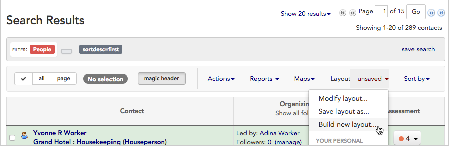
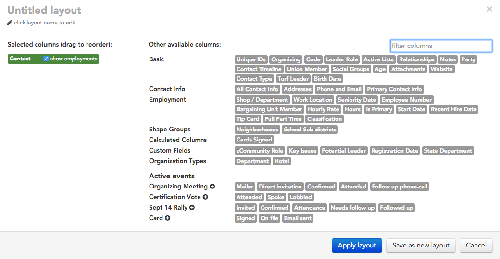
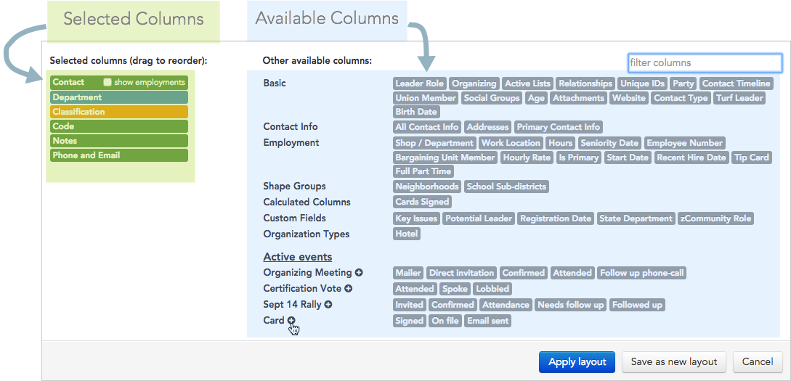
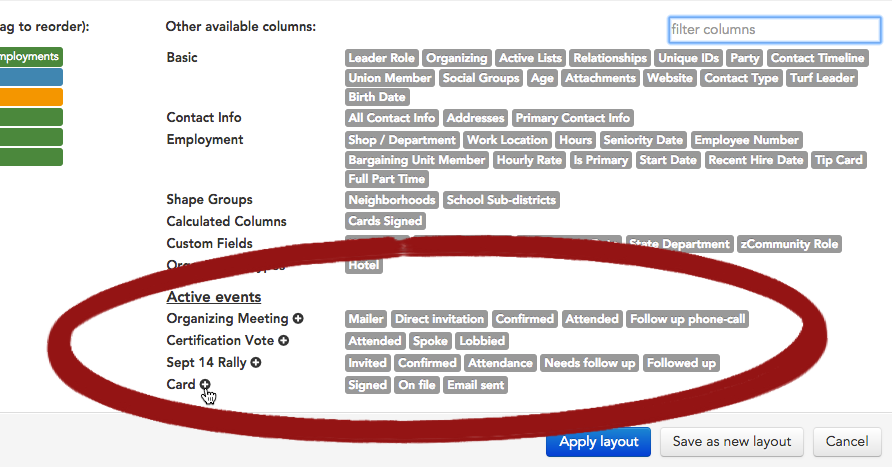
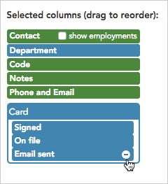
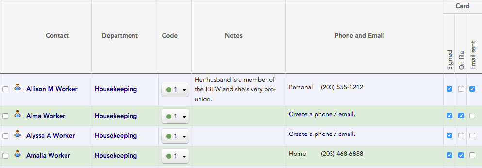
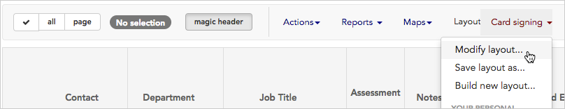
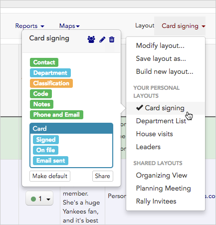

\[et\_pb\_section fb\_built="1" admin\_label="section" \_builder\_version="4.16" global\_colors\_info="{}"\]\[et\_pb\_row admin\_label="row" \_builder\_version="4.16" background\_size="initial" background\_position="top\_left" background\_repeat="repeat" global\_colors\_info="{}"\]\[et\_pb\_column type="4\_4" \_builder\_version="4.16" custom\_padding="|||" global\_colors\_info="{}" custom\_padding\_\_hover="|||"\]\[et\_pb\_text \_builder\_version="4.16" background\_size="initial" background\_position="top\_left" background\_repeat="repeat" global\_colors\_info="{}"\]

## Overview

Together with searches, the Broadstripes layout feature is your key to viewing the records you want in a format that matches your process. While a _search_ filters the set of contacts displayed by the criteria you choose, a _layout_ determines which exact information to display about those contacts, and in what order.

In short, layouts let you completely customize the contents of the search results panel, i.e. which data fields you see. You can choose just the columns of data you want, and leave out the ones that might get in the way.

What's more, you can create different layouts for different teams or tasks. By creating good layouts, you can view and record information in the most effective way possible. Once you've created a layout, you can apply it to any search results, any time. You can even share layouts with other users so whole organizing teams can work from the same set of crucial information.

## Create a layout

1. To build a new layout, start on the search results panel. (Learn about running a search in the [Search by name](https://help.broadstripes.com/help-articles/using-broadstripes/search/search-by-name/) article.)
2. In the upper-right area above your search results, click the drop-down menu next to the word **Layout** as shown below. Our drop-down menu is labeled "**unsaved**," but yours may look slightly different depending on whether you are currently using a saved layout or not.

1. Click **Build new layout...**
2. A layout-building tool will open.

1. Using the layout builder, **click once on any column** listed under **"Other available columns:"** to include it in your layout. Each column you choose will be added to the upper-left portion of the layout builder in the same order you choose it.
2. For this example, we are going to create a layout that will help us run a card-checking campaign. We'll choose some basic information about the workers as well as their employment info:
    - **Contact** (choosing this will display their first and last name in a single column. Checking "**show employments**" will add their full employment details to that column, too — for this example, we'll leave that unchecked)
    - **Department** (where they work)
    - **Classification** (their job position, sometimes labeled "Job position")
    - **Code** (their assessment code, sometimes labeled "assessment")
    - **Notes**
    - **Phone and email**

\[caption id="attachment\_23320" align="alignleft" width="1089"\] Single-click any gray column name on the right to add it to your search results layout.\[/caption\]

1. For this card-checking layout, we'll also choose to display information specifically related to workers' cards from the **Card** event under the **Active events** section:
    - **Signed**
    - **On file**
    - **Email sent**
2. Clicking the  **plus sign** next to the event name **Card** will add all three of the event steps (**Signed**, **On file**, and **Email sent**) to the layout at once (or you can single-click on each step name to add them one at a time).

\[caption id="" align="alignnone" width="892"\] If your project has active events, they will be shown at the bottom of the layout builder.\[/caption\]

#### Adding events and event steps to your layout

In this example, all the data related to signed cards is part of a **custom event** called "Card" that we set up specifically for this project. Depending on the events you have set up, the column choices might look a little different in your project.

However, in _all_ projects, your **active events** and **event steps** will always be shown in the lower section of the layout builder.

Note that creating events and event steps is usually handled by a project administrator, but you can read about when and how to use events in the [Create an event](https://help.broadstripes.com/help-articles/using-broadstripes/customize/create-events-to-track-goals/) article.

1. Once you've added all the columns you need to your layout, you can make some adjustments if needed:
    - **drag and drop column names** to change their position in the search results matrix (the column name at the top of the layout builder will be the first column on the left when your search results are displayed, while column name at the bottom will display as the furthest to the right).
    - **delete unwanted columns** by hovering over the column name and then clicking the  minus sign icon that appears.

\[caption id="" align="alignnone" width="240"\] Delete a column by clicking the minus sign next the the column's name.\[/caption\]

1. Once you have your layout configured the way you want it, give it a **name**, and click to **Save as new layout**. (If you just want to apply the layout once, and don't want to save it, click **Apply layout**.)
2. Clicking either button will return you to your search results, re-displaying the records according to your new custom layout.

## Modify a layout

1. If you want to make changes to a saved layout, for instance, add a column to the layout, click the **Layout drop-down menu** again.
2. Choose to **Modify layout...**

1. The layout builder will open. Using the builder, make the desired changes to the layout, using the same steps you used when you [first created the layout](#ftoc-heading-2). For instance, to add a column to your layout, **click once on any column** listed under "**Other available columns:"** 
2. Once your layout is modified, you can either choose **apply** the new layout just once, or **save and run it**.
    - Click **Apply without saving** to apply the layout to your current search results. This will re-display the results, but won't permanently save any of the changes you've made to the layout.
    - Click **Save changes** to overwrite the saved layout with the modifications you've just made.

## Use your saved layout again with new searches

1. To apply a saved layout to another set of search results, start by running the search.
2. Next, click the **Layout drop-down menu**.
3. Your saved layouts will appear in the lower half of the drop-down menu under the words YOUR PERSONAL LAYOUTS.
4. **Hovering over the name** of any saved layout will open a pop-up box. From this pop-up box you can:
    - see **details about the layout**, including which specific columns are included in the layout.
    - click to **share with one other user** , **edit**  or **delete**  the saved layout.
    - click **Make default** to apply this layout to all of your search results automatically each time you run a search.
    - click **Share** to convert the layout to a shared layout that all other users will see. Sharing the layout will make it available to them in their own **Layout drop-down menu.**

1. If you want to apply a saved layout to your search results, **click on the name** of the saved layout. This applies it and instantly displays your search results using the new layout.

\[/et\_pb\_text\]\[/et\_pb\_column\]\[/et\_pb\_row\]\[/et\_pb\_section\]
